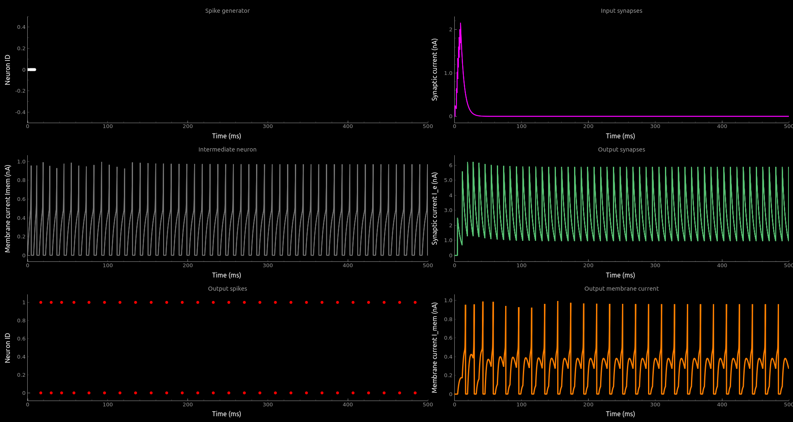

# teili

teili, das /taɪli/, Swiss german diminutive for piece. <br />

This toolbox was developed to provide computational neuroscientists and neuromorphic engineers with a playground for implementing neural algorithms which are simulated using **brian2**.<br />
Please report issues via the gitlab [issue tracker](https://code.ini.uzh.ch/ncs/teili/issues). You can find the documentation [here](https://teili.readthedocs.io/en/latest/).


By providing some pre-defined neural algorithms and an intuitive way to combine different aspects of those algorithms, e.g. plasticity, connectivity etc, we try to shorten the development time required to implement novel neural algorithms.
Furthermore, by providing an easy and modular way to construct those algorithms from the basic building blocks of computaton, e.g. neurons and synapses, we aim to reduce the gap between software simulation and hardware emulation.

## Getting Started

This toolbox is still in its alpha phase, so if you want to use it, follow the install instructions below.
Please also contact the main contributors with feedback.

Please look at the examples here: teili/examples/ and our [Documentation](https://teili.readthedocs.io/en/latest/)

### Installation
*  Clone the [repository](https://code.ini.uzh.ch/ncs/teili) or [download](https://code.ini.uzh.ch/ncs/teili) the tar.gz file<br />
    ```
    git clone git@code.ini.uzh.ch:ncs/teili.git
    ```
* Create a virtual environment using [conda](https://conda.io/docs/user-guide/install/index.html)
    ```
    # Replace myenv with the desired name for your virtual environment
    conda create --name myenv python=3.5
    ```
  If you want to use a specific version, as needed e.g. to use [CTXLCTL](http://ai-ctx.gitlab.io/ctxctl/index.html) add the particular python version to the conda environment
   ```
   conda create --name myenv python=3.6.6
   ```

*  Activate your conda environment
    ```
    source activate myenv
    ```

*  Navigate to the folder containing the cloned repository
    ```
    cd teili/
    ```
    or the downloaded `tar.gz` file
    ```
    cd Downloads/
    ```
*  Install teili using pip
    ```
    # Point pip to the location of the setup.py
    pip install .
    # or point pip to the downloaded tar.gz file
    pip install teili*.tar.gz
    ```
    The `setup.py` will by default create a folder in your home directory called `teiliApps`.
    This folder contains a selection of neuron and synapse models, example scripts, as well as unit tests.
    Please run the unit tests to check if everything is working as expected by:
    ```
    cd ~/teiliApps
    python -m unittest discover unit_tests/
    ```

    You are good to go!<br />
    If you want to specify the location of `teiliApps` just provide the path to the `setup.py`:
    ```
    cd teili/
    pip install . --install-option="--dir='/your/custom/path'"
    or
    pip install tar --install-option="--dir='/your/custom/path'"
    ```
### Alternative installation **NOT RECOMMENDED**
    If, however, you want to install all dependencies separately you can run the following commands **NOT RECOMMENDED**:
    ```
    git clone git@code.ini.uzh.ch:ncs/teili.git
    sudo apt install python3 python3-pip, python3-matplotlib python3-setuptools cython
    pip3 install brian2 sparse seaborn h5py numpy scipy pyqtgraph pyqt5 easydict
    ```
    if you did **not** use the setup.py you need to update your `$PYTHONPATH`:

    You can add the following line to your `~/.bashrc`<sup>1</sup>:
    ```
    export PYTHONPATH=$PYTHONPATH:"/path/to/parent_folder/of/teili"
    ```


<sup>1</sup> or type it on the terminal window that you are using.

We would recommend using iPython with spyder or Jupyter.

You probably need to use Linux if you want to use standalone code generation,
otherwise, Windows and Mac OSX works fine.

### Usage

```
from brian2 import ms
from teili import Neurons, Connections
from teili.models.neuron_models import DPI
from teili.models.synapse_models import DPISyn

# how to create a Neuron
num_neurons = 10
refP = 3 * ms
Neuron1 = Neurons(num_neurons, equation_builder=DPI(numInputs=1),
                  refractory=refP, name='Neuron1')

# how to create a Synapse
Synapse1 = Connections(Neuron1, Neuron1,
                      equation_builder=DPISyn(),
                      method='euler',
                      name='Synapse1')
```
For a more detailed explanation have a look at our [Tutorial](https://teili.readthedocs.io/en/latest/scripts/Tutorials.html)
## Examples
Please look at the [Neuron & Synapse example](https://teili.readthedocs.io/en/latest/scripts/Tutorials.html#neuron-synapse-tutorial), which is located in `~/teiliApps/examples/`.
You can also use them to test your installation.
To run an example and test if eveything is working, run the following command
```
cd `~/teiliApps/examples/
python3 neuron_synapse_test.py
```
The output should look like this



For more examples and use cases have look at our [Documentation](https://teili.readthedocs.io/en/latest/index.html)


## Brian2 debugging tips
Simulation is not going as expected?
* Restart Python kernel
* Are all groups added to the network?
* Are all statevars initialized with the correct value? (e.g. Membrane potential with resting potential, not 0)
* Use group.print() in order to see the equations
* Use connections.plot() in order to get a visualization


## Authors
See [docs/scripts/Contributors.md](https://teili.readthedocs.io/en/latest/scripts/Contributors.html) for a list of the authors.


## License
_teili_ is licenced under the MIT license, see the `LICENSE` file.

