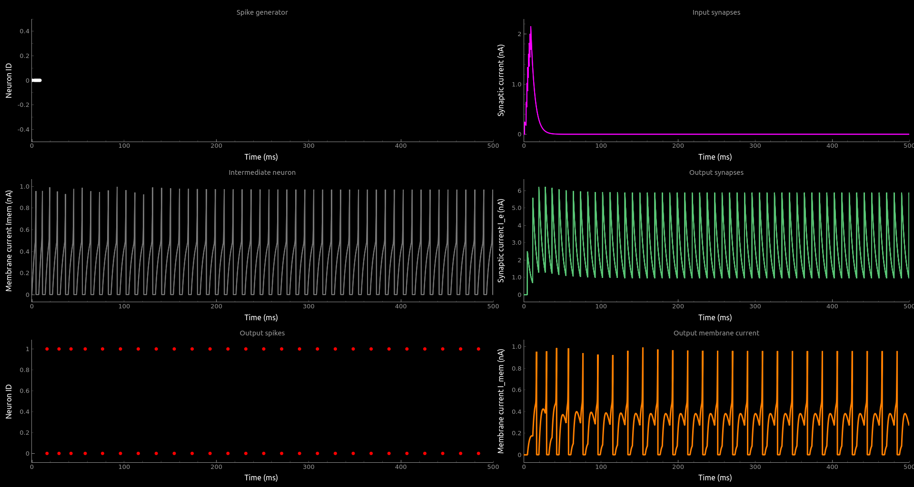

# teili

teili, das /taɪli/ <br />
swiss german diminutive for piece. <br />
This toolbox was developed to provide computational neuroscientists, as well as neuromorphic engineers, a play ground for neuronally implemented algorithms which are simulated using **brian2**.<br /> By providing pre-defined neural algorithms and an intuitive way to combine different aspects of those algorithms, e.g. plasticity, connectivity etc, we try to shorten the production time of novel neural algorithms. Furthermore, by providing an easy and modular way to construct those algorithms from the basic building blocks of computaton, e.g. neurons and synapses, we aim to reduce the gap between software simulation and hardware emulation

## Getting Started

This Library is still in alpha phase, so if you want to use it, just clone it and make sure to add it to your working directory or path. Please also contact the main contributors with feedback.

```
git clone git@code.ini.uzh.ch:ncs/teili.git
```

Please look at the Examples here: teili/examples/

### Prerequisites

* python3

* brian2

    You need to have brian2 installed.
    If you use Anaconda, just use

    ```
    conda install brian2
    ```

    If you don't use Anaconda, you can install all dependencies using:
    ```
    sudo apt install python3 python3-pip python3-matplotlib python3-setuptools cython
    pip3 install brian2 sparse seaborn h5py numpy scipy pyqtgraph pyqt5 easydict
    ```

* Add the pareent folder of teili to the PYTHONPATH
    You can add the following line to your `~/.bashrc`<sup>1</sup>:
    ```
    export PYTHONPATH=$PYTHONPATH:"/path/to/parent_folder/of/teili"
    ```

<sup>1</sup> or type it on the terminal window that you are using.

We would recommend to use iPython with spyder or jupyter

You probably need to use Linux if you want to use standalone code generation,
otherwise, Windows and Mac OSX works fine

### Usage

```
from brian2 import ms
from teili import Neurons, Connections
from teili.models.neuron_models import DPI
from teili.models.synapse_models import DPISyn

# how to create a Neuron
num_neurons = 10
refP = 3 * ms
Neuron1 = Neurons(num_neurons, equation_builder=DPI(numInputs=1),
                  refractory=refP, name='Neuron1')

# how to create a Synapse
Synapse1 = Connections(Neuron1, Neuron1,
                      equation_builder=DPISyn(),
                      method='euler',
                      name='Synapse1')
```

## Examples
Please look at the Examples here: teili/examples/
You can also use them to test your installation.
To run an example and test if eveything is working, run the following command
```
cd teili/examples
python3 neuron_synapse_test.py
```
The output should loo like this




## Brian2 debugging tips
Simulation is not going as expected
* Restart Python kernel
* Are all groups added to the network?
* Are all statevars initialized with the correct value? (e.g. Membrane potential with resting potential, not 0)
* Use group.print() in order to see the equations
* Use connections.plot() in order to get a visualization


## Authors

* **Moritz Milde** - *Initial work, equation builder, building blocks, neuron and synapse models, testbench* -
* **Alpha Renner** - *Initial work, core, visualizer, building blocks, tools* -
* **Marco Rasetto** - *Equation builder* -
* **Renate Krause** - *Visualization* -
* **Karla Burelo** - *Synaptic kernels* -
* **Nicoletta Risi** - *Mismatch, DYNAPSE interface* -
* **Daniele Conti** - *Silicon Neuron and Synapse* -


## License


## Acknowledgments

