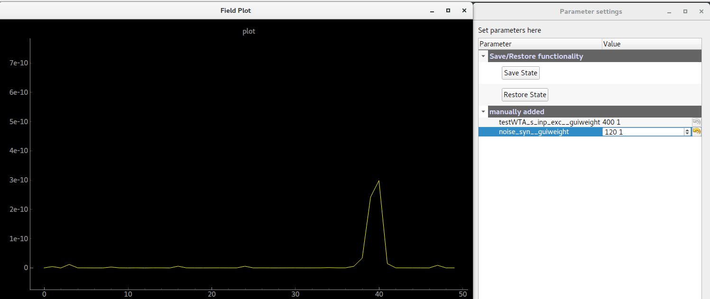
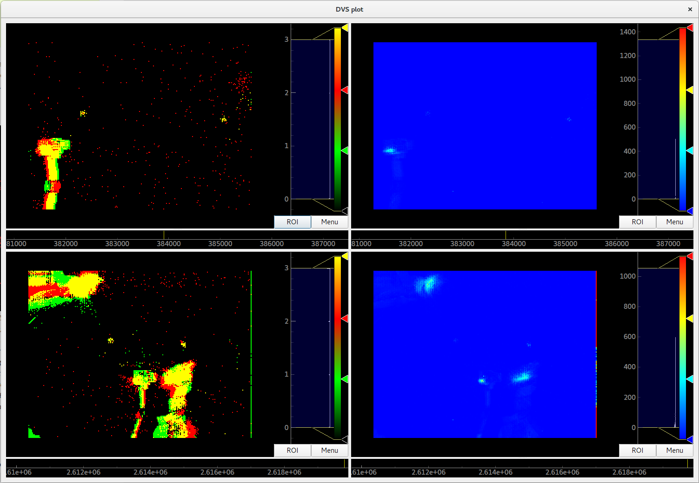

Advanced tutorials
==================

Online Clustering of Temporal Activity (OCTA)
---------------------------------------------

The ``OCTA`` network is a ``Buildingblock`` which implements a model
of the canonical microcircuit `[1]`_. The canonical microcircuit, which itself is
an abstraction and generalisation of anatomical reality, is
found throughout cortical domains, i.e. visual, auditory, motor etc., and
throughout the hierarchy, i.e. primary sensory and pre-frontal cortex.
The objective of the ``OCTA BuildingBlock`` is to leverage the temporal
information of so-called event-based sensory systems which are completely
time-continuous `[2]`_. The temporal information, or the precise timing
information of events, is used to extract spatio-temporal correlated
patterns from incoming streams of events. But also to learn temporally
structured, i.e ordered, sequences of patterns in order to perform temporal
predictions of future inputs.
A single ``OCTA BuildingBlock`` consists of two two-dimensional ``WTA``
networks (compression and prediction) connected in a recurrent manner to a
relay (projection) population.

It is inspired by the connectivity between the different layers of the mammalian cortex:
every element in the `teili` implementation has a cortical
counterpart for which the connectivity and function is preserved:

* compression['n_proj'] : Layer 4
* compression['n_exc'] : Layer 2/3
* prediction['n_exc'] : Layer 5/6

Given a high dimensional input in L2/3, the network extracts in the
recurrent connections of L4 a lower dimensional representation of
temporal dependencies by learning spatio-temporal features.

As in the other tutorials we start with importing the relevant libraries

.. code-block:: python
   
    import sys
    import numpy as np

    from pyqtgraph.Qt import QtGui
    import pyqtgraph as pg
    from brian2 import us, ms, prefs, defaultclock, core, float64
    import copy as cp

    from teili import TeiliNetwork
    from teili.building_blocks.octa import Octa
    from teili.models.parameters.octa_params import wta_params, octa_params,\
        mismatch_neuron_param, mismatch_synap_param
    from teili.models.neuron_models import OCTA_Neuron as octa_neuron
    from teili.stimuli.testbench import OCTA_Testbench
    from teili.tools.sorting import SortMatrix
    from teili.tools.visualizer.DataViewers import PlotSettings
    from teili.tools.visualizer.DataControllers.Rasterplot import Rasterplot
    from teili.tools.io import monitor_init
  
Now we set the code-generation target as well as the simulation time step.
Please note the small ``dt``. In order to avoid integration errors and make sure that
the timing of spikes/events can be used we need to lower the simulation time step much more
than in our other (simpler) tutorials.

.. note:: The ``OCTA`` building block can **not** be run in ``standalone`` mode as it requires quite complicated ``run_regulary`` functions which are currently not available in c++.

.. code-block:: pythone

    prefs.codegen.target = "numpy"
    defaultclock.dt = 0.1 * ms
    core.default_float_dtype = float64

Now we can create the ``TeiliNetwork`` and load the specifically designed ``OCTA_Testbench``.

.. code-block:: python

    # create the network
    Net = TeiliNetwork()
    OCTA_net = Octa(name='OCTA_net')

    #Input into the Layer 4 block: compression['n_proj']
    testbench_stim = OCTA_Testbench()
    testbench_stim.rotating_bar(length=10, nrows=10,
                                direction='cw',
                                ts_offset=3, angle_step=10,
                                noise_probability=0.2,
                                repetitions=300,
                                debug=False)

    OCTA_net.groups['spike_gen'].set_spikes(indices=testbench_stim.indices,
                                            times=testbench_stim.times * ms)

As in the other tutorials we can now add the different ``BuildingBlocks`` and ``sub_blocks`` to the network.
In order to visualise the input we need to explicitely add the monitor again, as we changed the
``Neurons`` it is monitoring.

.. code-block:: python

    Net.add(OCTA_net,
            OCTA_net.monitors['spikemon_proj'],
            OCTA_net.sub_blocks['compression'],
            OCTA_net.sub_blocks['prediction'])

    Net.run(np.max(testbench_stim.times) * ms,
            report='text')

The simulation will take about 10 minutes. In contrast to other tutorials we only provide
a pyqtgraph backend visualisation, as the amount of data is too high and the way we want
to look at the spiking activity needs a more sophisticated sub plot arrangement.

.. code-block:: python

    app = QtGui.QApplication.instance()
    if app is None:
        app = QtGui.QApplication(sys.argv)
    else:
        print('QApplication instance already exists: %s' % str(app))

    pg.setConfigOptions(antialias=True)
    labelStyle = {'color': '#FFF', 'font-size': 18}
    MyPlotSettings = PlotSettings(fontsize_title=18,
                                    fontsize_legend=12,
                                    fontsize_axis_labels=14,
                                    marker_size=10)
    sort_rasterplot = True
    win = pg.GraphicsWindow(title="Network activity")
    win.resize(1024, 768)
    p1 = win.addPlot(title="Spike raster plot: L4")
    p2 = win.addPlot(title="Zoomed in spike raster plot: L2/3")
    win.nextRow()
    p3 = win.addPlot(title="Zoomed in spike raster plot: L5/6",
                        colspan=2)

    p1.showGrid(x=True, y=True)
    p2.showGrid(x=True, y=True)
    p3.showGrid(x=True, y=True)

    region = pg.LinearRegionItem()
    region.setZValue(10)

    p1.addItem(region, ignoreBounds=True)
    

    monitor_p1 = OCTA_net.monitors['spikemon_proj']
    monitor_p2 = monitor_init()
    monitor_p2.i = cp.deepcopy(np.asarray(
        OCTA_net.sub_blocks['compression'].monitors['spikemon_exc'].i))
    monitor_p2.t = cp.deepcopy(np.asarray(
        OCTA_net.sub_blocks['compression'].monitors['spikemon_exc'].t))
    monitor_p3 = monitor_init()
    monitor_p3.i = cp.deepcopy(np.asarray(
        OCTA_net.sub_blocks['prediction'].monitors['spikemon_exc'].i))
    monitor_p3.t = cp.deepcopy(np.asarray(
        OCTA_net.sub_blocks['prediction'].monitors['spikemon_exc'].t))
    
    if sort_rasterplot:
        weights_23 = cp.deepcopy(np.asarray(
            OCTA_net.sub_blocks['compression'].groups['s_exc_exc'].w_plast))
        s_23 = SortMatrix(nrows=OCTA_net.sub_blocks['compression'].groups['s_exc_exc'].source.N,
                            ncols=OCTA_net.sub_blocks['compression'].groups['s_exc_exc'].target.N,
                            matrix=weights_23,
                            axis=1)

        weights_23_56 = cp.deepcopy(np.asarray(
            OCTA_net.sub_blocks['prediction'].groups['s_inp_exc'].w_plast))
        s_23_56 = SortMatrix(nrows=OCTA_net.sub_blocks['prediction'].groups['s_inp_exc'].source.N,
                                ncols=OCTA_net.sub_blocks['prediction'].groups['s_inp_exc'].target.N,
                                matrix=weights_23_56,
                                axis=1)

        monitor_p2.i = np.asarray([np.where(
            np.asarray(s_23.permutation) == int(i))[0][0] for i in monitor_p2.i])
        monitor_p3.i = np.asarray([np.where(
            np.asarray(s_23_56.permutation) == int(i))[0][0] for i in monitor_p3.i])

    duration = np.max(testbench_stim.times)
    Rasterplot(MyEventsModels=[monitor_p1],
                MyPlotSettings=MyPlotSettings,
                time_range=[0, duration],
                neuron_id_range=None,
                title="Input rotating bar",
                xlabel='Time (s)',
                ylabel="Neuron ID",
                backend='pyqtgraph',
                mainfig=win,
                subfig_rasterplot=p1,
                QtApp=app,
                show_immediately=False)

    Rasterplot(MyEventsModels=[monitor_p2],
                MyPlotSettings=MyPlotSettings,
                time_range=[0, duration],
                neuron_id_range=None,
                title="Spike raster plot of L2/3",
                xlabel='Time (s)',
                ylabel="Neuron ID",
                backend='pyqtgraph',
                mainfig=win,
                subfig_rasterplot=p2,
                QtApp=app,
                show_immediately=False)

    Rasterplot(MyEventsModels=[monitor_p3],
                MyPlotSettings=MyPlotSettings,
                time_range=[0, duration],
                neuron_id_range=None,
                title="Spike raster plot of L5/6",
                xlabel='Time (s)',
                ylabel="Neuron ID",
                backend='pyqtgraph',
                mainfig=win,
                subfig_rasterplot=p3,
                QtApp=app,
                show_immediately=False)

    region.sigRegionChanged.connect(update)
    p2.sigRangeChanged.connect(updateRegion)
    p3.sigRangeChanged.connect(updateRegion)
    region.setRegion([29.6, 30])
    p1.setXRange(25, 30, padding=0)

    app.exec_()

The generated plot should look like this:

    Network activity of the ``OCTA BuildingBlock``.
    Spike raster plot of the relay layer (L4, top left), the compression layer (L2/3, top right) and the prediction layer (L5/6, bottom). The blue bar indicates the zoomed-in region of the spike raster plot of L2/3 and L5/6. Note that the spike raster plots are sorted according to the recurrent weight matrix of L2/3 for the L2/3 spike raster plot and according to the L2/3 to L5/6 weights in the case of the L5/6 spike raster plot. This sorting enables us to see the learned structure of the synaptic weights. In case of L2/3 we can see that the temporally structured sequence is encoded in the recurrent weight matrix. In the case of L5/6 we can see that we can preserver temporal information in recurrent connections, which then can be used to predict the input. For more information plese refer to `Milde 2019`_  populations A, B and C encoding the relation A = B + C.

Three-way networks
------------------

The ``Threeway`` block is a ``BuildingBlock`` that implements a network of
three one-dimensional ``WTA`` populations A, B and C, connected to a hidden two-dimensional ``WTA`` population H.
The role of the hidden population is to encode a relation between A, B and C, which serve as inputs and\or outputs.

In this example A, B and C encode one-dimensional values in range from 0 to 1
in a relation A + B = C to each other, which is hardcoded into connectivity of
the hidden population.

To use the block instantiate it and add to the ``TeiliNetwork``

.. code-block:: python

    from brian2 import ms, prefs, defaultclock

    from teili.building_blocks.threeway import Threeway
    from teili.tools.three_way_kernels import A_plus_B_equals_C
    from teili import TeiliNetwork

    prefs.codegen.target = "numpy"
    defaultclock.dt = 0.1 * ms

    #==========Threeway building block test=========================================

    duration = 500 * ms

    #===============================================================================
    # create the network

    exampleNet = TeiliNetwork()

    TW = Threeway('TestTW',
                  hidden_layer_gen_func = A_plus_B_equals_C,
                  monitor=True)

    exampleNet.add(TW)

    #===============================================================================
    # simulation
    # set the example input values

    TW.set_A(0.4)
    TW.set_B(0.2)

    exampleNet.run(duration, report = 'text')

    #===============================================================================
    #Visualization

    TW_plot = TW.plot()

Methods ``set_A(double)``, ``set_B(double)`` and ``set_C(double)`` send population
coded values to respective populations. Here we send A=0.2, B=0.4 and activity in
population C is inferred via H, shaping in an activity bump encoding ~0.6:

.. figure:: fig/threeway_tutorial.png
    :align: left
    :width: 800px
    :height: 400px
    :figclass: align-left

    Network activity of a ``Threeway BuildingBlock``.
    Spike raster plot of the populations A, B and C encoding the relation A = B + C.

Teili2Genn
----------

Using the already existing brian2genn_ we can generate ``GeNN`` code which can be executed on a nVidia graphics card.
Make sure to change the ``DPIsyn`` model located in ``teiliApps/equations/DPIsyn.py``. To be able to use brian2genn_ with ``TeiliNetwork``
change this line:

.. code-block:: python

   Iin{input_number}_post = I_syn * sign(weight)  : amp (summed)

to

.. code-block:: python

   Iin{input_number}_post = I_syn * (-1 * (weight<0) + 1 * (weight>0))  : amp (summed)

Also move the following lines:

.. code-block:: python
    Iw = abs(weight) * baseweight                            : amp
    I_gain = Io_syn*(I_syn<=Io_syn) + I_th*(I_syn>Io_syn)    : amp
    Itau_syn = Io_syn*(I_syn<=Io_syn) + I_tau*(I_syn>Io_syn) : amp

to the ``on_pre`` key, such that it looks like:

.. code-block:: python
   
   'on_pre': """
        Iw = abs(weight) * baseweight                            : amp
        I_gain = Io_syn*(I_syn<=Io_syn) + I_th*(I_syn>Io_syn)    : amp
        Itau_syn = Io_syn*(I_syn<=Io_syn) + I_tau*(I_syn>Io_syn) : amp
        I_syn += Iw * w_plast * I_gain / (Itau_syn * ((I_gain/I_syn)+1))
        """,

.. attention:: If you don't change the model `GeNN` **can't** run its code generation routines as ``Subexpressions`` are not supported.

After you made the change in ``teiliApps/equations/DPIsyn.py`` you can run the ``teili2genn_tutorial.py`` located in ``teiliApps/tutorials/``.
The ``TeiliNetwork`` is the same as in ``neuron_synapse_tutorial`` but with the specific commands to use the **genn-backend**.

WTA live plot
-------------

The point of this tutorial is to demonstrate the live plot and parameter gui. They are imported as follows:

.. code-block:: python

    from teili.tools.live import ParameterGUI, PlotGUI

We can add a live plot by instantiating a PlotGUI as follows:

.. code-block:: python

    plot_gui = PlotGUI(data=neuron_group.statevariable)

Currently this only supports plotting a statevariable of a neuron or synapse group or subgroup with a line plot.

The parameter GUI is instantiated as follows:

.. code-block:: python

    param_gui = ParameterGUI(net=Net)
    param_gui.add_params(parameters=[synapse_group.weight, neuron_group.state_variable])
    param_gui.show_gui()

Make sure, you specify the state variables that you change in the GUI as (shared), so that they are the same for the whole group.
Or, as shown here in the tutorial, you can also just add a new state variable and copy over the value (or do other things with it) in a run_regularly:

.. code-block:: python

    syn_in_ex.add_state_variable('guiweight', unit=1, shared=True, constant=False, changeInStandalone=False)
    syn_in_ex.guiweight = 400
    syn_in_ex.run_regularly("weight = guiweight", dt=1 * ms)

    Screenshot of the plot window and GUI of the wta_live_tutorial. 
    The plot shows a bump that moves and the parameters can be adjusted 
    in the GUI having an immediate effect on the simulation.

.. note:: The brian2 simulator is not made for real time plotting. This currently only works with numpy code generation and timestep length can vary.

DVS visualizer
--------------
The point of this tutorial is to demonstrate how you can use the Plotter2d class to make a plot of 2d neural activity or DVS recordings.
In this tutorials, you are asked to provide a path for 2 .aedat or .npz files that are then plotted next to each other.

    On the left side, the on and off events of the two loaded DVS files are shown.
    On the right side, a (temporally) filtered version of the dvs events is shown.
    We use ``QtGui.QGridLayout`` to arrange the ImageViews that we get from the Plotter in a grid.

Sequence learning standalone
----------------------------
The point of this tutorial is to demonstrate the c++ standalone codegeneration and replacing of parameters in the c++ code so we can run the same compiled standalone program several times with different parameters.
The tutorial reimplements the sequence learning architecture described by Kreiser et al. 2018 (https://www.frontiersin.org/articles/10.3389/fnins.2018.00717/full).

After the standalone_params (that can be passed to the compiled program) are defined, the network is built:

.. code-block:: python

    seq_net.standalone_params = standalone_params
    seq_net.build()

Then it can be run several times with different parameters (without recompiling) and the results can be plotted in between.

.. code-block:: python

    seq_net.run(duration * second, standaloneParams=standalone_params)

This can be used if you have networks that you need to run very often with different parameters in a loop.

.. _brian2genn: https://github.com/brian-team/brian2genn
.. _Milde 2019: https://www.zora.uzh.ch/id/eprint/177970/
.. _[1]: https://physoc.onlinelibrary.wiley.com/doi/abs/10.1113/jphysiol.1991.sp018733
.. _[2]: https://ieeexplore.ieee.org/abstract/document/5537149
