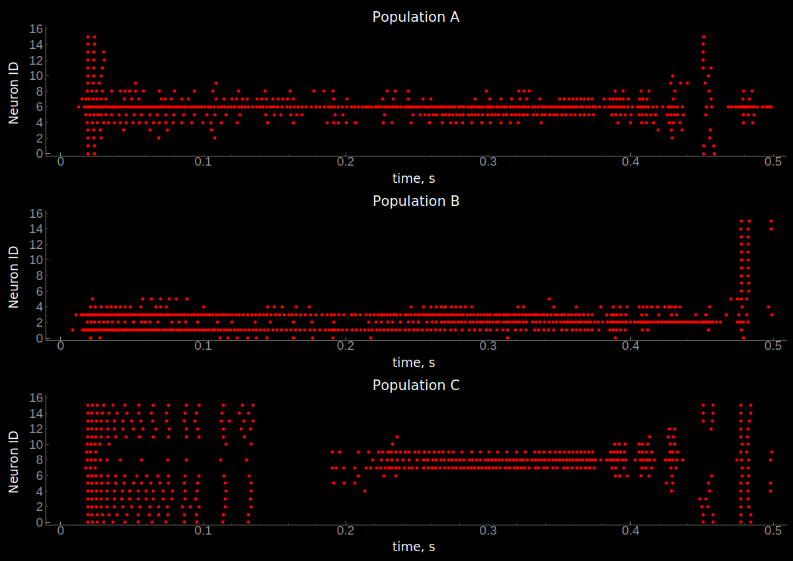

***************
Building Blocks
***************

The core of the motivation for the development of teili was to provide users
with a toolbox to easily build and combine neural ``BuildingBlocks`` which represent
basic algorithms implemented using neurons and synapses.
In order to provide these functionalities all ``BuildingBlocks`` share the same
parent class which amongst other provide I/O groups and properties to stack
``BuildingBlocks`` hierarchically.

BuildingBlock
=============

Every ``BuildingBlock`` has a set of parameters such as weights and refractory period, which can be specified outside the ``BuildingBlock`` generation and unpacked to the building block.
Each ``BuildingBlock`` has the following attributes:

Attributes:

* **name** (str, required): Name of the building_block population neuron_eq_builder (class, optional): neuron class as imported from models/neuron_models
* **synapse_eq_builder** (class, optional): synapse class as imported from models/synapse_models
* **params** (dictionary, optional): Dictionary containing all relevant parameters for each building block
* **debug** (bool, optional): Flag to gain additional information
* **groups** (dictionary): Keys to all neuron and synapse groups
* **monitors** (dictionary): Keys to all spike and state monitors
* **monitor** (bool, optional): Flag to auto-generate spike and state monitors
* **standalone_params** (dictionary): Dictionary for all parameters to create a standalone network
* **sub_blocks** (dictionary): Dictionary for all parent building blocks
* **input_groups** (dictionary): Dictionary containing all possible groups which are potential inputs
* **output_groups** (dictionary): Dictionary containing all possible groups which are potential outputs
* **hidden_groups** (dictionary): Dictionary containing all remaining groups which are neither inputs nor outputs

And as each ``BuildingBlock`` inherits from this parent class all ``BuildingBlocks`` share the same attributes and properties.
To assure this every ``BuildingBlock`` initialises the ``BuildingBlock`` class:

.. code-block:: python

  BuildingBlock.__init__(self,
                         name,
                         neuron_eq_builder,
                         synapse_eq_builder,
                         block_params,
                         debug,
                         monitor)

Furthermore, as described above as soon the parent class is initialised each ``BuildingBlock`` has a set of dictionaries which handle to I/O and different ``Neurons`` and ``Connections`` groups.

The ``BuildingBlock`` class comes with a set of ``__setter__`` and ``__getter__`` functions for collecting all ``groups`` involved or identifying a subset of groups which share the same `_tags`_

To retrieve all ``Neuron``, ``Connection``, ``SpikeGeneratorGroup`` etc. simply call the ``groups`` property

.. code-block:: python

     test_wta= WTA(name='test_wta', dimensions=1, num_neurons=16, debug=False)
     bb_groups = test_wta.groups

Tags
======================

Each ``TeiliGroup`` has an attribute called ``_tags``. The idea behind the ``_tags`` are that the user can easily define a dictionary and use this dictionary to gather all ``TeiliGroups`` which share the same ``_tags``.

Tags should be set as the network expands and the functionality changes.

Tags are defined as:

* **mismatch**: (bool) Flag to indicate if mismatch is present in the ``Group``
* **noise**: (bool) Noise input, noise connection or noise presence
* **level**: (int) Level of BuildingBlock in the hierarchy. A WTA BuildingBlock which is connected directly to a sensor array is level 1. An OCTA BuildinBlock, however, is level 2 as it consists of level 1 WTAs
* **sign**: (str : exc/inh/None) Sign on neuronal population. Following Dale law.
* **target_sign**: (str : exc/inh/None) Sign of target population. None if not applicable.
* **num_inputs**: (int) Number of inputs in Neuron population. None if not applicable.
* **bb_type**: (str : WTA/ OCTA/ 3-WAY) Building block type.
* **group_type**: (str : Neuron/Connection/ SpikeGen) Group type
* **connection_type**: (str : rec/lateral/fb/ff/None) Connection type

Setting Tags
--------------
Tags can be set:

.. code-block:: python

  test_wta = WTA(name='test_wta', dimensions=1, num_neurons=16, debug=False)
  target_group = test_wta._groups['n_exc']
  basic_tags_empty = {'mismatch' : 0,
                      'noise' : 0,
                      'level': 0 ,
                      'sign': 'None',
                      'target sign': 'None',
                      'num_inputs' : 0,
                      'bb_type' : 'None',
                      'group_type' : 'None',
                      'connection_type' : 'None',
                      }

  test_wta._set_tags(basic_tags_empty, target_group)

and updated:

.. code-block:: python

  test_wta._tags['mismatch'] = True

Getting Tags
--------------------
Specific groups can filtered using tags:

.. code-block:: python

  test_wta.get_groups({'group_type': 'SpikeGenerator'})

All tags of a group can be obtained by:

.. code-block:: python

  test_wta.print_tags('n_exc')

Winner-takes-all (WTA)
======================

For the WTA ``BuildingBlock`` the parameter dictionary looks as follows:

.. code-block:: python

      wta_params = {'we_inp_exc': 1.5,
                    'we_exc_inh': 1,
                    'wi_inh_exc': -1,
                    'we_exc_exc': 0.5,
                    'sigm': 3,
                    'rp_exc': 3 * ms,
                    'rp_inh': 1 * ms,
                    'ei_connection_probability': 1,
                    'ie_connection_probability': 1,
                    'ii_connection_probability': 0}

where each key is defined as:

* **we_inp_exc**: Excitatory synaptic weight between input SpikeGenerator and WTA neurons.
* **we_exc_inh**: Excitatory synaptic weight between WTA population and inhibitory interneuron.
* **wi_inh_exc**: Inhibitory synaptic weight between inhibitory interneuron and WTA population.
* **we_exc_exc**: Self-excitatory synaptic weight (WTA).
* **wi_inh_inh**: Self-inhibitory weight of the interneuron population.
* **sigm**: Standard deviation in number of neurons for Gaussian connectivity kernel.
* **rp_exc**: Refractory period of WTA neurons.
* **rp_inh**: Refractory period of inhibitory neurons.
* **ei_connection_probability**: WTA to interneuron connectivity probability.
* **ie_connection_probability**: Interneuron to WTA connectivity probability
* **ii_connection_probability**: Interneuron to Interneuron connectivity probability.

Now we can import the necessary modules and build our building block.

.. code-block:: python

      from teili.building_blocks.wta import WTA
      from teili.models.neuron_models import DPI

1 Dimensional WTA
----------------

The WTA ``BuildingBlock`` comes in two slightly different versions. The versions only differ in the dimensionality of the WTA.

.. code-block:: python

      # The number of neurons in your WTA population.
      # Note that this number is squared in the 2D WTA
      num_neurons = 50
      # The number of neurons which project to your WTA.
      # Note that this number is squared in the 2D WTA
      num_input_neurons = 50
      my_wta = WTA(name='my_wta', dimensions=1,
                   neuron_eq_builder=DPI,
                   num_neurons=num_neurons, num_inh_neurons=int(num_neurons**2/4),
                   num_input_neurons=num_input_neurons, num_inputs=2,
                   block_params=wta_params,
                   monitor=True)

2 Dimensional WTA
---------------

To generate a 2 dimensional WTA population you can do the following.

.. code-block:: python

      # The number of neurons in your WTA population.
      # Note that this number is squared in the 2D WTA
      num_neurons = 7
      # The number of neurons which project to your WTA.
      # Note that this number is squared in the 2D WTA
      num_input_neurons = 10
      my_wta = WTA(name='my_wta', dimensions=2,
                   neuron_eq_builder=DPI,
                   num_neurons=num_neurons, num_inh_neurons=int(num_neurons**2/4),
                   num_input_neurons=num_input_neurons, num_inputs=2,
                   block_params=wta_params,
                   monitor=True)

Changing a certain ``Connections`` group from being `static` to `plastic`:

.. code-block:: python

      from teili.core.groups import Connections
      from teili.models.synapse_models import DPIstdp
      my_wta._groups['s_exc_exc'] = Connections(my_wta._groups['n_exc'],
                                                my_wta._groups['n_exc'],
                                                equation_builder=DPIstdp
                                                method='euler',
                                                name=my_wta._groups['s_exc_exc'].name)
      my_wta._groups['s_exc_exc'].connect(True)

Now we changed the standard DPI synapse for the recurrent connection within a WTA population to an All-to-All STDP-based DPI synapse. In order to initialize the plastic weight ``w_plast`` we need to do:

.. code-block:: python

      my_wta._groups['s_exc_exc'].weight = 45
      my_wta._groups['s_exc_exc'].namespace.update({'w_mean': 0.45})
      my_wta._groups['s_exc_exc'].namespace.update({'w_std': 0.35})
      # Initializing the plastic weight randomly
      my_wta._groups['s_exc_exc'].w_plast = 'w_mean + randn() * w_std'

Chain
=====

.. note:: TBA by Alpha Renner

Sequence learning
=================

.. note:: TBA by Alpha Renner

Threeway network
================

``Threeway`` block is a ``BuildingBlock`` that implements a network of
three one-dimensional ``WTA`` populations A, B and C,
connected to a hidden two-dimensional ``WTA`` population H.
The role of the hidden population is to encode a relation between A, B and C,
which serve as inputs and\or outputs.

In this example A, B and C encode one-dimensional values in range from 0 to 1
in a relation A + B = C to each other, which is hardcoded into connectivity of
the hidden population.

To use the block instantiate it and add to the ``TeiliNetwork``

.. code-block:: python

    from brian2 import ms, prefs, defaultclock

    from teili.building_blocks.threeway import Threeway
    from teili.tools.three_way_kernels import A_plus_B_equals_C
    from teili import TeiliNetwork
    
    prefs.codegen.target = "numpy"
    defaultclock.dt = 0.1 * ms

    #==========Threeway building block test=========================================
    
    duration = 500 * ms
    
    #===============================================================================
    # create the network

    exampleNet = TeiliNetwork()
    
    TW = Threeway('TestTW',
                  hidden_layer_gen_func = A_plus_B_equals_C,
                  monitor=True)
    
    exampleNet.add(TW)
    
    #===============================================================================
    # simulation    
    # set the example input values
    
    TW.set_A(0.4)
    TW.set_B(0.2)

    exampleNet.run(duration, report = 'text')
    
    #===============================================================================
    #Visualization
    
    TW_plot = TW.plot()

Methods ``set_A(double)``, ``set_B(double)`` and ``set_C(double)`` send population
coded values to respective populations. Here we send A=0.2, B=0.4 and activity in
population C is inferred via H, shaping in an activity bump encoding ~0.6:

    
.. note:: To be extended by Dmitrii Zendrikov

Online Clustering of Temporal Activity (OCTA)
=============================================

Online Clustering of Temporal Activity (OCTA) is a second generation ``BuildingBlock``:
it uses multiple WTA networks recurrently connected to create a cortex
inspired microcircuit that, leveraging the spike timing
information, enables investigations of emergent network dynamics `[1]`_ (Download_).

.. figure:: fig/OCTA_module.png
    :width: 200px
    :align: center
    :height: 200px
    :alt: alternate text
    :figclass: align-center

    Schematic overview of a single OCTA ``BuildingBlock``

The basic OCTA module consists of a projection (L4), a clustering (Layer2/3) and a prediction (L5/6) sub-module.
Given that all connections are subject to learning, the objective of one OCTA module is
to continuously adjust its parameters, e.g. synaptic weights and time constants, based
on local information to best capture the spatio-temporal statistics of its input.

Parameters for the network are stored in two dictionaries located in ``teili/models/parameters/octa_params.py``.

The WTA keys are explained above, the OCTA keys are defined as:

* **duration**: Duriation of the simulation
* **revolutions**: Number of times input is presented
* **num_neurons**: Number of neurons in the compressionWTA. Keep in mind it is a 2D WTA.
* **num_input_neurons**: Number of neurons in the prediction WTA and in the starting data.
* **distribution**: (0 or 1) Distribution from which to initialize the weights. Gamma(1) or Normal(0).
* **dist_param_init**: Shape for Gamma distribution/ mean of normal distribution
* **scale_init**: Scale for Gamma distribution / std of normal distribution
* **dist_param_re_init**: Shape/mean for weight reinitialiazation in run_regular function
* **scale_re_init**: Scale/std for weight reinitialiazation in run_regular function
* **re_init_threshold**: (0 - 0.5) If the mean weight of a synapse is below or above
                      (1- re_init_threshold) the weight is reinitialized
* **buffer_size**: Size of the buffer for the weight dependent regularization
* **buffer_size_plast**: Size of the buffer of the activity dependent regularization
* **noise_weight**: Synaptic weight of the noise generator
* **variance_th_c**: Variance threshold for the compression group. Parameter included in the
                    ``activity`` synapse template.
* **variance_th_p**: Variance threshold for the prediction group.
* **learning_rate**: Learning rate
* **inh_learning_rate**: Inhibitory learning rate
* **decay**:  Decay parameter of the decay in the activity dependent run_regular
* **decay_strategy**: Type of weight decay ('global'/'local')
* **tau_stdp**: Time constant for stdp plasticity

Initialisation of the building block goes as follows:

.. code-block:: python

    from brian2 import ms
    from teili import TeiliNetwork
    from teili.building_blocks.octa import Octa
    from teili.models.parameters.octa_params import wta_params, octa_params
    from teili.models.neuron_models import OCTA_Neuron as octa_neuron
    from teili.stimuli.testbench import OCTA_Testbench

     Net = TeiliNetwork()

     OCTA =  Octa(name='OCTA',
                  wta_params=wta_params,
                  octa_params=octa_params,
                  neuron_eq_builder=octa_neuron,
                  num_input_neurons=10,
                  num_neurons=7,
                  external_input=True,
                  noise=True,
                  monitor=True,
                  debug=False)

    testbench_stim = OCTA_Testbench()

    testbench_stim.rotating_bar(length=10, nrows=10,
                                direction='cw',
                                ts_offset=3, angle_step=10,
                                noise_probability=0.2,
                                repetitions=90,
                                debug=False)

    OCTA_net.groups['spike_gen'].set_spikes(indices=testbench_stim.indices,
                                            times=testbench_stim.times * ms)

    Net.add(OCTA_net,
            OCTA_net.sub_blocks['prediction'],
            OCTA_net.sub_blocks['compression'])

    Net.run(10000*ms, report='text')

.. attention:: When ``Neurons`` or ``Connections`` groups of a ``BuildingBlock`` are changed from their default, one needs to ``add`` the affected ``sub_blocks`` explicitly.

* **external_input**: Flag to include an input to the network
* **noise**: Flag to include 10 Hz Poisson noise generator on ``n_exc`` of compression and prediction
* **monitor**: Flag to return monitors of the network
* **debug**: Flag for verbose debug

.. note:: To be extended by Moritz Milde

.. _OCTA: https://code.ini.uzh.ch/mmilde/OCTA/blob/dev/README.md
.. __tags: https://teili.readthedocs.io/en/latest/scripts/Building%20Blocks.html#tags
.. _[1]: https://www.zora.uzh.ch/id/eprint/177970/
.. _Download: https://www.dropbox.com/s/0ynid1730z7txfh/spike_based_computation.pdf?dl=1
