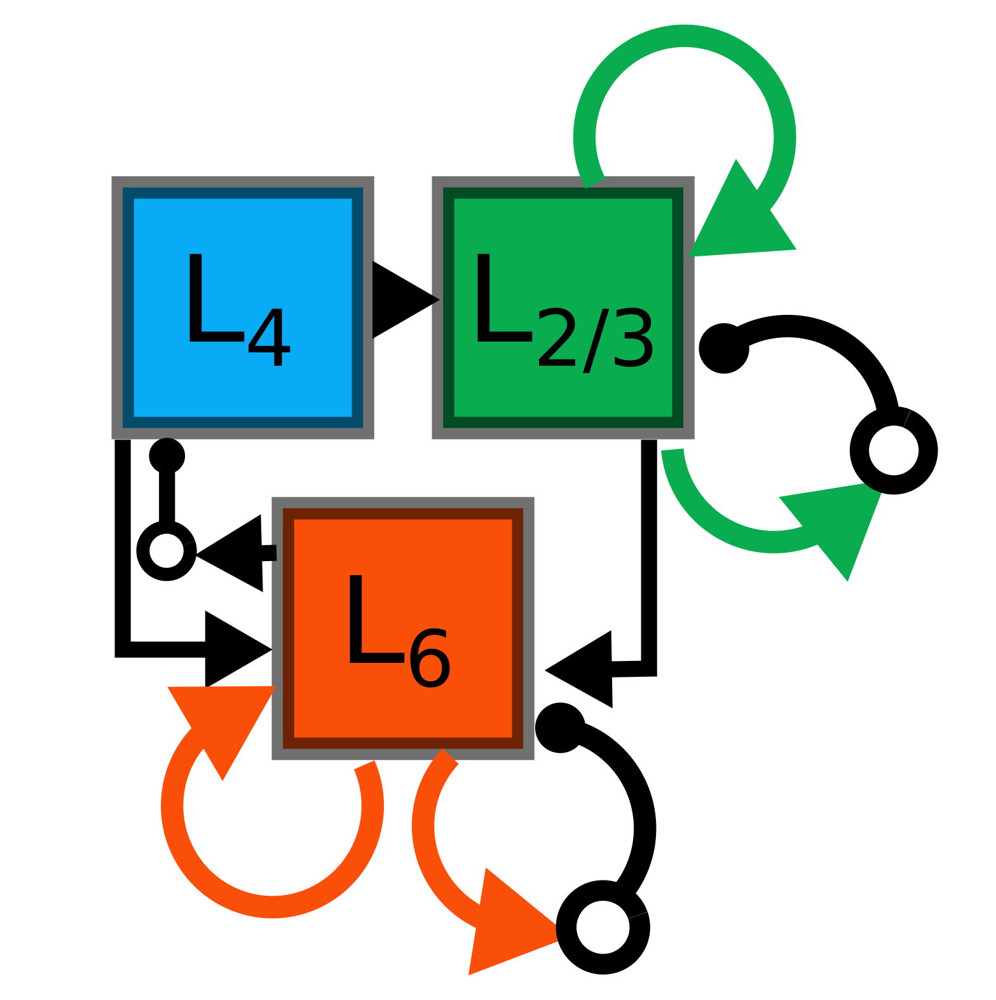

***************
Hierarchical Building Blocks
***************

Online Clustering of Temporal Activity (OCTA) is a second generation building block: 
it uses multiple WTA networks arranged in recurrently connected to create a cortex
insipired microcircuit that, leveraging the spike timing 
information, enables investigations of emergent network dynamics.

The basic OCTA module consists of a clustering (L2/3) and a prediction (L6) sub-module.
Given that all connections are subject to learning, the objective of one OCTA module is
to continuously adjust its parameters, e.g. synaptic weights and time constants, based 
on local information to best capture the spatio-temporal statistics of its input.

Parameters for the network are stored in two dictionaries located in tools/octa_tools/octa_params.py

.. code-block:: python

    from brian2 import ms
    from teili import TeiliNetwork
    from teili.building_blocks.octa import Octa
    from teili.tools.octa_tools.octa_param import wtaParameters, octaParameters,\
     octa_neuron
    
    
    OCTA_net= Octa(name='OCTA_net', 
                    wtaParams = wtaParameters,
                     octaParams = octaParameters,     
                     neuron_eq_builder=octa_neuron,
                     stacked_inp = True,
                    noise= True,
                     monitor=True,
                     debug=False)
    
    Net = TeiliNetwork()
    Net.add(      
                OCTA_net,
                OCTA_net.sub_blocks['predictionWTA'],
                OCTA_net.sub_blocks['compressionWTA']
              )
        
    Net.run(octaParameters['revolutions']*ms, report='text')
    

       
Every building block has a set of parameters such as weights and refractory period, which can be specified outside the building block generation and unpacked to the building block. For the WTA building_block this dictionary looks as follows:

It is implemented in the teili library as an example of hierarchical building block:
it uses two WTA networks recurrently connected

This section explaines the generation of more complex ``BuildingBlocks``:
the generation of more second generations BB is made easier by using predefined blocks
such as the ``WTA``.
We provide users with an example of such a network in OCTA

The core of the motivation for the development of teili was to provide users
with a toolbox to easily build and combine neural ``BuildingBlocks`` which represent
basic algorithms implemented using neurons and synapses.
In order to provide these functionalities all ``BuildingBlocks`` share the same
parent class which amongst other provide I/O groups and properties to stack
``BuildingBlocks`` hierarchically.

The cortex shows a remarkable, almost stereotyped organization [1], 
with repeating structures defined as canonical microcircuits [2]. 
The canonical microcircuit is characterised by highly recurrent 
connected populations of neurons, which can computationally be described 
by a winner-takes-all mechanism. Many models of cortical processing follow the 
assumption that all information is carried in the firing rate of a neuron, in 
which the spike timing is sampled from a Poisson distribution. However, there 
is more and more evidence that the timing of spikes is also relevant for computation [3].
How the information represented in the spike timing can be exploited for computation 
is still unclear. Here we propose an Online Clustering of Temporal Activity (OCTA) 
framework to enable investigations of emergent network dynamics, when the spike timing 
is considered to be informative.
