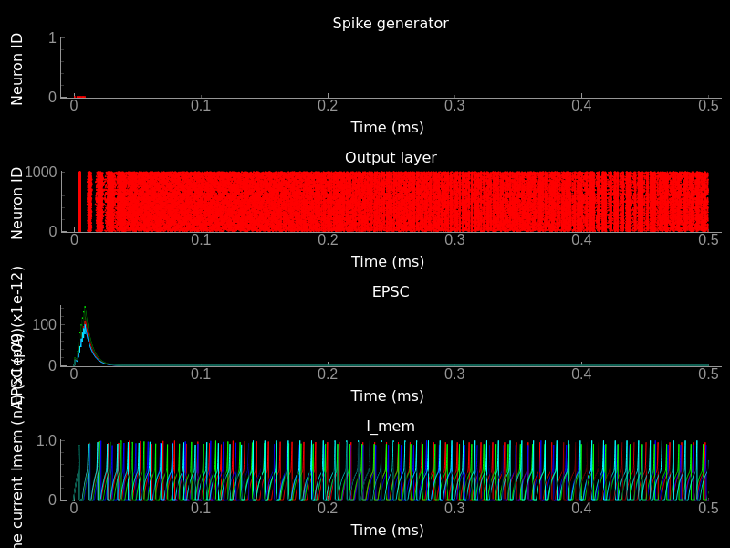
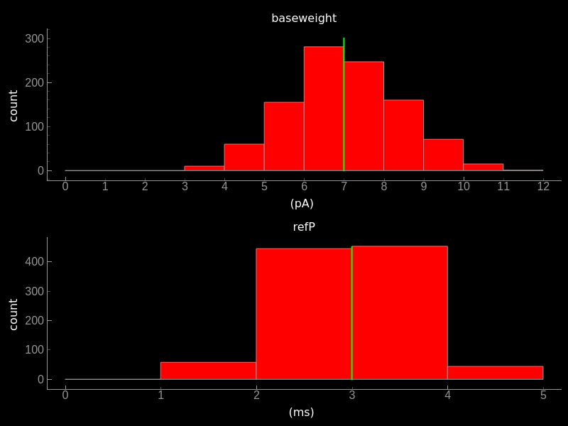

# Tutorials
Welcome to teili, a modular python-based framework for developing, testing and visualization of neural algorithms.
Before going through our tutorials we highly recommend doing the tutorials provided by [brian2](https://brian2.readthedocs.io/en/stable/resources/tutorials/index.html)


## Class object vs. import_eq
To generate all pre-defined neuron and synapse models, which are stored by default in `~/teiliApps/equations/`, please execute the following two scripts:
```bash
cd teili/models/
python -m synapse_models
python -m neuron_models
```

<div class="Note">

During installation the pre-defined models are generated. You only need to regenerate them if you manualy deleted them.

</div>

### Working with pre-compiled models
Once the pre-defined neuron and synapse models are exported to files you can choose between generating neuron/synapse models 'on the fly' or importing them from the generated files, which you can maually adapt to your needs without fiddling with the templates provided by teili.<br />
See an example for how to work with pre-compiled neuron and/or synapse models below.

```python
from teili.core.groups import Neurons, Connections

from teili.models.neuron_models import DPI as neuron_model
from teili.models.synapse_models import DPISyn as syn_model

test_neuron1 = Neurons(N=2, equation_builder=neuron_model(num_inputs=2),
                       name="testNeuron")
test_neuron2 = Neurons(N=2, equation_builder=neuron_model(num_inputs=2),
                       name="testNeuron")

test_synapse = Connections(test_neuron1, test_neuron2,
                           equation_builder=syn_model,
                           name="test_synapse")
```
### Import equation from a file
If you prefer to import your model from a file you can do so:

```python
import os
from teili.core.groups import Neurons, Connections
from teili.models.builder.neuron_equation_builder import NeuronEquationBuilder
from teili.models.builder.synapse_equation_builder import SynapseEquationBuilder

path = os.path.expanduser("~")
model_path = os.path.join(path, "teiliApps", "equations", "")

my_neuron_model = NeuronEquationBuilder.import_eq(
    model_path + 'DPI.py', num_inputs=2)

my_synapse_model = SynapseEquationBuilder.import_eq(
    model_path + 'DPISyn.py')

test_neuron1 = Neurons(2, equation_builder=my_neuron_model,
                       name="test_neuron1")
test_neuron2 = Neurons(2, equation_builder=my_neuron_model,
                       name="test_neuron2")

test_synapse = Connections(test_neuron1, test_neuron2,
                     equation_builder=my_synapse_model,
                     name="test_synapse")
```
If you want to see a more detailed report on which equations were used during the generation you can set `verbose=True`, such that it looks like this
```python
test_neuron1 = Neurons(2, equation_builder=my_neuron_model,
                       name="test_neuron1", verbose=True)
```
## Neuron & Synapse tutorial
We created a simple example of how to simulate a small neural network either using the EquationBuilder.
The example is located in `~\teiliApps/examples/neuron_synapse_tutorial.py`.
First we import all required libraries
```python
from pyqtgraph.Qt import QtGui
import pyqtgraph as pg
import numpy as np

from brian2 import ms, pA, nA, prefs,\
    SpikeMonitor, StateMonitor,\
    SpikeGeneratorGroup

from teili.core.groups import Neurons, Connections
from teili import TeiliNetwork
from teili.models.neuron_models import DPI as neuron_model
from teili.models.synapse_models import DPISyn as syn_model
from teili.models.parameters.dpi_neuron_param import parameters as neuron_model_param
```
We now can define the target for the code generation. Typically we use the `numpy` backend.
For more details on how to run your code more efficient and faster have a look at brian's [standalone mode](https://brian2.readthedocs.io/en/stable/advanced/preferences.html)
```python
prefs.codegen.target = "numpy"
```
We can now generate a simple input pattern using brian2's `SpikeGeneratorGroup`
```python
input_timestamps = np.asarray([1, 3, 4, 5, 6, 7, 8, 9]) * ms
input_indices = np.asarray([0, 0, 0, 0, 0, 0, 0, 0])
input_spikegenerator = SpikeGeneratorGroup(1, indices=input_indices,
                                           times=input_timestamps, name='gtestInp')
```
After defining the input group, we can build a TeiliNetwork.
```python
Net = TeiliNetwork()

test_neurons1 = Neurons(2, equation_builder=neuron_model(
    num_inputs=2), name="test_neurons1")

test_neurons2 = Neurons(2, equation_builder=neuron_model(
    num_inputs=2), name="test_neurons2")


input_synapse = Connections(input_spikegenerator, test_neurons1,
                            equation_builder=syn_model(), name="input_synapse")
input_synapse.connect(True)

test_synapse = Connections(test_neurons1, test_neurons2,
                           equation_builder=syn_model(), name="test_synapse")
test_synapse.connect(True)
```
After initializing the neuronal population and connecting them via synapses, we can set model parameters.
Note that parameters are set by default. This example only shows how you would need to go about if you want to set non-standard (self-defined) parameters.
Example parameter dictionaries can be found `teili/models/parameters`.
You can change all the parameters like this after creation of the neurongroup or synapsegroup.
Note that the if condition is only there for convenience to switch between voltage- or current-based models.
Normally, you have one or the other in your simulation, thus you will not need the if condition.
```python
# Example of how to set parameters, saved as a dictionary
test_neurons1.set_params(neuron_model_param)
test_neurons2.set_params(neuron_model_param)

# Example of how to set a single parameter
test_neurons1.refP = 1 * ms
test_neurons2.refP = 1 * ms

if 'Imem' in neuron_model().keywords['model']:
    input_synapse.weight = 5000
    test_synapse.weight = 800
    test_neurons1.Iconst = 10 * nA
elif 'Vm' in neuron_model().keywords['model']:
    input_synapse.weight = 1.5
    test_synapse.weight = 8.0
    test_neurons1.Iconst = 3 * nA
```
Now our simple spiking neural network is defined. In order to visualize what is happening during the simulation
we need to monitor the spiking behavior of our neurons and other state variables of neurons and synapses.
```python
spikemon_input = SpikeMonitor(input_spikegenerator, name='spikemon_input')
spikemon_test_neurons1 = SpikeMonitor(
    test_neurons1, name='spikemon_test_neurons1')
spikemon_test_neurons2 = SpikeMonitor(
    test_neurons2, name='spikemon_test_neurons2')

statemon_input_synapse = StateMonitor(
    input_synapse, variables='Ie_syn', record=True, name='statemon_input_synapse')

statemon_test_synapse = StateMonitor(
    test_synapse, variables='Ie_syn', record=True, name='statemon_test_synapse')

if 'Imem' in neuron_model().keywords['model']:
    statemon_test_neurons2 = StateMonitor(test_neurons2,
                                          variables=['Imem'],
                                          record=0, name='statemon_test_neurons2')
    statemon_test_neurons1 = StateMonitor(test_neurons1, variables=[
        "Iin", "Imem", "Iahp"], record=[0, 1], name='statemon_test_neurons1')
elif 'Vm' in neuron_model().keywords['model']:
    statemon_test_neurons2 = StateMonitor(test_neurons2,
                                          variables=['Vm'],
                                          record=0, name='statemon_test_neurons2')
    statemon_test_neurons1 = StateMonitor(test_neurons1, variables=[
        "Iin", "Vm", "Iadapt"], record=[0, 1], name='statemon_test_neurons1')
```
We can now finally add all defined `Neurons` and `Connections`, as well as the monitors to our `TeiliNetwork` and run the simulation.
```python
Net.add(gInpGroup, testNeurons, testNeurons2, InpSyn, Syn, spikemonInp, spikemon,
        spikemonOut, statemonNeuIn, statemonNeuOut, statemonSynOut, statemonInpSyn)

duration = 500
Net.run(duration * ms)
```
If you, however, prefer to use the equation files located in `~/teiliApss/equations/`, you need to change the way the neurons and synapses are defined. The only thing that changes from the example above is the import and neuron/synapse group definition:
```python
import os
from teili.models.builder.neuron_equation_builder import NeuronEquationBuilder
from teili.models.builder.synapse_equation_builder import SynapseEquationBuilder

# For this example you must first run models/neuron_models.py and synapse_models.py,
# which will create the equation template. This will be stored in models/equations
# Building neuron objects

path = os.path.expanduser("~")
model_path = os.path.join(path, "teiliApps", "equations", "")

builder_object1 = NeuronEquationBuilder.import_eq(
    model_path + 'DPI.py', num_inputs=2)
builder_object2 = NeuronEquationBuilder.import_eq(
    model_path + 'DPI.py', num_inputs=2)

builder_object3 = SynapseEquationBuilder.import_eq(
    model_path + 'DPISyn.py')
builder_object4 = SynapseEquationBuilder.import_eq(
    model_path + 'DPISyn.py')

test_neurons1 = Neurons(2, equation_builder=builder_object1, name="test_neurons1")
test_neurons2 = Neurons(2, equation_builder=builder_object2, name="test_neurons2")

input_synapse = Connections(input_spikegenerator, test_neurons1,
                     equation_builder=builder_object3, name="input_synapse", verbose=False)
input_synapse.connect(True)
test_synapse = Connections(test_neurons1, test_neurons2,
                  equation_builder=builder_object4, name="test_synapse")
test_synapse.connect(True)
```
The way parameters are set remains the same.
In order to visualize the behavior the example script also plots a couple of spike and state monitors.

```python
app = QtGui.QApplication.instance()
if app is None:
    app = QtGui.QApplication(sys.argv)
else:
    print('QApplication instance already exists: %s' % str(app))

pg.setConfigOptions(antialias=True)

labelStyle = {'color': '#FFF', 'font-size': '12pt'}
win = pg.GraphicsWindow()
win.resize(2100, 1200)
win.setWindowTitle('Simple Spiking Neural Network')

p1 = win.addPlot(title="Input spike generator")
p2 = win.addPlot(title="Input synapses")
win.nextRow()
p3 = win.addPlot(title='Intermediate test neurons 1')
p4 = win.addPlot(title="Test synapses")
win.nextRow()
p5 = win.addPlot(title="Rasterplot of output test neurons 2")
p6 = win.addPlot(title="Output test neurons 2")

colors = [(255, 0, 0), (89, 198, 118), (0, 0, 255), (247, 0, 255),
          (0, 0, 0), (255, 128, 0), (120, 120, 120), (0, 171, 255)]


p1.setXRange(0, duration, padding=0)
p2.setXRange(0, duration, padding=0)
p3.setXRange(0, duration, padding=0)
p4.setXRange(0, duration, padding=0)
p5.setXRange(0, duration, padding=0)
p6.setXRange(0, duration, padding=0)

# Spike generator
p1.plot(x=np.asarray(spikemon_input.t / ms), y=np.asarray(spikemon_input.i),
        pen=None, symbol='o', symbolPen=None,
        symbolSize=7, symbolBrush=(255, 255, 255))

# Input synapses
for i, data in enumerate(np.asarray(statemon_input_synapse.Ie_syn)):
    name = 'Syn_{}'.format(i)
    p2.plot(x=np.asarray(statemon_input_synapse.t / ms), y=data,
            pen=pg.mkPen(colors[3], width=2), name=name)

# Intermediate neurons
if hasattr(statemon_test_neurons1, 'Imem'):
    for i, data in enumerate(np.asarray(statemon_test_neurons1.Imem)):
        p3.plot(x=np.asarray(statemon_test_neurons1.t / ms), y=data,
                pen=pg.mkPen(colors[6], width=2))
if hasattr(statemon_test_neurons1, 'Vm'):
    for i, data in enumerate(np.asarray(statemon_test_neurons1.Vm)):
        p3.plot(x=np.asarray(statemon_test_neurons1.t / ms), y=data,
                pen=pg.mkPen(colors[6], width=2))

# Output synapses
for i, data in enumerate(np.asarray(statemon_test_synapse.Ie_syn)):
    name = 'Syn_{}'.format(i)
    p4.plot(x=np.asarray(statemon_test_synapse.t / ms), y=data,
            pen=pg.mkPen(colors[1], width=2), name=name)

if hasattr(statemon_test_neurons2, 'Imem'):
    for data in np.asarray(statemon_test_neurons2.Imem):
        p6.plot(x=np.asarray(statemon_test_neurons2.t / ms), y=data,
                pen=pg.mkPen(colors[5], width=3))
if hasattr(statemon_test_neurons2, 'Vm'):
    for data in np.asarray(statemon_test_neurons2.Vm):
        p6.plot(x=np.asarray(statemon_test_neurons2.t / ms), y=data,
                pen=pg.mkPen(colors[5], width=3))

p5.plot(x=np.asarray(spikemon_test_neurons2.t / ms), y=np.asarray(spikemon_test_neurons2.i),
        pen=None, symbol='o', symbolPen=None,
        symbolSize=7, symbolBrush=(255, 0, 0))

p1.setLabel('left', "Neuron ID", **labelStyle)
p1.setLabel('bottom', "Time (ms)", **labelStyle)
p2.setLabel('left', "EPSC", units='A', **labelStyle)
p2.setLabel('bottom', "Time (ms)", **labelStyle)
i_current_name = 'Imem' if 'Imem' in neuron_model().keywords['model'] else 'Vm'
p3.setLabel('left', "%s" %
            i_current_name, units="A", **labelStyle)
p3.setLabel('bottom', "Time (ms)", **labelStyle)
p4.setLabel('left', "EPSC", units="A", **labelStyle)
p4.setLabel('bottom', "Time (ms)", **labelStyle)
p6.setLabel('left', "%s" %
            i_current_name, units="A", **labelStyle)
p6.setLabel('bottom', "Time (ms)", **labelStyle)
p5.setLabel('left', "Neuron ID", **labelStyle)
p5.setLabel('bottom', "Time (ms)", **labelStyle)

b = QtGui.QFont("Sans Serif", 10)
p1.getAxis('bottom').tickFont = b
p1.getAxis('left').tickFont = b
p2.getAxis('bottom').tickFont = b
p2.getAxis('left').tickFont = b
p3.getAxis('bottom').tickFont = b
p3.getAxis('left').tickFont = b
p4.getAxis('bottom').tickFont = b
p4.getAxis('left').tickFont = b
p5.getAxis('bottom').tickFont = b
p5.getAxis('left').tickFont = b
p6.getAxis('bottom').tickFont = b
p6.getAxis('left').tickFont = b


app.exec()
```

In both cases of model definition the resulting figure should look like this:


## Winner-takes-all tutorial
Teili not only offers simple neuron-synapse models, but rather aims to provide high-level description of neuronal algorithm which can be formalized as scalable building block.
One example `BuildingBlock` is the winner-takes-all (WTA).
To show the basic interface of how to use a WTA we start with the imports.
The original file can be found in `teiliApps/examples/wta_standalone_tutorial.py`
Note, for instructions how design a novel `BuildingBlock` please refer to [Building block development](https://teili.readthedocs.io/en/latest/scripts/Developing%20Building%20Blocks.html)
```python
import os
import sys
import numpy as np
import matplotlib.pyplot as plt
from collections import OrderedDict
from pyqtgraph.Qt import QtGui
import pyqtgraph as pg

import scipy
from scipy import ndimage

from brian2 import prefs, ms, pA, StateMonitor, SpikeMonitor,\
    device, set_device,\
    second, msecond, defaultclock

from teili.building_blocks.wta import WTA
from teili.core.groups import Neurons, Connections
from teili.stimuli.testbench import WTA_Testbench
from teili import TeiliNetwork
from teili.models.synapse_models import DPISyn
```
Now we can define the codegeneration backend.
Here the user can either use the standard `numpy` backend, or by setting `run_as_standalone = True` the code will be compiled as c++ code before it is executed.
```python
prefs.codegen.target = 'numpy'
run_as_standalone = False

if run_as_standalone:
    standaloneDir = os.path.expanduser('~/WTA_standalone')
    set_device('cpp_standalone', directory=standaloneDir, build_on_run=False)
    device.reinit()
    device.activate(directory=standaloneDir, build_on_run=False)
    prefs.devices.cpp_standalone.openmp_threads = 2
```
We need to define two hyperparameters of our WTA and to illustrate its working behavior, we initialize an instance of a stimulus test class specifically designed for WTA's.
```python
num_neurons = 50
num_input_neurons = num_neurons

Net = TeiliNetwork()
duration = 500
testbench = WTA_Testbench()
```
In contrast to the simple spiking network above, the `BuildingBlocks` are a bit more complicated.
When we generate our BuildingBlock, we need to pass specific parameters, which set internal synaptic weights, connectivity kernels and connectivity probabilities.
For more information see [BuildingBlocks](https://teili.readthedocs.io/en/latest/scripts/Building%20Blocks.html) and the respective [source code](https://teili.readthedocs.io/en/latest/modules/teili.building_blocks.html#module-teili.building_blocks.wta).
To do so we define a dictionary, which passed to the BuildingBlock class.
Feel free to change the parameters to see what effect it has on the stability and signal-to-noise ratio.
```python
wtaParams = {'weInpWTA': 900,
             'weWTAInh': 500,
             'wiInhWTA': -550,
             'weWTAWTA': 650,
             'sigm': 2,
             'rpWTA': 3 * ms,
             'rpInh': 1 * ms,
             'EI_connection_probability': 0.7,
             }
```
We can define our network structure and connect the different inputs to the WTA network.
```python
test_WTA = WTA(name='test_WTA', dimensions=1, num_neurons=num_neurons, num_inh_neurons=40,
               num_input_neurons=num_input_neurons, num_inputs=2, block_params=wtaParams,
               spatial_kernel="kernel_gauss_1d")

testbench.stimuli(num_neurons=num_neurons, dimensions=1,
                  start_time=100, end_time=duration)
testbench.background_noise(num_neurons=num_neurons, rate=10)

test_WTA.inputGroup.set_spikes(
    indices=testbench.indices, times=testbench.times * ms)
noise_syn = Connections(testbench.noise_input, test_WTA,
                        equation_builder=DPISyn(), name="noise_syn", )
noise_syn.connect("i==j")
```
Before we can run the simulation we need to set bias parameter.
```python
noise_syn.weight = 3000
```

Setting up monitors to track network activity and visualize it later.
```python
statemonWTAin = StateMonitor(test_WTA.Groups['gWTAGroup'],
                             ('Ie0', 'Ii0', 'Ie1', 'Ii1',
                              'Ie2', 'Ii2', 'Ie3', 'Ii3'),
                             record=True,
                             name='statemonWTAin')

spikemonitor_input = SpikeMonitor(
    test_WTA.inputGroup, name="spikemonitor_input")
spikemonitor_noise = SpikeMonitor(
    testbench.noise_input, name="spikemonitor_noise")
```
Add all objects to the network object and define standalone parameters, if you are using standalone mode.
```python
Net.add(test_WTA, testbench.noise_input, noise_syn,
        statemonWTAin, spikemonitor_noise, spikemonitor_input)
Net.standalone_params.update({'test_WTA_Iconst': 1 * pA})

if run_as_standalone:
    Net.build()

standalone_params = OrderedDict([('duration', 0.7 * second),
                                 ('stestWTA_e_latWeight', 650),
                                 ('stestWTA_e_latSigma', 2),
                                 ('stestWTA_Inpe_weight', 900),
                                 ('stestWTA_Inhe_weight', 500),
                                 ('stestWTA_Inhi_weight', -550),

                                 ('test_WTA_refP', 1. * msecond),
                                 ('testWTA_Inh_refP', 1. * msecond)])

duration = standalone_params['duration'] / ms
Net.run(duration=duration * ms, standalone_params=standalone_params, report='text')
```
Now we visualize the activity of our WTA.
```python
app = QtGui.QApplication.instance()
if app is None:
    app = QtGui.QApplication(sys.argv)
else:
    print('QApplication instance already exists: %s' % str(app))

pg.setConfigOptions(antialias=True)

win_wta = pg.GraphicsWindow(title="STDP Unit Test")
win_wta.resize(2500, 1500)
win_wta.setWindowTitle("Spike Time Dependet Plasticity")
colors = [(255, 0, 0), (89, 198, 118), (0, 0, 255), (247, 0, 255),
          (0, 0, 0), (255, 128, 0), (120, 120, 120), (0, 171, 255)]
labelStyle = {'color': '#FFF', 'font-size': '12pt'}

p1 = win_wta.addPlot(title="Noise input")
win_wta.nextRow()
p2 = win_wta.addPlot(title="WTA activity")
win_wta.nextRow()
p3 = win_wta.addPlot(title="Actual signal")

p1.setXRange(0, duration, padding=0)
p2.setXRange(0, duration, padding=0)
p3.setXRange(0, duration, padding=0)


spikemonWTA = test_WTA.Groups['spikemonWTA']
spiketimes = spikemonWTA.t

p1.plot(x=np.asarray(spikemonitor_noise.t / ms), y=np.asarray(spikemonitor_noise.i),
        pen=None, symbol='s', symbolPen=None,
        symbolSize=7, symbolBrush=(255, 0, 0),
        name='Noise input')

p2.plot(x=np.asarray(spikemonWTA.t / ms), y=np.asarray(spikemonWTA.i),
        pen=None, symbol='s', symbolPen=None,
        symbolSize=7, symbolBrush=(255, 0, 0),
        name='WTA Rasterplot')

p3.plot(x=np.asarray(spikemonitor_input.t / ms), y=np.asarray(spikemonitor_input.i),
        pen=None, symbol='s', symbolPen=None,
        symbolSize=7, symbolBrush=(255, 0, 0),
        name='Desired signal')

app.exec()
```
The resulting figure should look like this:

## STDP tutorial
One key property of teili is that existing neuron/synapse models can easily be extended to provide additional functionality, such as extending a given synapse model with for example a Spike-Timing Dependent Plasticity (STDP) mechanism.
STDP is one mechanism which has been identified experimentally how neurons adjust their synaptic weight according to some correlated firing pattern.
Feel free to read more about STDP [here](https://scholar.google.com/scholar?&q=STDP).
The following tutorial can be found at `~/teiliApps/examples/stdp_tutorial.py`
If we want to add an activity dependent plasticity mechanism to our network we again start by importing the required packages.
```python
from pyqtgraph.Qt import QtGui
import pyqtgraph as pg
import pyqtgraph.exporters
import numpy as np
import os

from brian2 import ms, us, pA, prefs,\
    SpikeMonitor, StateMonitor, defaultclock

from teili.core.groups import Neurons, Connections
from teili import TeiliNetwork
from teili.models.neuron_models import DPI
from teili.models.synapse_models import DPISyn, DPIstdp
from teili.stimuli.testbench import STDP_Testbench
```
As before we can define the backend, as well as our `TeiliNetwork`:
```python
prefs.codegen.target = "numpy"
defaultclock.dt = 50 * us
Net = TeiliNetwork()
```
Note that we changed the `defaultclock`. This is usually helpful to prevent numerical integration error and to be sure that the network performs the desired computation. But keep in mind
by decreasing the `defaultclock.dt` the simulation takes longer!
In the next step we will load a simple STDP-protocol from `teili/stimuli/testbench.py`, which provides us with pre-defined pre-post spikegenerators with specific delays between pre and post spiking activity.
```python
stdp = STDP_Testbench()
pre_spikegenerator, post_spikegenerator = stdp.stimuli(isi=30)
```
Now we generate our test_neurons and connect via non-platic synapses to our `SpikeGeneratorGroups` and via plastic synapses between them.
```python
pre_neurons = Neurons(2, equation_builder=DPI(num_inputs=1),
                      name='pre_neurons')

post_neurons = Neurons(2, equation_builder=DPI(num_inputs=2),
                       name='post_neurons')


pre_synapse = Connections(pre_spikegenerator, pre_neurons,
                          equation_builder=DPISyn(), name='pre_synapse')

post_synapse = Connections(post_spikegenerator, post_neurons,
                           equation_builder=DPISyn(), name='post_synapse')

stdp_synapse = Connections(pre_neurons, post_neurons,
                           equation_builder=DPIstdp(), name='stdp_synapse')

pre_synapse.connect(True)
post_synapse.connect(True)
```
We can now set the biases.
Note that we define the temporal window of the STDP kernel using `taupost` and `taupost` bias.
The learning rate, i.e. the amount of maximal weight change, is set by `dApre`.
```python
pre_neurons.refP = 3 * ms
pre_neurons.Itau = 6 * pA

post_neurons.Itau = 6 * pA

pre_synapse.weight = 4000.

post_synapse.weight = 4000.

stdp_synapse.connect("i==j")
stdp_synapse.weight = 300.
stdp_synapse.Ie_tau = 10 * pA
stdp_synapse.dApre = 0.01
stdp_synapse.taupre = 3 * ms
stdp_synapse.taupost = 3 * ms
```
Now we define monitors, which are later use to visualize the STDP protocol and the respective weight change.
```python
spikemon_pre_neurons = SpikeMonitor(pre_neurons, name='spikemon_pre_neurons')
statemon_pre_neurons = StateMonitor(pre_neurons, variables='Imem',
                                    record=0, name='statemon_pre_neurons')

spikemon_post_neurons = SpikeMonitor(
    post_neurons, name='spikemon_post_neurons')
statemon_post_neurons = StateMonitor(
    post_neurons, variables='Imem', record=0, name='statemon_post_neurons')


statemon_pre_synapse = StateMonitor(
    pre_synapse, variables=['Ie_syn'], record=0, name='statemon_pre_synapse')

statemon_post_synapse = StateMonitor(stdp_synapse, variables=[
    'Ie_syn', 'w_plast', 'weight'],
    record=True, name='statemon_post_synapse')
```
We can now add all objects to our network and run the simulation.
```python
Net.add(pre_spikegenerator, post_spikegenerator,
        pre_neurons, post_neurons,
        pre_synapse, post_synapse, stdp_synapse,
        spikemon_pre_neurons, spikemon_post_neurons,
        statemon_pre_neurons, statemon_post_neurons,
        statemon_pre_synapse, statemon_post_synapse)

duration = 2000
Net.run(duration * ms)
```
After the simulation is finished we can visualize the effect of the STDP synapse.
```python
app = QtGui.QApplication.instance()
if app is None:
    app = QtGui.QApplication(sys.argv)
else:
    print('QApplication instance already exists: %s' % str(app))

pg.setConfigOptions(antialias=True)

win_stdp = pg.GraphicsWindow(title="STDP Unit Test")
win_stdp.resize(2500, 1500)
win_stdp.setWindowTitle("Spike Time Dependet Plasticity")
colors = [(255, 0, 0), (89, 198, 118), (0, 0, 255), (247, 0, 255),
          (0, 0, 0), (255, 128, 0), (120, 120, 120), (0, 171, 255)]
labelStyle = {'color': '#FFF', 'font-size': '12pt'}

p1 = win_stdp.addPlot(title="STDP protocol")
win_stdp.nextRow()
p2 = win_stdp.addPlot(title="Plastic synaptic weight")
win_stdp.nextRow()
p3 = win_stdp.addPlot(title="Post synaptic current")

p1.setXRange(0, duration, padding=0)
p1.setYRange(-0.1, 1.1, padding=0)
p2.setXRange(0, duration, padding=0)
p3.setXRange(0, duration, padding=0)

p1.plot(x=np.asarray(spikemon_pre_neurons.t / ms), y=np.asarray(spikemon_pre_neurons.i),
        pen=None, symbol='o', symbolPen=None,
        symbolSize=7, symbolBrush=(255, 255, 255),
        name='Pre synaptic neuron')

text1 = pg.TextItem(text='Homoeostasis', anchor=(-0.3, 0.5))
text2 = pg.TextItem(text='Weak Pot.', anchor=(-0.3, 0.5))
text3 = pg.TextItem(text='Weak Dep.', anchor=(-0.3, 0.5))
text4 = pg.TextItem(text='Strong Pot.', anchor=(-0.3, 0.5))
text5 = pg.TextItem(text='Strong Dep.', anchor=(-0.3, 0.5))
text6 = pg.TextItem(text='Homoeostasis', anchor=(-0.3, 0.5))
p1.addItem(text1)
p1.addItem(text2)
p1.addItem(text3)
p1.addItem(text4)
p1.addItem(text5)
p1.addItem(text6)

text1.setPos(0, 0.5)
text2.setPos(250, 0.5)
text3.setPos(550, 0.5)
text4.setPos(850, 0.5)
text5.setPos(1150, 0.5)
text6.setPos(1450, 0.5)


p1.plot(x=np.asarray(spikemon_post_neurons.t / ms), y=np.asarray(spikemon_post_neurons.i),
        pen=None, symbol='s', symbolPen=None,
        symbolSize=7, symbolBrush=(255, 0, 0),
        name='Post synaptic neuron')

for i, data in enumerate(np.asarray(statemon_post_synapse.w_plast)):
    if i == 1:
        p2.plot(x=np.asarray(statemon_post_synapse.t / ms), y=data,
                pen=pg.mkPen(colors[i], width=3))

p3.plot(x=np.asarray(statemon_post_synapse.t / ms), y=np.asarray(statemon_post_synapse.Ie_syn[1]),
        pen=pg.mkPen(colors[3], width=2))


p1.setLabel('left', "Neuron ID", **labelStyle)
p1.setLabel('bottom', "Time (ms)", **labelStyle)
p2.setLabel('bottom', "Time (ms)", **labelStyle)
p2.setLabel('left', "Synpatic weight w_plast", **labelStyle)
p3.setLabel('left', "Synapic current Ie", units='A', **labelStyle)
p3.setLabel('bottom', "Time (ms)", **labelStyle)

b = QtGui.QFont("Sans Serif", 10)
p1.getAxis('bottom').tickFont = b
p1.getAxis('left').tickFont = b
p2.getAxis('bottom').tickFont = b
p2.getAxis('left').tickFont = b
p3.getAxis('bottom').tickFont = b
p3.getAxis('left').tickFont = b

app.exec()
```
The resulting figure should look like this:


### Visualizing plasticity kernel
In order to better understand why the changes the way it does given the specific pre and post spike pairs we can visualize the STDP kernel. The following tutorial can be found at `~/teiliApps/examples/stdp_kernel_tutorial.py`
We start again by importing the required dependencies.
```python
from brian2 import ms, prefs, SpikeMonitor, run
from pyqtgraph.Qt import QtGui
import pyqtgraph as pg
import matplotlib.pyplot as plt
import numpy as np

from teili.core.groups import Neurons, Connections
from teili.models.synapse_models import DPIstdp
```
We define the simulation and visualization backend. And specify explicitly the font used by the visualization.
```python
prefs.codegen.target = "numpy"
visualization_backend = 'pyqt'  # Or set it to 'pyplot' to use matplotlib.pyplot to plot

font = {'family': 'serif',
        'color': 'darkred',
        'weight': 'normal',
        'size': 16,
        }
```
We need to define to variables used to visualize the kernel:
```python
tmax = 30 * ms
N = 100
```
Where `N` is the number of simulated neurons and `tmax` represents the time window in which we visualize the STDP kernel.
Now we can define our neuronal populations and connect them via an STDP synapse.
```python
pre_neurons = Neurons(N, model='''tspike:second''', threshold='t>tspike', refractory=100 * ms)

pre_neurons.namespace.update({'tmax': tmax})
post_neurons = Neurons(N, model='''
                Ii0 : amp
                Ie0 : amp
                tspike:second''', threshold='t>tspike', refractory=100 * ms)
post_neurons.namespace.update({'tmax': tmax})

pre_neurons.tspike = 'i*tmax/(N-1)'
post_neurons.tspike = '(N-1-i)*tmax/(N-1)'


stdp_synapse = Connections(pre_neurons, post_neurons,
                equation_builder=DPIstdp(), name='stdp_synapse')

stdp_synapse.connect('i==j')
```
Adjust the respective parameters
```python
stdp_synapse.w_plast = 0.5
stdp_synapse.dApre = 0.01
stdp_synapse.taupre = 10 * ms
stdp_synapse.taupost = 10 * ms
```
Setting up monitors for the visualization
```python
spikemon_pre_neurons = SpikeMonitor(pre_neurons, record=True)
spikemon_post_neurons = SpikeMonitor(post_neurons, record=True)
```
Now we run the simulation
```python
run(tmax + 1 * ms)
```
And visualizing the kernel, using either matplotlib or pyqtgraph as backend depending on `visualization_backend`
```python
if visualization_backend == 'pyqt':
    app = QtGui.QApplication.instance()
    if app is None:
        app = QtGui.QApplication(sys.argv)
    else:
        print('QApplication instance already exists: %s' % str(app))

    labelStyle = {'color': '#FFF', 'font-size': '12pt'}
    pg.GraphicsView(useOpenGL=True)
    win = pg.GraphicsWindow(title="STDP Kernel")
    win.resize(1024, 768)
    toPlot = win.addPlot(title="Spike-time dependent plasticity")

    toPlot.plot(x=np.asarray((post_neurons.tspike - pre_neurons.tspike) / ms), y=np.asarray(stdp_synapse.w_plast),
                pen=pg.mkPen((255, 128, 0), width=2))

    toPlot.setLabel('left', '<font>w</font>', **labelStyle)
    toPlot.setLabel('bottom', '<font>&Delta; t</font>', **labelStyle)
    b = QtGui.QFont("Sans Serif", 10)
    toPlot.getAxis('bottom').tickFont = b
    toPlot.getAxis('left').tickFont = b
    app.exec_()

elif visualization_backend == 'pyplot':
    plt.plot((post_neurons.tspike - pre_neurons.tspike) / ms, stdp_synapse.w_plast, color="black", linewidth=2.5, linestyle="-")
    plt.title("STDP", fontdict=font)
    plt.xlabel(r'$\Delta t$ (ms)')
    plt.ylabel(r'$w$')

    fig = plt.figure()
    plt.plot(spikemon_pre_neurons.t / ms, spikemon_pre_neurons.i, '.k')
    plt.plot(spikemon_post_neurons.t / ms, spikemon_post_neurons.i, '.k')
    plt.xlabel('Time [ms]')
    plt.ylabel('Neuron ID')
    plt.show()

```
The resulting figure should look like this:


## Add mismatch
This example shows how to add device mismatch to a neural network with one input neuron connected to 1000 output neurons.
Once our population is created, we will add device mismatch to the selected parameters
by specifying a dictionary with parameter names as keys and mismatch standard deviation as values. The following tutorial can be found at `~/teiliApps/examples/mismatch_tutorial.py`
Here neuron and synapse selected parameters are specified in mismatch_neuron_param and mismatch_synap_param respectively.
```python
import pyqtgraph as pg
import numpy as np
from brian2 import SpikeGeneratorGroup, SpikeMonitor, StateMonitor, ms, asarray, nA, prefs
from teili.core.groups import Neurons, Connections
from teili import TeiliNetwork
from teili.models.neuron_models import DPI as neuron_model
from teili.models.synapse_models import DPISyn as syn_model

prefs.codegen.target = "numpy"

Net = TeiliNetwork()

mismatch_neuron_param = {
'Inoise' : 0,
'Iconst' : 0,
'kn' : 0,
'kp' : 0,
'Ut' : 0,
'Io' : 0,
'Cmem' : 0,
'Iath' : 0,
'Iagain' : 0,
'Ianorm' : 0,
'Ica' : 0,
'Itauahp' : 0,
'Ithahp' : 0,
'Cahp' : 0,
'Ishunt' : 0,
'Ispkthr' : 0,
'Ireset' : 0,
'Ith' : 0,
'Itau' : 0,
'refP' : 0.2,
}

mismatch_synap_param = {
'Io_syn' : 0,
'kn_syn' : 0,
'kp_syn' : 0,
'Ut_syn' : 0,
'Csyn' : 0,
'Ie_tau' : 0,
'Ii_tau' : 0,
'Ie_th' : 0,
'Ii_th' : 0,
'Ie_syn' : 0,
'Ii_syn' : 0,
'w_plast' : 0,
'baseweight_e' : 0.2,
'baseweight_i' : 0,
}
```

This choice will add variability to the neuron refractory period (refP) and to the
synaptic weight (baseweight_e), with a standard deviation of 20% of the current value
for both parameters.

Let's first create the input SpikeGeneratorGroup, the output layer and the synapses.
Notice that a constant input current has been set for the output neurons.

```python
# Input layer
ts_input = asarray([1, 3, 4, 5, 6, 7, 8, 9]) * ms
ids_input = asarray([0, 0, 0, 0, 0, 0, 0, 0])
input_spikegen = SpikeGeneratorGroup(1, indices=ids_input,
                                  times=ts_input, name='gtestInp')

# Output layer
output_neurons = Neurons(1000, equation_builder=neuron_model(num_inputs=2),
                     name='output_neurons')
output_neurons.refP = 3 * ms
output_neurons.Iconst = 10 * nA

# Input Synapse
input_syn = Connections(input_spikegen, output_neurons, equation_builder=syn_model(),
                     name="inSyn", verbose=False)
input_syn.connect(True)
input_syn.weight = 5
```

Now we can add mismatch to the selected parameters.
First, we will store the current values of refP and baseweight_e to be able to
compare them to those generated by adding mismatch (see mismatch distribution plot below).
Notice that getattr(output_neurons, mism_param_neu) returns an array of length equal to the
number of neurons. Assuming that mismatch has not been added yet (e.g. if you
have just created the neuron population), the values of the selected parameter
will be the same for all the neurons in the population. Here we will arbitrarily choose to store
the first one.
```python
mean_neuron_param = np.copy(getattr(output_neurons, 'refP'))[0]
unit_old_param_neu = getattr(output_neurons, 'refP').unit
mean_synapse_param = np.copy(getattr(input_syn, 'baseweight_e'))[0]
unit_old_param_syn = getattr(input_syn, 'baseweight_e').unit
```

Now we can add mismatch to neurons and synapses by using the method add_mismatch(). To be able to reproduce the same mismatch across multiple simulations,
here we will also set the seed.

```python
output_neurons.add_mismatch(std_dict=mismatch_neuron_param, seed=10)
input_syn.add_mismatch(std_dict=mismatch_synap_param, seed=11)
```

Once we run the simulation, we can visualize the effect of device mismatch on the EPSC and on the output membrane current Imem
of five randomly selected neurons:

```python
# Setting monitors:
spikemon_input = SpikeMonitor(input_spikegen, name='spikemon_input')
spikemon_output = SpikeMonitor(output_neurons, name='spikemon_output')
statemon_output = StateMonitor(output_neurons,
                           variables=['Imem'],
                           record=True,
                           name='statemonNeuMid')
statemon_input_syn = StateMonitor(input_syn,
                           variables='Ie_syn',
                           record=True,
                           name='statemon_input_syn')

Net.add(input_spikegen, output_neurons, input_syn,
        spikemon_input, spikemon_output,
        statemon_output, statemon_input_syn)

# Run simulation for 500 ms
duration = 500
Net.run(duration * ms)

#%%
pg.setConfigOptions(antialias=True)
labelStyle = {'color': '#FFF', 'font-size': '12pt'}
colors = [(255, 255, 255), (255, 0, 0), (89, 198, 118), (0, 0, 255), (247, 0, 255),
          (0, 0, 0), (255, 128, 0), (120, 120, 120), (0, 171, 255)]

# Rasterplot and statemonitor
win1 = pg.GraphicsWindow(title='teili Test Simulation')
win1.resize(1900, 900)
win1.setWindowTitle('Simple SNN')
p1 = win1.addPlot(title="Spike generator")
win1.nextRow()
p2 = win1.addPlot(title="Output layer")
win1.nextRow()
p3 = win1.addPlot(title="EPSC")
win1.nextRow()
p4 = win1.addPlot(title="I_mem")

p1.plot(x=np.asarray(spikemon_input.t / ms), y=np.asarray(spikemon_input.i),
        pen=None, symbol='o', symbolPen=None,
        symbolSize=2, symbolBrush=colors[0])
p1.setLabel('left', "Neuron ID", **labelStyle)
p1.setLabel('bottom', "Time (ms)", **labelStyle)
p1.setXRange(0, duration, padding=0)

p2.plot(x=np.asarray(spikemon_output.t / ms), y=np.asarray(spikemon_output.i),
        pen=None, symbol='o', symbolPen=None,
        symbolSize=2, symbolBrush=colors[1])
p2.setLabel('left', "Neuron ID", **labelStyle)
p2.setLabel('bottom', "Time (ms)", **labelStyle)
p2.setXRange(0, duration, padding=0)

neuron_ids_to_plot = np.random.randint(1000, size=5)
for i, data in enumerate(np.asarray(statemon_input_syn.Ie_syn[neuron_ids_to_plot])):
    name = 'Syn_{}'.format(i)
    p3.plot(x=np.asarray(statemon_input_syn.t / ms), y=data,
            pen=pg.mkPen(colors[i], width=2), name=name)
p3.setLabel('left', "EPSC", units="A", **labelStyle)
p3.setLabel('bottom', "Time (ms)", **labelStyle)
p3.setXRange(0, duration, padding=0)

for i, data in enumerate(np.asarray(statemon_output.Imem[neuron_ids_to_plot])):
    p4.plot(x=np.asarray(statemon_output.t / ms), y=data,
            pen=pg.mkPen(colors[i], width=3))
p4.setLabel('left', "Membrane current Imem", units="A", **labelStyle)
p4.setLabel('bottom', "Time (ms)", **labelStyle)
p4.setXRange(0, duration, padding=0)
```


and the parameter distribution across neurons:
```python
# Mismatch distribution
win2 = pg.GraphicsWindow(title='teili Test Simulation')
win2.resize(1900, 600)
win2.setWindowTitle('Mismatch distribution')
p1 = win2.addPlot(title='baseweight_e')
win2.nextRow()
p2 = win2.addPlot(title='refP')

y,x = np.histogram(np.asarray(getattr(input_syn, 'baseweight_e')), bins="auto")
curve = pg.PlotCurveItem(x=x, y=y, stepMode=True, brush=(0, 0, 255, 80))
p1.addItem(curve)
p1.plot(x=np.asarray([mean_synapse_param, mean_synapse_param]), y=np.asarray([0, np.max(y)]),
        pen=pg.mkPen((255, 0, 0), width=2))
p1.setLabel('bottom', units=str(unit_old_param_syn), **labelStyle)

y,x = np.histogram(np.asarray(getattr(output_neurons, 'refP')), bins="auto")
curve = pg.PlotCurveItem(x=x, y=y, stepMode=True, brush=(0, 0, 255, 80))
p2.addItem(curve)
p2.plot(x=np.asarray([mean_neuron_param, mean_neuron_param]), y=np.asarray([0, np.max(y)]),
        pen=pg.mkPen((255, 0, 0), width=2))
p2.setLabel('bottom', units=str(unit_old_param_neu), **labelStyle)
```



