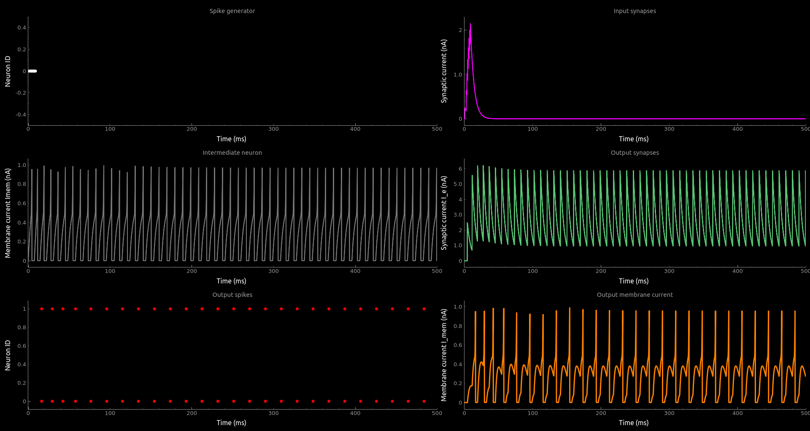

# Tutorials
Welcome to teili, a modular python-based framework for developing, testing and visualization of neural algorithms.


## Class object vs. import_eq
To generate all pre-defined neuron and synapse models, which are stored by default in `teili/models/equations/`, please execute the following two scripts:
```
cd models/
python3 -m synapse_models.py
python3 -m neuron_models.py
```
Once the pre-defined neuron and synapse models are exported to files you can choose between generating neuron/synapse models 'on the fly' or importing them from the generated files, which you can maually adapt to your needs without fiddling with the templates provided by teili.<br />
See examplesb for how to generate or load neuron and/or synapse models.
```
from teili.core.groups import Neurons, Connections

from teili.models.neuron_models import DPI as neuron_model
from teili.models.synapse_models import DPISyn as syn_model

test_neuron1 = Neurons(N=2, equation_builder=neuron_model(num_inputs=2),
                       name="testNeuron")
test_neuron2 = Neurons(N=2, equation_builder=neuron_model(num_inputs=2),
                       name="testNeuron")

test_synapse = Connections(test_neuron1, test_neuron2,
                           equation_builder=syn_model,
                           name="test_synapse")
```
If you prefer to import your model from a file you can do:

```
from teili.models.builder.neuron_equation_builder import NeuronEquationBuilder
from teili.models.builder.synapse_equation_builder import SynapseEquationBuilder

my_neuron_model = NeuronEquationBuilder.import_eq(
    'teili/models/equations/DPI', num_inputs=2)

my_synapse_model = SynapseEquationBuilder.import_eq(
    'teili/models/equations/DPISyn')

test_neuron1 = Neurons(2, equation_builder=my_neuron_model,
                       name="test_neuron1")
test_neuron2 = Neurons(2, equation_builder=my_neuron_model,
                       name="test_neuron2")

test_synapse = Connections(test_neuron1, test_neuron2,
                     equation_builder=my_synapse_model,
                     name="test_synapse")
```
## Neuron & Synapse tutorial
We created a simple example of how to simulate a small neural network either using the EquationBuilder:
```
from pyqtgraph.Qt import QtGui, QtCore
import pyqtgraph as pg
import numpy as np

from brian2 import ms, mV, pA, nS, nA, pF, us, volt, second, Network, prefs,\
    SpikeMonitor, StateMonitor, figure, plot, show, xlabel, ylabel,\
    seed, xlim, ylim, subplot, network_operation, TimedArray,\
    defaultclock, SpikeGeneratorGroup, asarray, pamp, set_device, device

from teili.core.groups import Neurons, Connections
from teili import teiliNetwork

from teili.models.neuron_models import DPI as neuron_model
from teili.models.synapse_models import DPISyn as syn_model
from teili.models.parameters.dpi_neuron_param import parameters as neuron_model_param

prefs.codegen.target = "numpy"

tsInp = asarray([1, 3, 4, 5, 6, 7, 8, 9]) * ms
indInp = asarray([0, 0, 0, 0, 0, 0, 0, 0])
gInpGroup = SpikeGeneratorGroup(1, indices=indInp,
                                times=tsInp, name='gtestInp')


Net = teiliNetwork()

testNeurons = Neurons(2, equation_builder=neuron_model(num_inputs=2), name="testNeuron")
# Example of how to set parameters, saved as a dictionary
testNeurons.set_params(neuron_model_param)
testNeurons.refP = 3 * ms

testNeurons2 = Neurons(2, equation_builder=neuron_model(num_inputs=2), name="testNeuron2")
testNeurons2.set_params(neuron_model_param)
testNeurons2.refP = 3 * ms


InpSyn = Connections(gInpGroup, testNeurons, equation_builder=syn_model(), name="testSyn", verbose=False)
InpSyn.connect(True)

Syn = Connections(testNeurons, testNeurons2, equation_builder=syn_model(), name="testSyn2")
Syn.connect(True)

# you can change all the parameters like this after creation of the neurongroup:
if 'Imem' in neuron_model().keywords['model']:
    InpSyn.weight = 10
    Syn.weight = 100

    # Example of how to set single parameters, rather than using an entire dictionary
    testNeurons.Iconst = 10 * nA
    # testNeurons2.Itau = 13 * pA
    # testNeurons2.Iath = 80 * pA
    # testNeurons2.Iagain = 20 * pA
    # testNeurons2.Ianorm = 8 * pA
elif 'Vm' in neuron_model().keywords['model']:
    InpSyn.weight = 1.5
    Syn.weight = 8.0
    # Example of how to set single parameters, rather than using an entire dictionary
    testNeurons.Iconst = 3 * nA

spikemonInp = SpikeMonitor(gInpGroup, name='spikemonInp')
spikemon = SpikeMonitor(testNeurons, name='spikemon')
spikemonOut = SpikeMonitor(testNeurons2, name='spikemonOut')
statemonInpSyn = StateMonitor(
    InpSyn, variables='Ie_syn', record=True, name='statemonInpSyn')
if 'Imem' in neuron_model().keywords['model']:
    statemonNeuOut = StateMonitor(testNeurons2,
                                  variables=['Imem'],
                                  record=0, name='statemonNeuOut')
    statemonNeuIn = StateMonitor(testNeurons, variables=[
                             "Iin", "Imem", "Iahp"], record=[0, 1], name='statemonNeu')
elif 'Vm' in neuron_model().keywords['model']:
    statemonNeuOut = StateMonitor(testNeurons2,
                                  variables=['Vm'],
                                  record=0, name='statemonNeuOut')
    statemonNeuIn = StateMonitor(testNeurons, variables=[
                             "Iin", "Vm", "Iadapt"], record=[0, 1], name='statemonNeu')

statemonSynOut = StateMonitor(
    Syn, variables='Ie_syn', record=True, name='statemonSynOut')

Net.add(gInpGroup, testNeurons, testNeurons2, InpSyn, Syn, spikemonInp, spikemon,
        spikemonOut, statemonNeuIn, statemonNeuOut, statemonSynOut, statemonInpSyn)

duration = 500
Net.run(duration * ms)
```
or using the import method of the EquationBuilder, which imports a pre-defined model. The only thing that changes from the example above is the import and neuron/synapse group definition:
```
from teili.models.builder.neuron_equation_builder import NeuronEquationBuilder
from teili.models.builder.synapse_equation_builder import SynapseEquationBuilder

# For this example you must first run models/neuron_models.py and synapse_models.py,
# which will create the equation template. This will be stored in models/equations
# Building neuron objects
builder_object1 = NeuronEquationBuilder.import_eq(
    'teili/models/equations/DPI', num_inputs=2)
builder_object2 = NeuronEquationBuilder.import_eq(
    'teili/models/equations/DPI', num_inputs=2)
# Building synapses objects
builder_object3 = SynapseEquationBuilder.import_eq(
    'teili/models/equations/DPISyn')
builder_object4 = SynapseEquationBuilder.import_eq(
    'teili/models/equations/DPISyn')

testNeurons = Neurons(2, equation_builder=builder_object1, name="testNeuron")
testNeurons2 = Neurons(2, equation_builder=builder_object2, name="testNeuron2")

InpSyn = Connections(gInpGroup, testNeurons,
                     equation_builder=builder_object3, name="testSyn", verbose=False)
InpSyn.connect(True)
Syn = Connections(testNeurons, testNeurons2,
                  equation_builder=builder_object4, name="testSyn2")
Syn.connect(True)
```
The way parameters are set remains the same.
In order to visualize the behaviour the example script also plots a couple of spike and state monitors.

```
pg.setConfigOptions(antialias=True)

labelStyle = {'color': '#FFF', 'font-size': '12pt'}
win = pg.GraphicsWindow(title='teili Test Simulation')
win.resize(1900, 600)
win.setWindowTitle('Simple SNN')

p1 = win.addPlot(title="Spike generator")
p2 = win.addPlot(title="Input synapses")
win.nextRow()
p3 = win.addPlot(title='Intermediate neuron')
p4 = win.addPlot(title="Output synapses")
win.nextRow()
p5 = win.addPlot(title="Output spikes")
p6 = win.addPlot(title="Output membrane current")

colors = [(255, 0, 0), (89, 198, 118), (0, 0, 255), (247, 0, 255),
          (0, 0, 0), (255, 128, 0), (120, 120, 120), (0, 171, 255)]


p1.setXRange(0, duration, padding=0)
p2.setXRange(0, duration, padding=0)
p3.setXRange(0, duration, padding=0)
p4.setXRange(0, duration, padding=0)
p5.setXRange(0, duration, padding=0)
p6.setXRange(0, duration, padding=0)

# Spike generator
p1.plot(x=np.asarray(spikemonInp.t / ms), y=np.asarray(spikemonInp.i),
        pen=None, symbol='o', symbolPen=None,
        symbolSize=7, symbolBrush=(255, 255, 255))

# Input synapses
for i, data in enumerate(np.asarray(statemonInpSyn.Ie_syn)):
    name = 'Syn_{}'.format(i)
    p2.plot(x=np.asarray(statemonInpSyn.t / ms), y=data,
            pen=pg.mkPen(colors[3], width=2), name=name)

# Intermediate neurons
if hasattr(statemonNeuIn,'Imem'):
    for i, data in enumerate(np.asarray(statemonNeuIn.Imem)):
        p3.plot(x=np.asarray(statemonNeuIn.t / ms), y=data,
                pen=pg.mkPen(colors[6], width=2))
if hasattr(statemonNeuIn,'Vm'):
    for i, data in enumerate(np.asarray(statemonNeuIn.Vm)):
        p3.plot(x=np.asarray(statemonNeuIn.t / ms), y=data,
                pen=pg.mkPen(colors[6], width=2))

# Output synapses
for i, data in enumerate(np.asarray(statemonSynOut.Ie_syn)):
    name = 'Syn_{}'.format(i)
    p4.plot(x=np.asarray(statemonSynOut.t / ms), y=data,
            pen=pg.mkPen(colors[1], width=2), name=name)

if hasattr(statemonNeuOut,'Imem'):
    for data in np.asarray(statemonNeuOut.Imem):
        p6.plot(x=np.asarray(statemonNeuOut.t / ms), y=data,
                pen=pg.mkPen(colors[5], width=3))
if hasattr(statemonNeuOut,'Vm'):
    for data in np.asarray(statemonNeuOut.Vm):
        p6.plot(x=np.asarray(statemonNeuOut.t / ms), y=data,
                pen=pg.mkPen(colors[5], width=3))

p5.plot(x=np.asarray(spikemonOut.t / ms), y=np.asarray(spikemonOut.i),
        pen=None, symbol='o', symbolPen=None,
        symbolSize=7, symbolBrush=(255, 0, 0))

p1.setLabel('left', "Neuron ID", **labelStyle)
p1.setLabel('bottom', "Time (ms)", **labelStyle)
p2.setLabel('left', "Synaptic current", units='A', **labelStyle)
p2.setLabel('bottom', "Time (ms)", **labelStyle)
i_current_name = 'Imem' if 'Imem' in neuron_model().keywords['model'] else 'Vm'
p3.setLabel('left', "Membrane current %s"%i_current_name, units="A", **labelStyle)
p3.setLabel('bottom', "Time (ms)", **labelStyle)
p4.setLabel('left', "Synaptic current I_e", units="A", **labelStyle)
p4.setLabel('bottom', "Time (ms)", **labelStyle)
p6.setLabel('left', "Membrane current %s"%i_current_name, units="A", **labelStyle)
p6.setLabel('bottom', "Time (ms)", **labelStyle)
p5.setLabel('left', "Neuron ID", **labelStyle)
p5.setLabel('bottom', "Time (ms)", **labelStyle)

b = QtGui.QFont("Sans Serif", 10)
p1.getAxis('bottom').tickFont = b
p1.getAxis('left').tickFont = b
p2.getAxis('bottom').tickFont = b
p2.getAxis('left').tickFont = b
p3.getAxis('bottom').tickFont = b
p3.getAxis('left').tickFont = b
p4.getAxis('bottom').tickFont = b
p4.getAxis('left').tickFont = b
p5.getAxis('bottom').tickFont = b
p5.getAxis('left').tickFont = b
p6.getAxis('bottom').tickFont = b
p6.getAxis('left').tickFont = b


QtGui.QApplication.instance().exec_()
```


In both cases of model definition the resulting figure should look like this:


## STDP tutorial
One key property of teili is that existing neuron/synapse models can easily be extended to provide additional functionality, such as extending a given synapse model with for example a Spike-Timing Dependent Plasticity mechanism.

## Add mismatch
This example shows how to add device mismatch to a neural network with one input neuron connected to 1000 output neurons.
Once our population is created, we will add device mismatch to the selected parameters 
by specifying a dictionary with parameter names as keys and mismatch standard deviation as values.
Here neuron and synapse selected parameters are specified in mismatch_neuron_param and mismatch_synap_param respectively.
```
import pyqtgraph as pg
import numpy as np
from brian2 import SpikeGeneratorGroup, SpikeMonitor, StateMonitor, ms, asarray, nA, prefs
from teili.core.groups import Neurons, Connections
from teili import teiliNetwork
from teili.models.neuron_models import DPI as neuron_model
from teili.models.synapse_models import DPISyn as syn_model

prefs.codegen.target = "numpy"

Net = teiliNetwork()

mismatch_neuron_param = {
'Inoise' : 0,
'Iconst' : 0,
'kn' : 0,
'kp' : 0,
'Ut' : 0,
'Io' : 0,
'Cmem' : 0,
'Iath' : 0,
'Iagain' : 0,
'Ianorm' : 0,
'Ica' : 0,
'Itauahp' : 0,
'Ithahp' : 0,
'Cahp' : 0,
'Ishunt' : 0,
'Ispkthr' : 0,
'Ireset' : 0,
'Ith' : 0,
'Itau' : 0,
'refP' : 0.2,
}

mismatch_synap_param = {
'Io_syn' : 0,
'kn_syn' : 0,
'kp_syn' : 0,
'Ut_syn' : 0,
'Csyn' : 0,
'Ie_tau' : 0,
'Ii_tau' : 0,
'Ie_th' : 0,
'Ii_th' : 0,
'Ie_syn' : 0,
'Ii_syn' : 0,
'w_plast' : 0,
'baseweight_e' : 0.2,
'baseweight_i' : 0,
}
```

This choice will add variability to the neuron refractory period (refP) and to the 
synaptic weight (baseweight_e), with a standard deviation of 20% of the current value 
for both parameters.

Let's first create the input SpikeGeneratorGroup, the output layer and the synapses.
Notice that a constant input current has been set for the output neurons. 

```
# Input layer
ts_input = asarray([1, 3, 4, 5, 6, 7, 8, 9]) * ms
ids_input = asarray([0, 0, 0, 0, 0, 0, 0, 0])
input_spikegen = SpikeGeneratorGroup(1, indices=ids_input,
                                  times=ts_input, name='gtestInp')

# Output layer
output_neurons = Neurons(1000, equation_builder=neuron_model(num_inputs=2), 
                     name='output_neurons') 
output_neurons.refP = 3 * ms
output_neurons.Iconst = 10 * nA

# Input Synapse
input_syn = Connections(input_spikegen, output_neurons, equation_builder=syn_model(), 
                     name="inSyn", verbose=False)
input_syn.connect(True)
input_syn.weight = 5
```

Now we can add mismatch to the selected parameters. 
First, we will store the current values of refP and baseweight_e to be able to
compare them to those generated by adding mismatch (see mismatch distribution plot below). 
Notice that getattr(output_neurons, mism_param_neu) returns an array of length equal to the
number of neurons. Assuming that mismatch has not been added yet (e.g. if you
have just created the neuron population), the values of the selected parameter
will be the same for all the neurons in the population. Here we will arbitarily choose to store 
the first one.
```
mean_neuron_param = np.copy(getattr(output_neurons, 'refP'))[0]
unit_old_param_neu = getattr(output_neurons, 'refP').unit
mean_synapse_param = np.copy(getattr(input_syn, 'baseweight_e'))[0]
unit_old_param_syn = getattr(input_syn, 'baseweight_e').unit
```

Now we can add mismatch to neurons and synapses by using the method add_mismatch(). To be able to reproduce the same mismatch across multiple simualtions, 
here we will also set the seed.

```
output_neurons.add_mismatch(std_dict=mismatch_neuron_param, seed=10)
input_syn.add_mismatch(std_dict=mismatch_synap_param, seed=11)
```

Once we run the simulation, we can visualize the parameter distribution across neurons 
and the effect of device mismatch on the EPSC and on the output membrane current Imem 
of five randomly selected neurons. 

```
# Setting monitors:
spikemon_input = SpikeMonitor(input_spikegen, name='spikemon_input')
spikemon_output = SpikeMonitor(output_neurons, name='spikemon_output')
statemon_output = StateMonitor(output_neurons,
                           variables=['Imem'],
                           record=True, 
                           name='statemonNeuMid')
statemon_input_syn = StateMonitor(input_syn, 
                           variables='Ie_syn', 
                           record=True, 
                           name='statemon_input_syn')

Net.add(input_spikegen, output_neurons, input_syn,
        spikemon_input, spikemon_output, 
        statemon_output, statemon_input_syn)

# Run simulation for 500 ms
duration = 500
Net.run(duration * ms)
              
#%% 
pg.setConfigOptions(antialias=True)
labelStyle = {'color': '#FFF', 'font-size': '12pt'}
colors = [(255, 255, 255), (255, 0, 0), (89, 198, 118), (0, 0, 255), (247, 0, 255),
          (0, 0, 0), (255, 128, 0), (120, 120, 120), (0, 171, 255)]

# Rasterplot and statemonitor
win1 = pg.GraphicsWindow(title='teili Test Simulation')
win1.resize(1900, 900)
win1.setWindowTitle('Simple SNN')
p1 = win1.addPlot(title="Spike generator")
win1.nextRow()
p2 = win1.addPlot(title="Output layer")
win1.nextRow()
p3 = win1.addPlot(title="EPSC")
win1.nextRow()
p4 = win1.addPlot(title="I_mem")

p1.plot(x=np.asarray(spikemon_input.t / ms), y=np.asarray(spikemon_input.i),
        pen=None, symbol='o', symbolPen=None,
        symbolSize=2, symbolBrush=colors[0])
p1.setLabel('left', "Neuron ID", **labelStyle)
p1.setLabel('bottom', "Time (ms)", **labelStyle)
p1.setXRange(0, duration, padding=0)

p2.plot(x=np.asarray(spikemon_output.t / ms), y=np.asarray(spikemon_output.i),
        pen=None, symbol='o', symbolPen=None,
        symbolSize=2, symbolBrush=colors[1])
p2.setLabel('left', "Neuron ID", **labelStyle)
p2.setLabel('bottom', "Time (ms)", **labelStyle)
p2.setXRange(0, duration, padding=0)

neuron_ids_to_plot = np.random.randint(1000, size=5)
for i, data in enumerate(np.asarray(statemon_input_syn.Ie_syn[neuron_ids_to_plot])):
    name = 'Syn_{}'.format(i)
    p3.plot(x=np.asarray(statemon_input_syn.t / ms), y=data,
            pen=pg.mkPen(colors[i], width=2), name=name)
p3.setLabel('left', "EPSC", units="A", **labelStyle)
p3.setLabel('bottom', "Time (ms)", **labelStyle)
p3.setXRange(0, duration, padding=0)

for i, data in enumerate(np.asarray(statemon_output.Imem[neuron_ids_to_plot])):
    p4.plot(x=np.asarray(statemon_output.t / ms), y=data,
            pen=pg.mkPen(colors[i], width=3))
p4.setLabel('left', "Membrane current Imem", units="A", **labelStyle)
p4.setLabel('bottom', "Time (ms)", **labelStyle)    
p4.setXRange(0, duration, padding=0)    

# Mismatch distribution
win2 = pg.GraphicsWindow(title='teili Test Simulation')
win2.resize(1900, 600)
win2.setWindowTitle('Mismatch distribution')
p1 = win2.addPlot(title='baseweight_e')
win2.nextRow()
p2 = win2.addPlot(title='refP')

y,x = np.histogram(np.asarray(getattr(input_syn, 'baseweight_e')), bins="auto")
curve = pg.PlotCurveItem(x=x, y=y, stepMode=True, brush=(0, 0, 255, 80))
p1.addItem(curve)
p1.plot(x=np.asarray([mean_synapse_param, mean_synapse_param]), y=np.asarray([0, np.max(y)]), 
        pen=pg.mkPen((255, 0, 0), width=2))
p1.setLabel('bottom', units=str(unit_old_param_syn), **labelStyle)

y,x = np.histogram(np.asarray(getattr(output_neurons, 'refP')), bins="auto")
curve = pg.PlotCurveItem(x=x, y=y, stepMode=True, brush=(0, 0, 255, 80))
p2.addItem(curve)
p2.plot(x=np.asarray([mean_neuron_param, mean_neuron_param]), y=np.asarray([0, np.max(y)]), 
        pen=pg.mkPen((255, 0, 0), width=2))
p2.setLabel('bottom', units=str(unit_old_param_neu), **labelStyle)
```