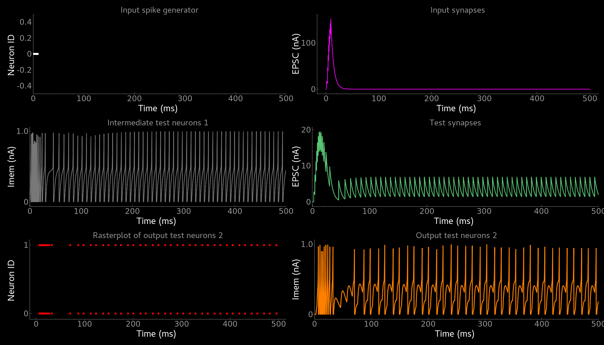
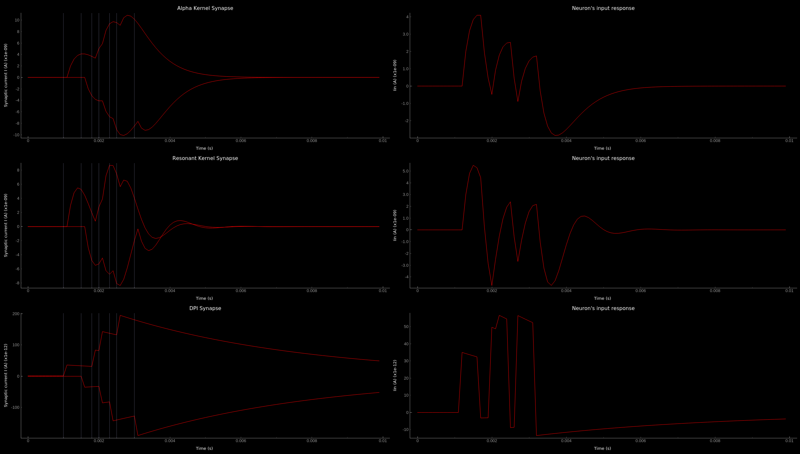
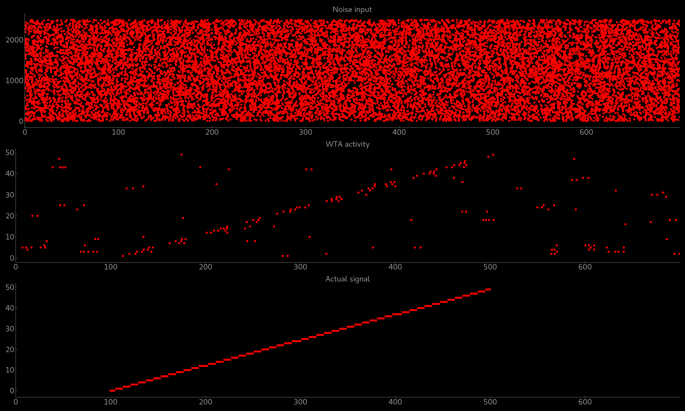
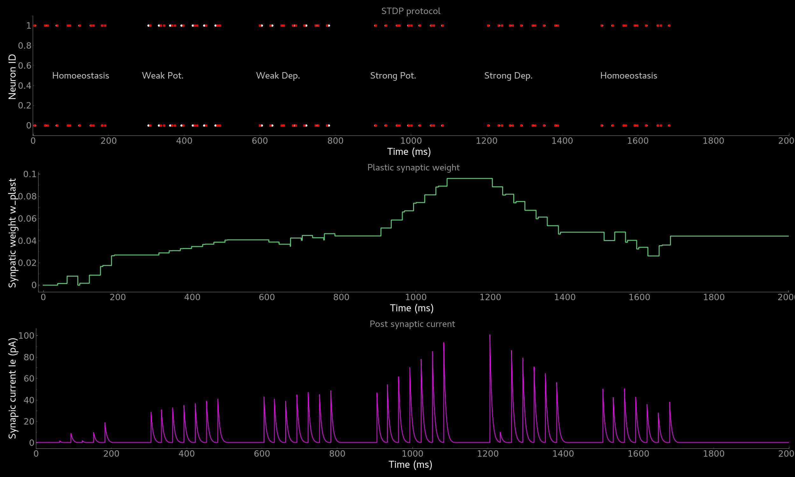
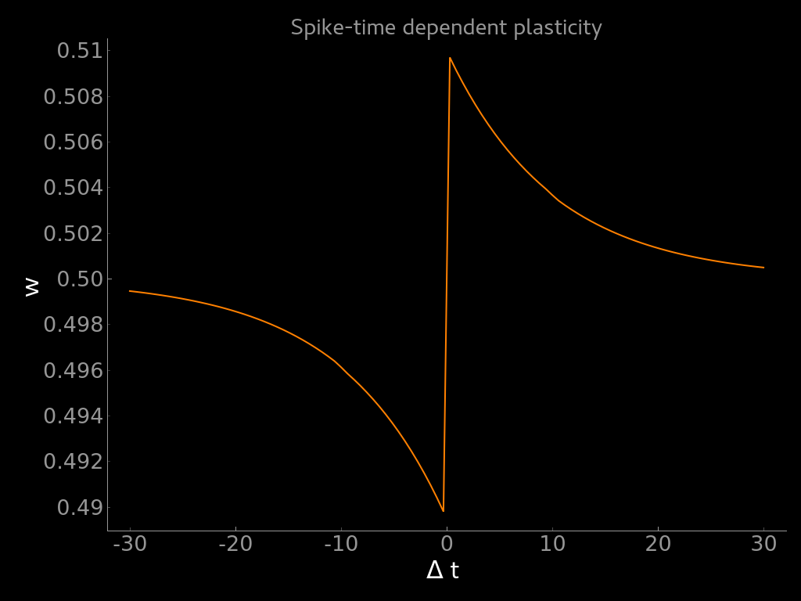
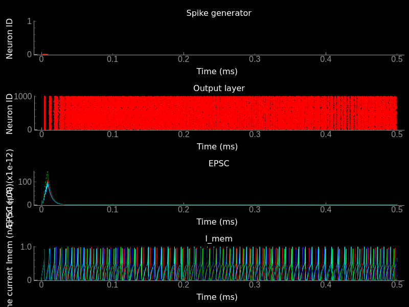
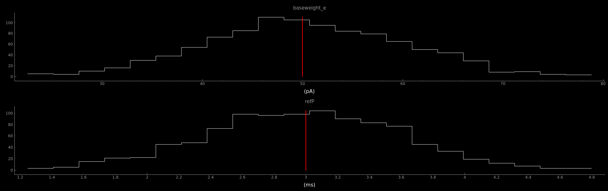

*********
Tutorials
*********
Welcome to teili, a modular python-based framework for developing, testing and visualization of neural algorithms.
Before going through our tutorials we highly recommend doing the tutorials provided by Brian2_

Class object vs. import_eq
===========================

To generate all pre-defined neuron and synapse models, which are stored by default in ``teiliApps/equations/``, please execute the following two scripts:

.. note:: During installation the pre-defined models are generated be default. You only need to regenerate them if you manualy deleted them.

.. code-block:: bash

    cd teili/models/
    python -m synapse_models
    python -m neuron_models

Working with pre-assembled models
--------------------------------
Once the pre-defined neuron and synapse models are exported to files you can choose between generating neuron/synapse models 'on the fly' or importing them from the generated files, which you can maually adapt to your needs without fiddling with the ``templates`` provided by `teili`.

See an example for how to work with pre-assembled neuron and/or synapse models below.

.. code-block:: python

    from teili.core.groups import Neurons, Connections

    from teili.models.neuron_models import DPI as neuron_model
    from teili.models.synapse_models import DPISyn as syn_model

    test_neuron1 = Neurons(N=2,
                           equation_builder=neuron_model(num_inputs=2),
                           name="test_neuron1")

    test_neuron2 = Neurons(N=2,
                           equation_builder=neuron_model(num_inputs=2),
                           name="test_neuron2")

    test_synapse = Connections(test_neuron1, test_neuron2,
                               equation_builder=syn_model,
                               name="test_synapse")

Import equation from a file
---------------------------
If you prefer to import your model from a file you can do so:

.. code-block:: python

    import os
    from teili.core.groups import Neurons, Connections
    from teili.models.builder.neuron_equation_builder import NeuronEquationBuilder
    from teili.models.builder.synapse_equation_builder import SynapseEquationBuilder

    path = os.path.expanduser("~")
    model_path = os.path.join(path, "teiliApps", "equations", "")

    my_neuron_model = NeuronEquationBuilder.import_eq(
            model_path + 'DPI.py', num_inputs=2)

    my_synapse_model = SynapseEquationBuilder.import_eq(
            model_path + 'DPISyn.py')

    test_neuron1 = Neurons(N=2,
                           equation_builder=my_neuron_model,
                           name="test_neuron1")
    test_neuron2 = Neurons(N=2,
                           equation_builder=my_neuron_model,
                           name="test_neuron2")

    test_synapse = Connections(test_neuron1, test_neuron2,
                               equation_builder=my_synapse_model,
                               name="test_synapse")

If you want to see a more detailed report on which equations were used during the generation you can set ``verbose=True``, such that it looks like this

.. code-block:: python

    test_neuron1 = Neurons(N=2,
                           equation_builder=my_neuron_model,
                           name="test_neuron1", verbose=True)

Neuron & Synapse tutorial
=========================

We created a simple tutorial of how to simulate a small neural network either using the EquationBuilder.
The tutorial is located in ``teiliApps/tutorials/neuron_synapse_tutorial.py``.
First we import all required libraries

.. code-block:: python

    from pyqtgraph.Qt import QtGui
    import pyqtgraph as pg
    import numpy as np

    from Brian2 import ms, pA, nA, prefs,\
            SpikeMonitor, StateMonitor,\
            SpikeGeneratorGroup

    from teili.core.groups import Neurons, Connections
    from teili import TeiliNetwork
    from teili.models.neuron_models import DPI as neuron_model
    from teili.models.synapse_models import DPISyn as syn_model
    from teili.models.parameters.dpi_neuron_param import parameters as neuron_model_param

    from teili.tools.visualizer.DataViewers import PlotSettings
    from teili.tools.visualizer.DataControllers import Rasterplot, Lineplot

We now can define the target for the code generation. Typically we use the ``numpy`` backend.
For more details on how to run your code more efficient and faster have a look at brian's `standalone mode`_

.. code-block:: python

    prefs.codegen.target = "numpy"

We can now generate a simple input pattern using Brian2's ``SpikeGeneratorGroup``

.. code-block:: python

    input_timestamps = np.asarray([1, 3, 4, 5, 6, 7, 8, 9]) * ms
    input_indices = np.asarray([0, 0, 0, 0, 0, 0, 0, 0])
    input_spikegenerator = SpikeGeneratorGroup(1, indices=input_indices,
                                               times=input_timestamps, name='gtestInp')

After defining the input group, we can build a ``TeiliNetwork``.

.. code-block:: python

    Net = TeiliNetwork()

    test_neurons1 = Neurons(N=2,
                            equation_builder=neuron_model(num_inputs=2),
                            name="test_neurons1")

    test_neurons2 = Neurons(N=2,
                            equation_builder=neuron_model(num_inputs=2),
                            name="test_neurons2")

    input_synapse = Connections(input_spikegenerator, test_neurons1,
                                equation_builder=syn_model(),
                                name="input_synapse")
    input_synapse.connect(True)

    test_synapse = Connections(test_neurons1, test_neurons2,
                               equation_builder=syn_model(),
                               name="test_synapse")
    test_synapse.connect(True)

After initializing the neuronal population and connecting them via synapses, we can set model parameters.
Note that parameters are set by default. This example only shows how you would need to go about if you want to set non-standard (self-defined) parameters.
Example parameter dictionaries can be found ``teili/models/parameters``.
You can change all the parameters like this after creation of the neurongroup or synapsegroup.
Note that the if condition is only there for convenience to switch between voltage- or current-based models.
Normally, you have one or the other in your simulation, thus you will not need the if condition.

.. attention:: The ``weight`` multiplies the baseweight, which is currently initialised to 7 pA by default. In order to elicit an output spike in response to a single ``SpikeGenerator`` input spike the weight must be greater than 3250.

.. code-block:: python

    # Example of how to set parameters, saved as a dictionary
    test_neurons1.set_params(neuron_model_param)
    test_neurons2.set_params(neuron_model_param)

    # Example of how to set a single parameter
    test_neurons1.refP = 1 * ms
    test_neurons2.refP = 1 * ms

    if 'Imem' in neuron_model().keywords['model']:
            input_synapse.weight = 5000
            test_synapse.weight = 800
            test_neurons1.Iconst = 10 * nA
    elif 'Vm' in neuron_model().keywords['model']:
            input_synapse.weight = 1.5
            test_synapse.weight = 8.0
            test_neurons1.Iconst = 3 * nA

Now our simple spiking neural network is defined. In order to visualize what is happening during the simulation we need to monitor the spiking behavior of our neurons and other state variables of neurons and synapses.

.. code-block:: python

    spikemon_input = SpikeMonitor(
            input_spikegenerator, name='spikemon_input')
    spikemon_test_neurons1 = SpikeMonitor(
            test_neurons1, name='spikemon_test_neurons1')
    spikemon_test_neurons2 = SpikeMonitor(
            test_neurons2, name='spikemon_test_neurons2')

    statemon_input_synapse = StateMonitor(
            input_synapse, variables='I_syn',
            record=True, name='statemon_input_synapse')

    statemon_test_synapse = StateMonitor(
            test_synapse, variables='I_syn',
            record=True, name='statemon_test_synapse')

    if 'Imem' in neuron_model().keywords['model']:
            statemon_test_neurons1 = StateMonitor(test_neurons1,
                                                  variables=["Iin", "Imem", "Iahp"],
                                                  record=[0, 1],
                                                  name='statemon_test_neurons1')
            
            statemon_test_neurons2 = StateMonitor(test_neurons2,
                                                  variables=['Imem'],
                                                  record=0,
                                                  name='statemon_test_neurons2')

    elif 'Vm' in neuron_model().keywords['model']:
            statemon_test_neurons1 = StateMonitor(test_neurons1,
                                                  variables=["Iin", "Vm", "Iadapt"],
                                                  record=[0, 1],
                                                  name='statemon_test_neurons1')

            statemon_test_neurons2 = StateMonitor(test_neurons2,
                                                  variables=['Vm'],
                                                  record=0,
                                                  name='statemon_test_neurons2')

We can now finally add all defined ``Neurons`` and ``Connections``, as well as the monitors to our ``TeiliNetwork`` and run the simulation.

.. code-block:: python

    Net.add(input_spikegenerator,
            test_neurons1, test_neurons2,
            input_synapse, test_synapse,
            spikemon_input, spikemon_test_neurons1,
            spikemon_test_neurons2,
            statemon_test_neurons1, statemon_test_neurons2,
            statemon_test_synapse, statemon_input_synapse)

    duration = 500
    Net.run(duration * ms)

If you, however, prefer to use the equation files located in ``teiliApss/equations/``, you need to change the way the neurons and synapses are defined. The only thing that changes from the example above is the import and neuron/synapse group definition:

.. code-block:: python

    import os
    from teili.models.builder.neuron_equation_builder import NeuronEquationBuilder
    from teili.models.builder.synapse_equation_builder import SynapseEquationBuilder

    # For this example you must first run models/neuron_models.py and synapse_models.py,
    # which will create the equation template. This will be stored in models/equations
    # Building neuron objects

    path = os.path.expanduser("~")
    model_path = os.path.join(path, "teiliApps", "equations", "")

    builder_object1 = NeuronEquationBuilder.import_eq(
            model_path + 'DPI.py', num_inputs=2)
    builder_object2 = NeuronEquationBuilder.import_eq(
            model_path + 'DPI.py', num_inputs=2)

    builder_object3 = SynapseEquationBuilder.import_eq(
            model_path + 'DPISyn.py')
    builder_object4 = SynapseEquationBuilder.import_eq(
            model_path + 'DPISyn.py')

    test_neurons1 = Neurons(2, equation_builder=builder_object1, name="test_neurons1")
    test_neurons2 = Neurons(2, equation_builder=builder_object2, name="test_neurons2")

    input_synapse = Connections(input_spikegenerator, test_neurons1,
                                equation_builder=builder_object3,
                                name="input_synapse", verbose=False)
    input_synapse.connect(True)
    test_synapse = Connections(test_neurons1, test_neurons2,
                               equation_builder=builder_object4, name="test_synapse")
    test_synapse.connect(True)

The way parameters are set remains the same.
In order to visualize the behavior the example script also plots a couple of spike and state monitors.

.. code-block:: python

    app = QtGui.QApplication.instance()
    if app is None:
        app = QtGui.QApplication(sys.argv)
    else:
        print('QApplication instance already exists: %s' % str(app))

    pg.setConfigOptions(antialias=True)
    labelStyle = {'color': '#FFF', 'font-size': 12}
    MyPlotSettings = PlotSettings(fontsize_title=labelStyle['font-size'],
                                  fontsize_legend=labelStyle['font-size'],
                                  fontsize_axis_labels=10,
                                  marker_size=7)

    win = pg.GraphicsWindow()
    win.resize(2100, 1200)
    win.setWindowTitle('Simple Spiking Neural Network')

    p1 = win.addPlot(title="Input spike generator")
    p2 = win.addPlot(title="Input synapses")
    win.nextRow()
    p3 = win.addPlot(title='Intermediate test neurons 1')
    p4 = win.addPlot(title="Test synapses")
    win.nextRow()
    p5 = win.addPlot(title="Rasterplot of output test neurons 2")
    p6 = win.addPlot(title="Output test neurons 2")

    # Spike generator
    Rasterplot(MyEventsModels=[spikemon_input],
                         MyPlotSettings=MyPlotSettings,
                         time_range=[0, duration],
                         neuron_id_range=None,
                         title="Input spike generator",
                         xlabel='Time (ms)',
                         ylabel="Neuron ID",
                         backend='pyqtgraph',
                         mainfig=win,
                         subfig_rasterplot=p1,
                         QtApp=app,
                         show_immediately=False)

    # Input synapses
    Lineplot(DataModel_to_x_and_y_attr=[(statemon_input_synapse, ('t', 'I_syn'))],
                       MyPlotSettings=MyPlotSettings,
                       x_range=[0, duration],
                       title="Input synapses",
                       xlabel="Time (ms)",
                       ylabel="EPSC (A)",
                       backend='pyqtgraph',
                       mainfig=win,
                       subfig=p2,
                       QtApp=app,
                       show_immediately=False)

    # Intermediate neurons
    if hasattr(statemon_test_neurons1, 'Imem'):
        MyData_intermed_neurons = [(statemon_test_neurons1, ('t', 'Imem'))]
    if hasattr(statemon_test_neurons1, 'Vm'):
        MyData_intermed_neurons = [(statemon_test_neurons1, ('t', 'Vm'))]

    i_current_name = 'Imem' if 'Imem' in neuron_model().keywords['model'] else 'Vm'
    Lineplot(DataModel_to_x_and_y_attr=MyData_intermed_neurons,
                       MyPlotSettings=MyPlotSettings,
                       x_range=[0, duration],
                       title='Intermediate test neurons 1',
                       xlabel="Time (ms)",
                       ylabel=i_current_name,
                       backend='pyqtgraph',
                       mainfig=win,
                       subfig=p3,
                       QtApp=app,
                       show_immediately=False)

    # Output synapses
    Lineplot(DataModel_to_x_and_y_attr=[(statemon_test_synapse, ('t', 'I_syn'))],
                       MyPlotSettings=MyPlotSettings,
                       x_range=[0, duration],
                       title="Test synapses",
                       xlabel="Time (ms)",
                       ylabel="EPSC (A)",
                       backend='pyqtgraph',
                       mainfig=win,
                       subfig=p4,
                       QtApp=app,
                       show_immediately=False)

    Rasterplot(MyEventsModels=[spikemon_test_neurons2],
                         MyPlotSettings=MyPlotSettings,
                         time_range=[0, duration],
                         neuron_id_range=None,
                         title="Rasterplot of output test neurons 2",
                         xlabel='Time (ms)',
                         ylabel="Neuron ID",
                         backend='pyqtgraph',
                         mainfig=win,
                         subfig_rasterplot=p5,
                         QtApp=app,
                         show_immediately=False)

    if hasattr(statemon_test_neurons2, 'Imem'):
        MyData_output = [(statemon_test_neurons2, ('t','Imem'))]
    if hasattr(statemon_test_neurons2, 'Vm'):
        MyData_output = [(statemon_test_neurons2, ('t','Vm'))]

    Lineplot(DataModel_to_x_and_y_attr=MyData_output,
                       MyPlotSettings=MyPlotSettings,
                       x_range=[0, duration],
                       title="Output test neurons 2",
                       xlabel="Time (ms)",
                       ylabel="%s" %i_current_name,
                       backend='pyqtgraph',
                       mainfig=win,
                       subfig=p6,
                       QtApp=app,
                       show_immediately=False)

    app.exec()

In both cases of model definition the resulting figure should look like this:

    Simple neuron and networks dynamics.

Synaptic kernels tutorial
=========================

In Teili we provide synaptic models that modify the shape of the synaptic current; we call them kernels. Here we provide an tutorial of how to use them and how they look when applied together with a neuron model.
The first steps are the same as in the previous tutorial.
The tutorial is located in ``teiliApps/tutorials/neuron_synapse_tutorial.py``.
We first import all required libraries

.. code-block:: python

    from pyqtgraph.Qt import QtGui, QtCore
    import pyqtgraph as pg
    import numpy as np

    from brian2 import second, ms, prefs,\
            SpikeMonitor, StateMonitor,\
            SpikeGeneratorGroup

    from teili.core.groups import Neurons, Connections
    from teili import TeiliNetwork
    from teili.models.neuron_models import DPI as neuron_model
    from teili.models.synapse_models import Alpha, Resonant, DPISyn
    from teili.models.parameters.dpi_neuron_param import parameters as neuron_model_param

    from teili.tools.visualizer.DataViewers import PlotSettings
    from teili.tools.visualizer.DataModels import  StateVariablesModel
    from teili.tools.visualizer.DataControllers import Lineplot

We define the target for the code generation. As in the previous example we use the ``numpy`` backend.

.. code-block:: python

    prefs.codegen.target = "numpy"

We define a simple input pattern using Brian2's ``SpikeGeneratorGroup``. This will consist of two neurons, one will send excitatory and the other inhibitory spikes.

.. code-block:: python

    input_timestamps = np.asarray([1, 1.5, 1.8, 2.0, 2.0, 2.3, 2.5, 3]) * ms
    input_indices = np.asarray([0, 1, 0, 1, 0, 1, 0, 1])
    input_spikegenerator = SpikeGeneratorGroup(2, indices=input_indices,
                                    times=input_timestamps, name='gtestInp')

We now build a ``TeiliNetwork``.

.. code-block:: python

    Net = TeiliNetwork()

In this tutorial we will show three kernels, therefore we have created three different neurons. The first one will receive synapses with an Alpha kernel shape, the second will receive synapses with a Resonant kernel shape and the third one will receive a synapse of the DPY synapse model, which has an exponential decay shape. Note that a single neuron can receive synapses with different kernels at the same time. Here we split them for better visualization.

.. code-block:: python

    test_neurons1 = Neurons(1, 
    equation_builder=neuron_model(num_inputs=2), name="test_neurons")

    test_neurons1.set_params(neuron_model_param)
    test_neurons1.refP = 1 * ms

    test_neurons2 = Neurons(1, 
    equation_builder=neuron_model(num_inputs=2), name="test_neurons2")

    test_neurons2.set_params(neuron_model_param)
    test_neurons2.refP = 1 * ms

    test_neurons3 = Neurons(1, 
    equation_builder=neuron_model(num_inputs=2), name="test_neurons3")

    test_neurons3.set_params(neuron_model_param)
    test_neurons3.refP = 1 * ms

.. attention:: We are using the DPI neuron model for this tutorial but the synaptic model is independent of the neuron's model and therefore other neuron models can be used.

We already set the parameters for our neuron model. As explained above, we can set the standard parameters from a dictionary but also change single parameters as in this example with the refractory period.
Now we specify the connections. The synaptic models are Alpha, Resonant and DPI.

.. code-block:: python

    syn_alpha = Connections(input_spikegenerator, test_neurons1,
                         equation_builder=Alpha(), name="test_syn_alpha", verbose=False)
    syn_alpha.connect(True)
    
    syn_resonant = Connections(input_spikegenerator, test_neurons2,
                     equation_builder=Resonant(), name="test_syn_resonant", verbose=False)
    syn_resonant.connect(True)

    syn_dpi = Connections(input_spikegenerator, test_neurons3,
                     equation_builder=DPISyn(), name="test_syn_dpi", verbose=False)
    syn_dpi.connect(True)
    
We set the parameters for the synases. In this case, we specify that the first neuron in the spike generator will have a postivie effect (weight>0) and the second one will have a negative effect (weight<0) on the post-synpatic neuron.

.. code-block:: python

    syn_alpha.weight = np.asarray([10,-10])
    syn_resonant.weight = np.asarray([10,-10])
    syn_dpi.weight = np.asarray([10,-10])

.. attention:: The ``weight`` multiplies the baseweight, which is currently initialised to 7 pA by default. In order to elicit an output spike in response to a single ``SpikeGenerator`` input spike, the weight must be greater than 3250.

Now our simple spiking neural network is defined. In order to visualize what is happening during the simulation
we need to monitor the spiking behavior of our neurons and other state variables of the neurons and synapses.

.. code-block:: python

    spikemon_inp = SpikeMonitor(input_spikegenerator, name='spikemon_inp')
    statemon_syn_alpha = StateMonitor(syn_alpha, variables='I_syn', 
                                      record=True, name='statemon_syn_alpha')
    statemon_syn_resonant = StateMonitor(syn_resonant,variables='I_syn', 
                                         record=True, name='statemon_syn_resonant')
    statemon_syn_dpi = StateMonitor(syn_dpi, variables='I_syn', 
                                    record=True, name='statemon_syn_dpi')
    statemon_test_neuron1 = StateMonitor(test_neurons1, variables=['Iin'], 
                                         record=0, name='statemon_test_neuron1')
    statemon_test_neuron2 = StateMonitor(test_neurons2, variables=['Iin'], 
                                         record=0, name='statemon_test_neuron2')
    statemon_test_neuron3 = StateMonitor(test_neurons3, variables=['Iin'], 
                                         record=0, name='statemon_test_neuron3')

We can now finally add all defined ``Neurons`` and ``Connections`` and also the monitors to our ``TeiliNetwork`` and run the simulation.

.. code-block:: python

    Net.add(input_spikegenerator, test_neurons1, 
            test_neurons2,test_neurons3,
            syn_alpha, syn_resonant, syn_dpi, 
            spikemon_inp, statemon_syn_alpha, 
            statemon_syn_resonant,statemon_syn_dpi,
            statemon_test_neuron1, statemon_test_neuron2, 
            statemon_test_neuron3)

    duration = 0.010
    Net.run(duration * second)

In order to visualize the behavior, the example script also plots a couple of spike and state monitors.

.. code-block:: python

    app = QtGui.QApplication.instance()
    if app is None:
        app = QtGui.QApplication(sys.argv)
    else:
        print('QApplication instance already exists: %s' % str(app))

    pg.setConfigOptions(antialias=True)
    labelStyle = {'color': '#FFF', 'font-size': 12}
    MyPlotSettings = PlotSettings(fontsize_title=labelStyle['font-size'],
                                  fontsize_legend=labelStyle['font-size'],
                                  fontsize_axis_labels=10,
                                  marker_size=7)

    win = pg.GraphicsWindow(title='Kernels Simulation')
    win.resize(900, 600)
    win.setWindowTitle('Simple SNN')

    p1 = win.addPlot()
    p2 = win.addPlot()
    win.nextRow()
    p3 = win.addPlot()
    p4 = win.addPlot()
    win.nextRow()
    p5 = win.addPlot()
    p6 = win.addPlot()

    # Alpha kernel synapse
    data = statemon_syn_alpha.I_syn.T
    data[:, 1] *= -1.
    datamodel_syn_alpha = StateVariablesModel(state_variable_names=['I_syn'],
                                    state_variables=[data],
                                    state_variables_times=[statemon_syn_alpha.t])
    Lineplot(DataModel_to_x_and_y_attr=[(datamodel_syn_alpha, ('t_I_syn', 'I_syn'))],
             MyPlotSettings=MyPlotSettings,
             x_range=(0, duration),
             y_range=None,
             title='Alpha Kernel Synapse',
             xlabel='Time (s)',
             ylabel='Synaptic current I (A)',
             backend='pyqtgraph',
             mainfig=win,
             subfig=p1,
             QtApp=app)
    for i, data in enumerate(np.asarray(spikemon_inp.t)):
        vLine = pg.InfiniteLine(pen=pg.mkPen(color=(200, 200, 255),
                    style=QtCore.Qt.DotLine),pos=data, angle=90, movable=False,)
        p1.addItem(vLine, ignoreBounds=True)

    # Neuron response
    Lineplot(DataModel_to_x_and_y_attr=[(statemon_test_neuron1, ('t', 'Iin'))],
             MyPlotSettings=MyPlotSettings,
             x_range=(0, duration),
             y_range=None,
             title='Neuron response',
             xlabel='Time (s)',
             ylabel='Membrane current I_mem (A)',
             backend='pyqtgraph',
             mainfig=win,
             subfig=p2,
             QtApp=app)

    # Resonant kernel synapse
    data = statemon_syn_resonant.I_syn.T
    data[:, 1] *= -1.
    datamodel_syn_resonant = StateVariablesModel(state_variable_names=['I_syn'],
                                    state_variables=[data],
                                    state_variables_times=[statemon_syn_resonant.t])

    Lineplot(DataModel_to_x_and_y_attr=[(datamodel_syn_resonant, ('t_I_syn','I_syn'))],
             MyPlotSettings=MyPlotSettings,
             x_range=(0, duration),
             y_range=None,
             title='Resonant Kernel Synapse',
             xlabel='Time (s)',
             ylabel='Synaptic current I (A)',
             backend='pyqtgraph',
             mainfig=win,
             subfig=p3,
             QtApp=app)
    for i, data in enumerate(np.asarray(spikemon_inp.t)):
        vLine = pg.InfiniteLine(pen=pg.mkPen(color=(200, 200, 255),
                    style=QtCore.Qt.DotLine),pos=data, angle=90, movable=False,)
        p3.addItem(vLine, ignoreBounds=True)

    # Neuron response
    Lineplot(DataModel_to_x_and_y_attr=[(statemon_test_neuron2, ('t', 'Iin'))],
             MyPlotSettings=MyPlotSettings,
             x_range=(0, duration),
             y_range=None,
             title='Neuron response',
             xlabel='Time (s)',
             ylabel='Membrane current I_mem (A)',
             backend='pyqtgraph',
             mainfig=win,
             subfig=p4,
             QtApp=app)

    # DPI synapse
    data = statemon_syn_dpi.I_syn.T
    data[:, 1] *= -1.
    datamodel_syn_dpi = StateVariablesModel(state_variable_names=['I_syn'],
                                    state_variables=[data],
                                    state_variables_times=[statemon_syn_dpi.t])

    Lineplot(DataModel_to_x_and_y_attr=[(datamodel_syn_dpi, ('t_I_syn','I_syn'))],
             MyPlotSettings=MyPlotSettings,
             x_range=(0, duration),
             y_range=None,
             title='DPI Synapse',
             xlabel='Time (s)',
             ylabel='Synaptic current I (A)',
             backend='pyqtgraph',
             mainfig=win,
             subfig=p5,
             QtApp=app)
    for i, data in enumerate(np.asarray(spikemon_inp.t)):
        vLine = pg.InfiniteLine(pen=pg.mkPen(color=(200, 200, 255),
                    style=QtCore.Qt.DotLine),pos=data, angle=90, movable=False,)
        p5.addItem(vLine, ignoreBounds=True)

    # Neuron response
    Lineplot(DataModel_to_x_and_y_attr=[(statemon_test_neuron3, ('t', 'Iin'))],
             MyPlotSettings=MyPlotSettings,
             x_range=(0, duration),
             y_range=None,
             title='Neuron response',
             xlabel='Time (s)',
             ylabel='Membrane current I_mem (A)',
             backend='pyqtgraph',
             mainfig=win,
             subfig=p6,
             QtApp=app,
             show_immediately=True)

The synaptic current is always positive, the negative effect is oberved in the `Iin` of the neuron. To better visualize the synapse dynamics, we have multiplied the I_syn of the inhibitory synapse by -1.
The resulting figure should look like this:

Winner-takes-all tutorial
=========================

`Teili` not only offers simple neuron-synapse models, but rather aims to provide high-level description of neuronal algorithm which can be formalized as scalable building block.
One example ``BuildingBlock`` is the winner-takes-all (WTA).
To show the basic interface of how to use a WTA we start with the imports.
The original file can be found in ``teiliApps/tutorials/wta_tutorial.py``

.. note:: For instructions on how to design a novel `BuildingBlock` please refer to `Building block development`_

.. code-block:: python

    import os
    import sys
    import numpy as np
    import matplotlib.pyplot as plt
    from collections import OrderedDict
    from pyqtgraph.Qt import QtGui
    import pyqtgraph as pg

    import scipy
    from scipy import ndimage

    from Brian2 import prefs, ms, pA, StateMonitor, SpikeMonitor,\
            device, set_device,\
            second, msecond, defaultclock

    from teili.building_blocks.wta import WTA
    from teili.core.groups import Neurons, Connections
    from teili.stimuli.testbench import WTA_Testbench
    from teili import TeiliNetwork
    from teili.models.synapse_models import DPISyn

    from teili.tools.visualizer.DataControllers import Rasterplot

Now we can define the code generation backend.
Here the user can either use the standard ``numpy`` backend, or by setting ``run_as_standalone = True`` the code will be compiled as C++ code before it is executed.

.. note:: To run the WTA ``BuildingBlock`` in standalone mode please refer to the `standalone tutorial`_

.. code-block:: python

    prefs.codegen.target = 'numpy'
    run_as_standalone = False

    if run_as_standalone:
            standaloneDir = os.path.expanduser('~/WTA_standalone')
            set_device('cpp_standalone', directory=standaloneDir, build_on_run=False)
            device.reinit()
            device.activate(directory=standaloneDir, build_on_run=False)
            prefs.devices.cpp_standalone.openmp_threads = 2

We need to define two hyperparameters of our WTA and to illustrate its working behavior, we initialize an instance of a stimulus test class specifically designed for WTA's.

.. code-block:: python

    num_neurons = 50
    num_input_neurons = num_neurons

    Net = TeiliNetwork()
    duration = 500
    testbench = WTA_Testbench()

In contrast to the simple spiking network above, the ``BuildingBlocks`` are a bit more complicated.
When we generate our ``BuildingBlock``, we need to pass specific parameters, which set internal synaptic weights, connectivity kernels and connectivity probabilities.
For more information see BuildingBlocks_ and the `source code`_, respectively.
To do so we define a dictionary, which passed to the ``BuildingBlock`` class.
Feel free to change the parameters to see what effect it has on the stability and signal-to-noise ratio.

.. code-block:: python

    wta_params = {'we_inp_exc': 900,
                  'we_exc_inh': 500,
                  'wi_inh_exc': -550,
                  'we_exc_exc': 650,
                  'sigm': 2,
                  'rp_exc': 3 * ms,
                  'rp_inh': 1 * ms,
                  'ei_connection_probability': 0.7,
                  }

We can define our network structure and connect the different inputs to the WTA network.

.. code-block:: python

    test_WTA = WTA(name='test_WTA', dimensions=1,
                  num_neurons=num_neurons, num_inh_neurons=40,
                  num_input_neurons=num_input_neurons,
                  num_inputs=2, block_params=wta_params,
                  spatial_kernel="kernel_gauss_1d")

    testbench.stimuli(num_neurons=num_neurons, dimensions=1,
                      start_time=100, end_time=duration)

    testbench.background_noise(num_neurons=num_neurons, rate=10)

    test_WTA.spike_gen.set_spikes(
            indices=testbench.indices, times=testbench.times * ms)

    noise_syn = Connections(testbench.noise_input, test_WTA,_groups['n_exc'],
                            equation_builder=DPISyn(), name="noise_syn")
    noise_syn.connect("i==j")

Before we can run the simulation we need to set bias parameter.

.. attention:: Please note in order to elicit one spike in the DPI neuron per spike in a ``SpikeGenerator`` you need to set the synaptic weight to 3250 or crank up the ``baseweight`` parameter of the DPI synapse

.. code-block:: python

    noise_syn.weight = 3000

Setting up monitors to track network activity and visualize it later.

.. code-block:: python

    statemon_wta_input = StateMonitor(test_WTA._groups['n_exc'],
                                 ('Iin0', 'Iin1', 'Iin2', 'Iin3'),
                                 record=True,
                                 name='statemon_wta_input')

    spikemonitor_wta_input = SpikeMonitor(
            test_WTA.spike_gen, name="spikemonitor_wta_input")
    spikemonitor_noise = SpikeMonitor(
            testbench.noise_input, name="spikemonitor_noise")

Add all objects to the network object and define standalone parameters, if you are using standalone mode.

.. code-block:: python

    Net.add(test_WTA, testbench.noise_input, noise_syn,
            statemon_wta_input, spikemonitor_noise, spikemonitor_wta_input)
    Net.standalone_params.update({'test_WTA_Iconst': 1 * pA})

    if run_as_standalone:
            Net.build()

    standalone_params = OrderedDict([('duration', 0.7 * second),
                                     ('stestWTA_e_latWeight', 650),
                                     ('stestWTA_e_latSigma', 2),
                                     ('stestWTA_Inpe_weight', 900),
                                     ('stestWTA_Inhe_weight', 500),
                                     ('stestWTA_Inhi_weight', -550),
                                     ('test_WTA_refP', 1. * msecond),
                                     ('testWTA_Inh_refP', 1. * msecond)])

    duration = standalone_params['duration'] / ms
    Net.run(duration=duration * ms, standalone_params=standalone_params, report='text')

Now we visualize the activity of our WTA.

.. code-block:: python

    win_wta = pg.GraphicsWindow(title="WTA")
    win_wta.resize(2500, 1500)
    win_wta.setWindowTitle("WTA")
    p1 = win_wta.addPlot()
    win_wta.nextRow()
    p2 = win_wta.addPlot()
    win_wta.nextRow()
    p3 = win_wta.addPlot()

    spikemonWTA = test_WTA.monitors['spikemon_exc']
    spiketimes = spikemonWTA.t

    Rasterplot(MyEventsModels = [spikemonitor_noise],
                time_range=(0, duration_s),
                title="Noise input",
                xlabel='Time (s)',
                ylabel=None,
                backend='pyqtgraph',
                mainfig=win_wta,
                subfig_rasterplot=p1)

    Rasterplot(MyEventsModels=[spikemonWTA],
                time_range=(0, duration_s),
                title="WTA activity",
                xlabel='Time (s)',
                ylabel=None,
                backend='pyqtgraph',
                mainfig=win_wta,
                subfig_rasterplot=p2)

    Rasterplot(MyEventsModels=[spikemonitor_input],
                time_range=(0, duration_s),
                title="Actual signal",
                xlabel='Time (s)',
                ylabel=None,
                backend='pyqtgraph',
                mainfig=win_wta,
                subfig_rasterplot=p3,
                show_immediately=True)

The resulting figure should look like this:

    Simple signal restoration behaviour of soft WTA network.

STDP tutorial
=============

One key property of teili is that existing neuron/synapse models can easily be extended to provide additional functionality, such as extending a given synapse model with for example a Spike-Timing Dependent Plasticity (STDP) mechanism.
STDP is one mechanism which has been identified experimentally how neurons adjust their synaptic weight according to some correlated firing pattern.
Feel free to read more about STDP_.
The following tutorial can be found at ``teiliApps/tutorials/stdp_tutorial.py``
If we want to add an activity dependent plasticity mechanism to our network we again start by importing the required packages.

.. code-block:: python

    from pyqtgraph.Qt import QtGui
    import pyqtgraph as pg
    import pyqtgraph.exporters
    import numpy as np
    import os

    from Brian2 import ms, us, pA, prefs,\
            SpikeMonitor, StateMonitor, defaultclock

    from teili.core.groups import Neurons, Connections
    from teili import TeiliNetwork
    from teili.models.neuron_models import DPI
    from teili.models.synapse_models import DPISyn, DPIstdp
    from teili.stimuli.testbench import STDP_Testbench

    from teili.tools.visualizer.DataViewers import PlotSettings
    from teili.tools.visualizer.DataModels import StateVariablesModel
    from teili.tools.visualizer.DataControllers import Lineplot, Rasterplot

As before we can define the backend, as well as our ``TeiliNetwork``:

.. code-block:: python

    prefs.codegen.target = "numpy"
    defaultclock.dt = 50 * us
    Net = TeiliNetwork()

Note that we changed the ``defaultclock``.
This is usually helpful to prevent numerical integration error and to be sure that the network performs the desired computation. But keep in mind by decreasing the ``defaultclock.dt`` the simulation takes longer!
In the next step we will load a simple STDP-protocol from ``teili/stimuli/testbench.py``, which provides us with pre-defined pre-post spikegenerators with specific delays between pre and post spiking activity.

.. code-block:: python

    stdp = STDP_Testbench()
    pre_spikegenerator, post_spikegenerator = stdp.stimuli(isi=30)

Now we generate our test_neurons and connect via non-plastic synapses to our ``SpikeGeneratorGroups`` and via plastic synapses between them.

.. code-block:: python

    pre_neurons = Neurons(N=2,
                          equation_builder=DPI(num_inputs=1),
                          name='pre_neurons')

    post_neurons = Neurons(N=2,
                           equation_builder=DPI(num_inputs=2),
                           name='post_neurons')

    pre_synapse = Connections(pre_spikegenerator, pre_neurons,
                              equation_builder=DPISyn(),
                              name='pre_synapse')

    post_synapse = Connections(post_spikegenerator, post_neurons,
                               equation_builder=DPISyn(),
                               name='post_synapse')

    stdp_synapse = Connections(pre_neurons, post_neurons,
                               equation_builder=DPIstdp(),
                               name='stdp_synapse')

    pre_synapse.connect(True)
    post_synapse.connect(True)

We can now set the biases.
.. note:: Note that we define the temporal window of the STDP kernel using ``taupost`` and ``taupost`` bias. The learning rate, i.e. the amount of maximal weight change, is set by ``dApre``.

.. code-block:: python

    pre_neurons.refP = 3 * ms
    pre_neurons.Itau = 6 * pA

    post_neurons.Itau = 6 * pA

    pre_synapse.weight = 4000.

    post_synapse.weight = 4000.

    stdp_synapse.connect("i==j")
    stdp_synapse.weight = 300.
    stdp_synapse.I_tau = 10 * pA
    stdp_synapse.dApre = 0.01
    stdp_synapse.taupre = 3 * ms
    stdp_synapse.taupost = 3 * ms

Now we define monitors, which are later use to visualize the STDP protocol and the respective weight change.

.. code-block:: python

    spikemon_pre_neurons = SpikeMonitor(pre_neurons, name='spikemon_pre_neurons')
    statemon_pre_neurons = StateMonitor(pre_neurons, variables='Imem',
                                        record=0, name='statemon_pre_neurons')

    spikemon_post_neurons = SpikeMonitor(
            post_neurons, name='spikemon_post_neurons')
    statemon_post_neurons = StateMonitor(
            post_neurons, variables='Imem',
            record=0, name='statemon_post_neurons')

    statemon_pre_synapse = StateMonitor(
            pre_synapse, variables=['I_syn'],
            record=0, name='statemon_pre_synapse')

    statemon_post_synapse = StateMonitor(
            stdp_synapse,
            variables=['I_syn', 'w_plast', 'weight'],
            record=True,
            name='statemon_post_synapse')

We can now add all objects to our network and run the simulation.

.. code-block:: python

    Net.add(pre_spikegenerator, post_spikegenerator,
            pre_neurons, post_neurons,
            pre_synapse, post_synapse, stdp_synapse,
            spikemon_pre_neurons, spikemon_post_neurons,
            statemon_pre_neurons, statemon_post_neurons,
            statemon_pre_synapse, statemon_post_synapse)

    duration = 2000
    Net.run(duration * ms)

After the simulation is finished we can visualize the effect of the STDP synapse.

.. code-block:: python

    win_stdp = pg.GraphicsWindow(title="STDP Unit Test")
    win_stdp.resize(2500, 1500)
    win_stdp.setWindowTitle("Spike Time Dependent Plasticity")

    p1 = win_stdp.addPlot()
    win_stdp.nextRow()
    p2 = win_stdp.addPlot()
    win_stdp.nextRow()
    p3 = win_stdp.addPlot()

    text1 = pg.TextItem(text='Homoeostasis', anchor=(-0.3, 0.5))
    text2 = pg.TextItem(text='Weak Pot.', anchor=(-0.3, 0.5))
    text3 = pg.TextItem(text='Weak Dep.', anchor=(-0.3, 0.5))
    text4 = pg.TextItem(text='Strong Pot.', anchor=(-0.3, 0.5))
    text5 = pg.TextItem(text='Strong Dep.', anchor=(-0.3, 0.5))
    text6 = pg.TextItem(text='Homoeostasis', anchor=(-0.3, 0.5))
    p1.addItem(text1)
    p1.addItem(text2)
    p1.addItem(text3)
    p1.addItem(text4)
    p1.addItem(text5)
    p1.addItem(text6)
    text1.setPos(0, 0.5)
    text2.setPos(0.300, 0.5)
    text3.setPos(0.600, 0.5)
    text4.setPos(0.900, 0.5)
    text5.setPos(1.200, 0.5)
    text6.setPos(1.500, 0.5)

    Rasterplot(MyEventsModels=[spikemon_pre_neurons, spikemon_post_neurons],
                MyPlotSettings=PlotSettings(colors=['w', 'r']),
                time_range=(0, duration),
                neuron_id_range=(-1, 2),
                title="STDP protocol",
                xlabel="Time (s)",
                ylabel="Neuron ID",
                backend='pyqtgraph',
                mainfig=win_stdp,
                subfig_rasterplot=p1)

    Lineplot(DataModel_to_x_and_y_attr=[(statemon_post_synapse, ('t', 'w_plast'))],
                MyPlotSettings=PlotSettings(colors=['g']),
                x_range=(0, duration),
                title="Plastic synaptic weight",
                xlabel="Time (s)",
                ylabel="Synpatic weight w_plast",
                backend='pyqtgraph',
                mainfig=win_stdp,
                subfig=p2)

    datamodel = StateVariablesModel(state_variable_names=['I_syn'],
                                    state_variables=[np.asarray(statemon_post_synapse.I_syn[1])],
                                    state_variables_times=[np.asarray(statemon_post_synapse.t)])
    Lineplot(DataModel_to_x_and_y_attr=[(datamodel, ('t_I_syn', 'I_syn'))],
                MyPlotSettings=PlotSettings(colors=['m']),
                x_range=(0, duration),
                title="Post synaptic current",
                xlabel="Time (s)",
                ylabel="Synapic current I (pA)",
                backend='pyqtgraph',
                mainfig=win_stdp,
                subfig=p3,
                show_immediately=True)

.. attention:: Please keep in mind that the spike times for the plasticity protocol are sampled randomly. The random sampling might lead to asymmetric weight updates.

The resulting figure should look like this:

    Weight update as a function of pre-post pairs of spikes. Homeostasis, weak and strong potentation and depression are shown.

Visualizing plasticity kernel of STDP synapse
---------------------------------------------
In order to better understand why the synapt weight changes the way it does given the specific pre and post spike pairs we can visualize the STDP kernel. The following tutorial can be found at ``~/teiliApps/tutorials/stdp_kernel_tutorial.py``
We start again by importing the required dependencies.

.. code-block:: python

    from Brian2 import ms, prefs, SpikeMonitor, run
    from pyqtgraph.Qt import QtGui
    import pyqtgraph as pg
    import matplotlib.pyplot as plt
    import numpy as np

    from teili.core.groups import Neurons, Connections
    from teili.models.synapse_models import DPIstdp

    from teili.tools.visualizer.DataViewers import PlotSettings
    from teili.tools.visualizer.DataModels import StateVariablesModel
    from teili.tools.visualizer.DataControllers import Lineplot, Rasterplot

We define the simulation and visualization backend. And specify explicitly the font used by the visualization.

.. code-block:: python

    prefs.codegen.target = "numpy"
    visualization_backend = 'pyqt'  # Or set it to 'pyplot' to use matplotlib.pyplot to plot

    font = {'family': 'serif',
                    'color': 'darkred',
                    'weight': 'normal',
                    'size': 16,
                    }

We need to define to variables used to visualize the kernel:

.. code-block:: python

    tmax = 30 * ms
    N = 100

Where ``N`` is the number of simulated neurons and ``tmax`` represents the time window in which we visualize the STDP kernel.
Now we can define our neuronal populations and connect them via an STDP synapse.

.. code-block:: python

    pre_neurons = Neurons(N, model='''tspike:second''',
                          threshold='t>tspike',
                          refractory=100 * ms)

    pre_neurons.namespace.update({'tmax': tmax})
    post_neurons = Neurons(N, model='''
                                    Iin : amp
                                    tspike:second''',
                           threshold='t>tspike', refractory=100 * ms)

    post_neurons.namespace.update({'tmax': tmax})

    pre_neurons.tspike = 'i*tmax/(N-1)'
    post_neurons.tspike = '(N-1-i)*tmax/(N-1)'

    stdp_synapse = Connections(pre_neurons, post_neurons,
                               equation_builder=DPIstdp(),
                               name='stdp_synapse')

    stdp_synapse.connect('i==j')

Adjust the respective parameters

.. code-block:: python

    stdp_synapse.w_plast = 0.5
    stdp_synapse.dApre = 0.01
    stdp_synapse.taupre = 10 * ms
    stdp_synapse.taupost = 10 * ms

Setting up monitors for the visualization

.. code-block:: python

    spikemon_pre_neurons = SpikeMonitor(pre_neurons, record=True)
    spikemon_post_neurons = SpikeMonitor(post_neurons, record=True)

Now we run the simulation

.. code-block:: python

    run(tmax + 1 * ms)

And visualizing the kernel, using either matplotlib or pyqtgraph as backend depending on ``visualization_backend``

.. code-block:: python

    if visualization_backend == 'pyqtgraph':
        app = QtGui.QApplication.instance()
        if app is None:
            app = QtGui.QApplication(sys.argv)
        else:
            print('QApplication instance already exists: %s' % str(app))
    else:
        app=None

    datamodel = StateVariablesModel(state_variable_names=['w_plast'],
                                    state_variables=[stdp_synapse.w_plast],
                                    state_variables_times=[np.asarray((post_neurons.tspike - pre_neurons.tspike) / ms)])
    Lineplot(DataModel_to_x_and_y_attr=[(datamodel, ('t_w_plast', 'w_plast'))],
            title="Spike-time dependent plasticity",
            xlabel='\u0394 t',  # delta t
            ylabel='w',
            backend=visualization_backend,
            QtApp=app,
            show_immediately=False)

    Rasterplot(MyEventsModels=[spikemon_pre_neurons, spikemon_post_neurons],
                MyPlotSettings=PlotSettings(colors=['r']*2),
                title='',
                xlabel='Time (s)',
                ylabel='Neuron ID',
                backend=visualization_backend,
                QtApp=app,
                show_immediately=True)

The resulting figure should look like this:

    Visualization of the weight update as a function of the pre and post synaptic spikes.

Add mismatch
============
| This example shows how to add device mismatch to a neural network with one input neuron connected to 1000 output neurons.
| Once our population is created, we will add device mismatch to the selected parameters by specifying a dictionary with parameter names as keys and mismatch standard deviation as values. 
The following tutorial can be found at ``~/teiliApps/examples/mismatch_tutorial.py``.
| Here neuron and synapse selected parameters are specified in ``mismatch_neuron_param`` and ``mismatch_synap_param`` respectively.

.. code-block:: python

    import pyqtgraph as pg
    import numpy as np
    from brian2 import SpikeGeneratorGroup, SpikeMonitor, StateMonitor, second, ms, asarray, nA, prefs
    from teili.core.groups import Neurons, Connections
    from teili import TeiliNetwork
    from teili.models.neuron_models import DPI as neuron_model
    from teili.models.synapse_models import DPISyn as syn_model

    from teili.tools.visualizer.DataModels.StateVariablesModel import StateVariablesModel
    from teili.tools.visualizer.DataControllers.Rasterplot import Rasterplot
    from teili.tools.visualizer.DataControllers.Lineplot import Lineplot
    from teili.tools.visualizer.DataControllers.Histogram import Histogram
    from teili.tools.visualizer.DataViewers import PlotSettings

    prefs.codegen.target = "numpy"

    Net = TeiliNetwork()

    mismatch_neuron_param = {
    'Inoise' : 0,
    'Iconst' : 0,
    'kn' : 0,
    'kp' : 0,
    'Ut' : 0,
    'Io' : 0,
    'Cmem' : 0,
    'Iath' : 0,
    'Iagain' : 0,
    'Ianorm' : 0,
    'Ica' : 0,
    'Itauahp' : 0,
    'Ithahp' : 0,
    'Cahp' : 0,
    'Ishunt' : 0,
    'Ispkthr' : 0,
    'Ireset' : 0,
    'Ith' : 0,
    'Itau' : 0,
    'refP' : 0.2,
    }

    mismatch_synap_param = {
        'Io_syn': 0,
        'kn_syn': 0,
        'kp_syn': 0,
        'Ut_syn': 0,
        'Csyn': 0,
        'I_tau': 0,
        'I_th': 0,
        'I_syn': 0,
        'w_plast': 0,
        'baseweight': 0.2
        }

| This choice will add variability to the neuron refractory period (``refP``) and to the synaptic weight (``baseweight``), with a standard deviation of 20% of the current value for both parameters.
| Let's first create the input SpikeGeneratorGroup, the output layer and the synapses.
| Notice that a constant input current has been set for the output neurons.

.. code-block:: python

    # Input layer
    ts_input = asarray([1, 3, 4, 5, 6, 7, 8, 9]) * ms
    ids_input = asarray([0, 0, 0, 0, 0, 0, 0, 0])
    input_spikegen = SpikeGeneratorGroup(1, indices=ids_input,
                                         times=ts_input, name='gtestInp')

    # Output layer
    output_neurons = Neurons(1000, equation_builder=neuron_model(num_inputs=2),
                            name='output_neurons')
    output_neurons.refP = 3 * ms
    output_neurons.Iconst = 10 * nA

    # Input Synapse
    input_syn = Connections(input_spikegen, output_neurons, equation_builder=syn_model(),
                            name="inSyn", verbose=False)
    input_syn.connect(True)
    input_syn.weight = 5

| Now we can add mismatch to the selected parameters.
| First, we will store the current values of ``refP`` and ``baseweight`` to be able to compare them to those generated by adding mismatch (see mismatch distribution plot below).
| Assuming that mismatch has not been added yet (e.g. if you have just created the neuron population), the values of the selected parameter will be the same for all the neurons in the population.
| Here we will arbitrarily choose to store the first one.

.. code-block:: python

    neuron_param_mean = np.copy(getattr(output_neurons, 'refP'))[0]
    neuron_param_unit = getattr(output_neurons, 'refP').unit
    synapse_param_mean = np.copy(getattr(input_syn, 'baseweight'))[0]
    synapse_param_unit = getattr(input_syn, 'baseweight').unit

Now we can add mismatch to neurons and synapses by using the method ``add_mismatch()``.
To be able to reproduce the same mismatch across multiple simulations, here we will also set the seed.

.. code-block:: python

    output_neurons.add_mismatch(std_dict=mismatch_neuron_param, seed=10)
    input_syn.add_mismatch(std_dict=mismatch_synap_param, seed=11)

Once we run the simulation, we can visualize the effect of device mismatch on the `EPSC` and on the output membrane current ``Imem`` of five randomly selected neurons, 
and the parameter distribution across neurons.

.. code-block:: python

    # Setting monitors:
    spikemon_input = SpikeMonitor(input_spikegen, name='spikemon_input')
    spikemon_output = SpikeMonitor(output_neurons, name='spikemon_output')
    statemon_output = StateMonitor(output_neurons,
                                     variables=['Imem'],
                                     record=True,
                                     name='statemonNeuMid')
    statemon_input_syn = StateMonitor(input_syn,
                                      variables='I_syn',
                                      record=True,
                                      name='statemon_input_syn')

    Net.add(input_spikegen, output_neurons, input_syn,
                    spikemon_input, spikemon_output,
                    statemon_output, statemon_input_syn)

    # Run simulation for 500 ms
    duration = .500
    Net.run(duration * second)

.. code-block:: python

    # define general settings
    app = QtGui.QApplication.instance()
    if app is None:
        app = QtGui.QApplication(sys.argv)
    else:
        print('QApplication instance already exists: %s' % str(app))
        pg.setConfigOptions(antialias=True)
    MyPlotSettings = PlotSettings(fontsize_title=12,
                                  fontsize_legend=12,
                                  fontsize_axis_labels=12,
                                  marker_size=2)

    # prepare data (part 1)
    neuron_ids_to_plot = np.random.randint(1000, size=5)

    distinguish_neurons_in_plot = True  # show values in different color per neuron otherwise the same color per subgroup

    ## plot EPSC (subfig3)
    if distinguish_neurons_in_plot:
        # to get every neuron plotted with a different color to distinguish them
        DataModels_EPSC = []
        for neuron_id in neuron_ids_to_plot:
            MyData_EPSC = StateVariablesModel(state_variable_names=['EPSC'],
                                              state_variables=[statemon_input_syn.I_syn[neuron_id]],
                                              state_variables_times=[statemon_input_syn.t])
            DataModels_EPSC.append((MyData_EPSC, ('t_EPSC', 'EPSC')))
    else:
        # to get all neurons plotted in the same color
        neuron_ids_to_plot = np.random.randint(1000, size=5)
        MyData_EPSC = StateVariablesModel(state_variable_names=['EPSC'],
                                     state_variables=[statemon_input_syn.I_syn[neuron_ids_to_plot].T],
                                     state_variables_times=[statemon_input_syn.t])
        DataModels_EPSC=[(MyData_EPSC, ('t_EPSC', 'EPSC'))]

    ## plot Imem (subfig4)
    if distinguish_neurons_in_plot:
        # to get every neuron plotted with a different color to distinguish them
        DataModels_Imem = []
        for neuron_id in neuron_ids_to_plot:
            MyData_Imem = StateVariablesModel(state_variable_names=['Imem'],
                                              state_variables=[statemon_output.Imem[neuron_id].T],
                                              state_variables_times=[statemon_output.t])
            DataModels_Imem.append((MyData_Imem, ('t_Imem', 'Imem')))
    else:
        # to get all neurons plotted in the same color
        neuron_ids_to_plot = np.random.randint(1000, size=5)
        MyData_Imem = StateVariablesModel(state_variable_names=['Imem'],
                                          state_variables=[statemon_output.Imem[neuron_ids_to_plot].T],
                                          state_variables_times=[statemon_output.t])
        DataModels_Imem=[(MyData_Imem, ('t_Imem', 'Imem'))]

    # set up main window and subplots (part 1)
    QtApp = QtGui.QApplication([])
    mainfig = pg.GraphicsWindow(title='Simple SNN')
    subfig1 = mainfig.addPlot(row=0, col=0)
    subfig2 = mainfig.addPlot(row=1, col=0)
    subfig3 = mainfig.addPlot(row=2, col=0)
    subfig4 = mainfig.addPlot(row=3, col=0)

    # add data to plots
    Rasterplot(MyEventsModels=[spikemon_input],
                          MyPlotSettings=MyPlotSettings,
                          time_range=[0, duration],
                          title="Spike generator", xlabel="Time (ms)", ylabel="Neuron ID",
                          backend='pyqtgraph', mainfig=mainfig, subfig_rasterplot=subfig1, QtApp=QtApp,
                          show_immediately=False)
    Rasterplot(MyEventsModels=[spikemon_output],
                         MyPlotSettings=MyPlotSettings,
                         time_range=[0, duration],
                         title="Output layer", xlabel="Time (ms)", ylabel="Neuron ID",
                         backend='pyqtgraph', mainfig=mainfig, subfig_rasterplot=subfig2, QtApp=QtApp,
                         show_immediately=False)
    Lineplot(DataModel_to_x_and_y_attr=DataModels_EPSC,
                       MyPlotSettings=MyPlotSettings,
                       x_range=[0, duration],
                       title="EPSC", xlabel="Time (ms)", ylabel="EPSC (pA)",
                       backend='pyqtgraph', mainfig=mainfig, subfig=subfig3, QtApp=QtApp,
                       show_immediately=False)
    Lineplot(DataModel_to_x_and_y_attr=DataModels_Imem,
                       MyPlotSettings=MyPlotSettings,
                       x_range=[0, duration],
                       title="I_mem", xlabel="Time (ms)", ylabel="Membrane current Imem (nA)",
                       backend='pyqtgraph', mainfig=mainfig, subfig=subfig4, QtApp=QtApp,
                       show_immediately=True)

    Effect of mismatch on neuron and synapse dynamics.

.. code-block:: python

    # Mismatch distribution
    # prepare data (part 1)
    input_syn_baseweights = np.asarray(getattr(input_syn, 'baseweight'))*10**12
    MyData_baseweight = StateVariablesModel(state_variable_names=['baseweight'],
                                              state_variables=[input_syn_baseweights])  # to pA

    refractory_periods = np.asarray(getattr(output_neurons, 'refP'))*10**3 # to ms
    MyData_refP = StateVariablesModel(state_variable_names=['refP'],
                                      state_variables=[refractory_periods])

    # set up main window and subplots (part 2)
    mainfig = pg.GraphicsWindow(title='Mismatch distribution')
    subfig1 = mainfig.addPlot(row=0, col=0)
    subfig2 = mainfig.addPlot(row=1, col=0)

    # add data to plots
    Histogram(DataModel_to_attr=[(MyData_baseweight, 'baseweight')],
                        MyPlotSettings=MyPlotSettings,
                        title='baseweight', xlabel='(pA)', ylabel='count',
                        backend='pyqtgraph',
                        mainfig=mainfig, subfig=subfig1, QtApp=QtApp,
                        show_immediately=False)
    y, x = np.histogram(input_syn_baseweights, bins="auto")
    subfig1.plot(x=np.asarray([synapse_param_mean*10**12, synapse_param_mean*10**12]),
                 y=np.asarray([0, 300]),
                    pen=pg.mkPen((0, 255, 0), width=2))

    Histogram(DataModel_to_attr=[(MyData_refP, 'refP')],
                        MyPlotSettings=MyPlotSettings,
                        title='refP', xlabel='(ms)', ylabel='count',
                        backend='pyqtgraph',
                        mainfig=mainfig, subfig=subfig2, QtApp=QtApp,
                        show_immediately=False)
    subfig2.plot(x=np.asarray([neuron_param_mean*10**3, neuron_param_mean*10**3]),
                 y=np.asarray([0, 450]),
            pen=pg.mkPen((0, 255, 0), width=2))

    app.exec()

    Effect of mismatch on paramters.

.. _Building block development: https://teili.readthedocs.io/en/latest/scripts/Developing%20Building%20Blocks.html
.. _BuildingBlocks: https://teili.readthedocs.io/en/latest/scripts/Building%20Blocks.html
.. _source code: https://teili.readthedocs.io/en/latest/modules/teili.building_blocks.html#module-teili.building_blocks.wta
.. _standalone mode: https://Brian2.readthedocs.io/en/stable/advanced/preferences.html
.. _Brian2: https://Brian2.readthedocs.io/en/stable/resources/tutorials/index.html
.. _STDP: https://scholar.google.com/scholar?&q=STDP
.. _standalone tutorial: https://code.ini.uzh.ch/ncs/teili/tree/dev/tutorials/wta_standalone_tutorial.py
