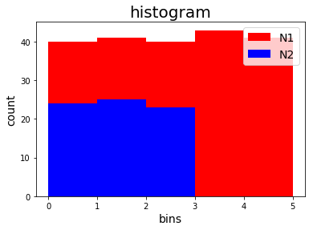
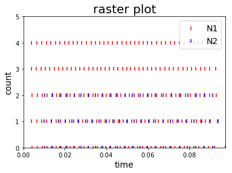
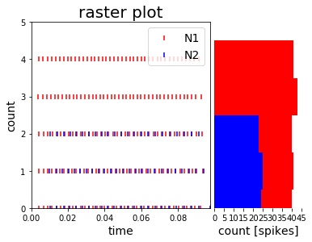
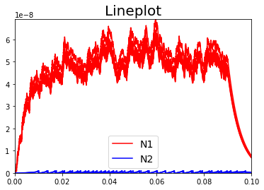
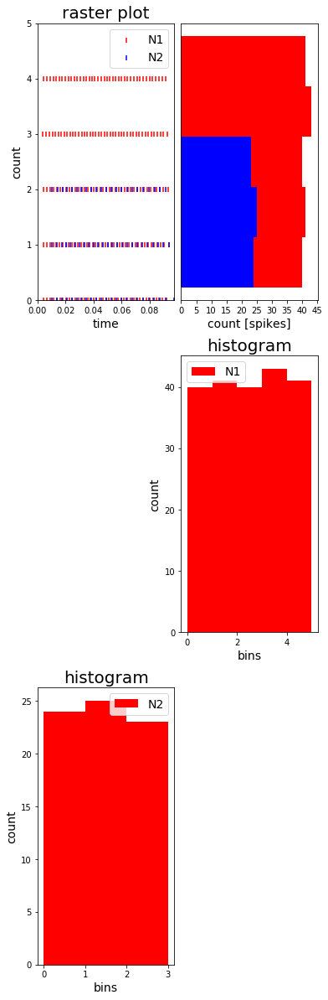

.. code:: python

    # SPDX-License-Identifier: MIT
    # Copyright (c) 2018 University of Zurich

Visualizer
=================================

**Model**:

The model represents the data, and does nothing else. The model does NOT depend on the controller or the view.
   -  EventsModel
   -  StateVariablesModel
   -  …

**View**:

The view displays the model data, and sends user actions (e.g. button clicks) to the controller. The view can:
-  be independent of both the model and the controller; or
-  actually be the controller, and therefore depend on the model.
   -  HistogramViewer
   -  RasterplotViewer
   -  LineplotViewer
   -  …

**Controller**:

The controller provides model data to the view, and interprets user actions such as button clicks. The controller depends on the view and the model. In some cases, the controller and the view are the same object.
   -  HistogramController (called Histogram)
   -  RasterplotController (called Rasterplot)
   -  LineplotController (called Lineplot)
   -  …

**PlotSettings()**
   -  font sizes
   -  …

How to use it - in short
~~~~~~~~~~~~~~~~~~~~~~~~

**1) get data**
.. code-block:: python
	spikemonN1, spikemonN2, statemonN1, statemonN2 =
	run_your_own_brian_network()

**2) define PLOTSETTING**
.. code-block:: python

	from teili.tools.visualizer.DataViewers import PlotSettings
	MyPlotSettings = PlotSettings(fontsize_title=20, fontsize_legend=14,
	fontsize_axis_labels=14, marker_size = 30,colors = [‘r’, ‘b’, ‘g’, ‘c’,
	‘k’, ‘m’, ‘y’])

**3) call CONTROLLER of desired type of plot, e.g. Histogram,
Rasterplot, Lineplot, …**

from teili.tools.visualizer.DataControllers import Histogram

DataModel_to_attr = [(spikemonN1, ‘i’), (spikemonN2, ‘i’)]

subgroup_labels = [‘N1’, ‘N2’]

HC = Histogram(MyPlotSettings=MyPlotSettings, DataModel_to_attr=DataModel_to_attr, subgroup_labels=subgroup_labels, backend=‘matplotlib’)

**If you want to change anything else on the main figure/window or one of the subplots …**

… you can directly access the mainfigure (matplotlib: figure, pyqtgraph:
qt-window) as \* **my_controller.mainfig** \* or the corresponding
subplot under **my_controller.subfig**

How to use it - the slightly longer version
~~~~~~~~~~~~~~~~~~~~~~~~~~~~~~~~~~~~~~~~~~~~~~~~~~~~~~~~~~~~~~~~~~~~~~~~~~~~~~~~~~~~~~
.. code-block:: python

    %pylab inline
    import numpy as np
    import os
    import sys
    sys.path.append(os.getenv("HOME")+'/Dropbox/src/teili/')
    
    from brian2 import us, ms, second, prefs, defaultclock, start_scope, SpikeGeneratorGroup, SpikeMonitor, StateMonitor
    import matplotlib.pylab as plt
    import pyqtgraph as pg
    from PyQt5 import QtGui
    
    from teili.core.groups import Neurons, Connections
    from teili import TeiliNetwork
    from teili.models.neuron_models import DPI
    from teili.models.synapse_models import DPISyn
    from teili.models.parameters.dpi_neuron_param import parameters as neuron_model_param
    from teili.models.parameters.dpi_synapse_param import parameters as synapse_model_param
    
    QtApp = QtGui.QApplication([])

.. code-block:: python

    def run_brian_network():
        prefs.codegen.target = "numpy"
        defaultclock.dt = 10 * us
        
        start_scope()
        N_input, N_N1, N_N2 = 1, 5, 3
        duration_sim = 100
        Net = TeiliNetwork()
        # setup spike generator
        spikegen_spike_times = np.sort(np.random.choice(size=500, a=np.arange(float(defaultclock.dt), float(duration_sim*ms)*0.9,
                                                                              float(defaultclock.dt*5)), replace=False)) * second
        spikegen_neuron_ids  = np.zeros_like(spikegen_spike_times) / ms
        gInpGroup = SpikeGeneratorGroup(N_input, indices=spikegen_neuron_ids,
                                        times=spikegen_spike_times, name='gtestInp')
        # setup neurons
        testNeurons1 = Neurons(N_N1, equation_builder=DPI(num_inputs=2), name="testNeuron")
        testNeurons1.set_params(neuron_model_param)
        testNeurons2 = Neurons(N_N2, equation_builder=DPI(num_inputs=2), name="testNeuron2")
        testNeurons2.set_params(neuron_model_param)
        # setup connections
        InpSyn = Connections(gInpGroup, testNeurons1, equation_builder=DPISyn(), name="testSyn", verbose=False)
        InpSyn.connect(True)
        InpSyn.weight = '200 + rand() * 100'
        Syn = Connections(testNeurons1, testNeurons2, equation_builder=DPISyn(), name="testSyn2", verbose=False)
        Syn.connect(True)
        Syn.weight = '200 + rand() * 100'
        # spike monitors input and network
        spikemonInp = SpikeMonitor(gInpGroup, name='spikemonInp')
        spikemonN1 = SpikeMonitor(testNeurons1, name='spikemon')
        spikemonN2 = SpikeMonitor(testNeurons2, name='spikemonOut')
        # state monitor neurons
        # statemonN1 = StateMonitor(testNeurons1, variables=["Iin", "Imem"], record=[0, 3], name='statemonNeu')
        statemonN1 = StateMonitor(testNeurons1, variables=["Iin", "Iahp"], record=True, name='statemonNeu')
        # statemonN2 = StateMonitor(testNeurons2, variables=['Iahp'], record=0, name='statemonNeuOut')
        statemonN2 = StateMonitor(testNeurons2, variables=['Imem'], record=True, name='statemonNeuOut')    
        
        Net.add(gInpGroup, testNeurons1, testNeurons2, InpSyn, Syn, spikemonN1, spikemonN2, statemonN1, statemonN2)
        # run simulation
        Net.run(duration_sim * ms)
        print ('Simulation run for {} ms'.format(duration_sim))
        return spikemonN1, spikemonN2, statemonN1, statemonN2

1. Get the data to plot
~~~~~~~~~~~~~~~~~~~~~~~

**Option A: run brian network to get SpikeMonitors and StateMonitors**

.. code-block:: python

    spikemonN1, spikemonN2, statemonN1, statemonN2 = run_brian_network()

**Option B: create DataModel instance from arrays, lists or brian-SpikeMonitors/StateMonitors**

Available DataModels:

-  StateVariablesModel 

    **EventsModel:** stores neuron_ids and spike_times
    
    .. code-block:: python
    
        # create from array/list
        from teili.tools.visualizer.DataModels import EventsModel
        neuron_ids  = [1, 1, 1, 2, 3, 1, 4, 5]
        spike_times = [11, 14, 14, 16, 17, 25, 36, 40]
        EM = EventsModel(neuron_ids=neuron_ids, spike_times=spike_times)
        
        # create from brian spike monitor
        EM = EventsModel.from_brian_spike_monitor(spikemonN1)
        
        print('Then the created EventsModel EM has the following attributes:')
        for var in vars(EM):
            print(var,': \n', getattr(EM, var))
    
    .. parsed-literal::

        Then the created EventsModel EM has the following attributes:
        neuron_ids : 
         [3 4 1 0 2 3 4 1 0 2 3 4 1 0 2 3 4 1 0 2 3 4 1 0 2 3 4 1 0 2 3 4 1 0 2 3 4
         1 0 2 3 4 1 0 2 3 4 1 0 2 3 4 1 0 2 3 4 1 0 2 3 4 1 0 3 2 4 1 3 0 2 4 1 3
         0 2 4 1 3 0 2 4 1 3 0 2 4 3 1 0 2 4 3 1 0 2 4 3 1 0 2 4 3 1 0 2 4 3 1 0 2
         4 3 1 0 2 4 3 1 0 2 4 3 1 0 2 3 4 1 0 2 3 4 1 0 3 2 4 1 0 3 4 2 1 3 0 4 2
         1 3 0 4 2 1 3 0 4 2 1 3 0 4 2 1 3 4 0 2 1 3 4 0 2 1 3 4 0 2 1 3 4 0 2 3 1
         4 0 2 3 1 4 0 2 3 1 4 0 3 2 1 4 0 3 2 1]
        spike_times : 
         [0.00387 0.004   0.00405 0.00411 0.00413 0.00628 0.00651 0.00659 0.00669
         0.00673 0.0085  0.0088  0.00891 0.00903 0.00908 0.0107  0.0111  0.01124
         0.01139 0.01145 0.01278 0.01326 0.01344 0.01363 0.0137  0.01491 0.01552
         0.01574 0.01595 0.01603 0.01699 0.01764 0.01788 0.01812 0.01821 0.01907
         0.01984 0.02012 0.02039 0.02049 0.02108 0.02183 0.02216 0.02247 0.02259
         0.02304 0.02391 0.02426 0.0246  0.02473 0.02506 0.02604 0.02644 0.02684
         0.027   0.02719 0.02822 0.02867 0.02914 0.02932 0.02935 0.03047 0.03094
         0.03139 0.03144 0.03155 0.03261 0.03313 0.03351 0.03359 0.03375 0.0347
         0.03525 0.03554 0.03576 0.03594 0.03682 0.03731 0.03748 0.03781 0.038
         0.03885 0.03937 0.03945 0.03987 0.04005 0.04084 0.04141 0.04142 0.042
         0.04222 0.04304 0.04359 0.04372 0.04438 0.04459 0.04526 0.04569 0.04591
         0.04663 0.04688 0.04752 0.04786 0.04816 0.04878 0.04902 0.04953 0.0498
         0.05021 0.0509  0.05117 0.05161 0.0518  0.05233 0.05309 0.05338 0.05373
         0.05384 0.05449 0.05522 0.0555  0.05575 0.05579 0.05655 0.05743 0.05774
         0.05788 0.05792 0.0587  0.05949 0.05978 0.05978 0.05989 0.06072 0.06163
         0.0618  0.06194 0.06198 0.06289 0.06389 0.06391 0.06419 0.06423 0.06514
         0.06605 0.06618 0.06643 0.06656 0.06748 0.06828 0.06855 0.06871 0.0689
         0.06966 0.07033 0.07075 0.07086 0.07114 0.07195 0.0725  0.07303 0.07306
         0.07343 0.07423 0.07471 0.0754  0.07545 0.0759  0.07656 0.07688 0.07763
         0.07774 0.07815 0.07875 0.07899 0.07997 0.08017 0.08062 0.0811  0.08119
         0.08212 0.08238 0.08286 0.08328 0.0833  0.08428 0.08459 0.08509 0.08537
         0.0855  0.08647 0.08687 0.08744 0.08757 0.08783 0.08879 0.08929 0.08982
         0.08987 0.0902  0.09128 0.0921  0.09261 0.09306 0.09351]
    
    
    **StateVariablesModel:**  stores any number of variables with their name and the list of timepoints when the variable was sampled
    
    .. code-block:: python
    
        from teili.tools.visualizer.DataModels import StateVariablesModel
        
        # create from array/list
        state_variable_names = ['var_name']
        num_neurons, num_timesteps = 6, 50
        state_variables       = [np.random.random((num_neurons, num_timesteps))]
        state_variables_times = [np.linspace(0, 100, num_timesteps)]
        SVM = StateVariablesModel(state_variable_names, state_variables, state_variables_times)
        
        # from brian state monitorS
        skip_not_rec_neuron_ids=False
        SVM = StateVariablesModel.from_brian_state_monitors([statemonN1, statemonN2], skip_not_rec_neuron_ids)
        
        skip_not_rec_neuron_ids=True
        SVM = StateVariablesModel.from_brian_state_monitors([statemonN1, statemonN2], skip_not_rec_neuron_ids)
        
        print('Then the created StateVariablesModel SVM has the following attributes:')
        for var in vars(SVM):
            print(var,': \n', getattr(SVM, var))
    
    
    .. parsed-literal::
    
        Then the created StateVariablesModel SVM has the following attributes:
        Iin : 
         [[0.00000000e+00 0.00000000e+00 0.00000000e+00 0.00000000e+00
          0.00000000e+00]
         [0.00000000e+00 0.00000000e+00 0.00000000e+00 0.00000000e+00
          0.00000000e+00]
         [0.00000000e+00 0.00000000e+00 0.00000000e+00 0.00000000e+00
          0.00000000e+00]
         ...
         [6.82521123e-09 7.02939025e-09 6.74769896e-09 7.76629202e-09
          7.21872104e-09]
         [6.81237889e-09 7.01617406e-09 6.73501234e-09 7.75169045e-09
          7.20514890e-09]
         [6.79957068e-09 7.00298271e-09 6.72234958e-09 7.73711634e-09
          7.19160228e-09]]
        t_Iin : 
         [0.000e+00 1.000e-05 2.000e-05 ... 9.997e-02 9.998e-02 9.999e-02]
        Iahp : 
         [[5.00000000e-13 5.00000000e-13 5.00000000e-13 5.00000000e-13
          5.00000000e-13]
         [5.00000000e-13 5.00000000e-13 5.00000000e-13 5.00000000e-13
          5.00000000e-13]
         [5.00000000e-13 5.00000000e-13 5.00000000e-13 5.00000000e-13
          5.00000000e-13]
         ...
         [2.35349697e-11 2.45322975e-11 2.37997191e-11 2.54116963e-11
          2.38412778e-11]
         [2.35283328e-11 2.45253794e-11 2.37930076e-11 2.54045302e-11
          2.38345545e-11]
         [2.35216978e-11 2.45184633e-11 2.37862979e-11 2.53973662e-11
          2.38278332e-11]]
        t_Iahp : 
         [0.000e+00 1.000e-05 2.000e-05 ... 9.997e-02 9.998e-02 9.999e-02]
        Imem : 
         [[0.00000000e+00 0.00000000e+00 0.00000000e+00]
         [4.74578721e-33 4.74578721e-33 4.74578721e-33]
         [9.49157441e-33 9.49157441e-33 9.49157441e-33]
         ...
         [1.14559533e-10 2.80317027e-10 3.29995059e-10]
         [1.15005619e-10 2.80084652e-10 3.29576244e-10]
         [1.15447969e-10 2.79851599e-10 3.29157605e-10]]
        t_Imem : 
         [0.000e+00 1.000e-05 2.000e-05 ... 9.997e-02 9.998e-02 9.999e-02]
    

2. Plot the collected data
~~~~~~~~~~~~~~~~~~~~~~~~~~~

2.1 Define PlotSettings
-----------------------

-  The PlotSettings are defined only once for all the plots that will be
   created. This should make it easier to get consistent color-codings,
   fontsizes and markersize across different plots.
-  The colors can be defined as RGBA to additionally define the
   transparency

.. code-block:: python

    from teili.tools.visualizer.DataViewers import PlotSettings
    MyPlotSettings = PlotSettings(fontsize_title=20, fontsize_legend=14, fontsize_axis_labels=14,
                                   marker_size = 30,             # default 5
                                   colors = ['r', 'b'],          # default ['r', 'b', 'g', 'c', 'k', 'm', 'y']
    )

2.2 Call the DataController of the desired type of plot
-------------------------------------------------------

So far in teili: \* Histogram \* Rasterplot \* Lineplot

2.2a) Histogram
---------------

**Histogram - Inputs**

::

   * DataModel_to_attr             --> e.g. [(spikemonN1, 'i'), (spikemonN2, 'i')] OR
                                               [(EventsModel, 'i'), (EventsModel, 'i')]
   * MyPlotSettings=PlotSettings()
   * subgroup_labels=None          --> e.g. ['Neurongroup N1', 'Neurongroup N2']
   * bins=None                     --> e.g. range(0,9)
   * orientation='vertical'        --> 'horizontal' OR 'vertical'
   * title='histogram
   * xlabel='bins'
   * ylabel='count',
   * backend='matplotlib'
   * show_immediately=False

.. code-block:: python

    ''' Simple example to plot a histogram of two NeuronGroups '''
    from teili.tools.visualizer.DataControllers import Histogram
    
    # plot data from BrianSpikeMontiors/StateMonitors
    DataModel_to_attr =  [(spikemonN1, 'i'), (spikemonN2, 'i')]
    
    # or plot data from DataModels
    # EM1 = EventsModel.from_brian_spike_monitor(spikemonN1)
    # EM2 = EventsModel.from_brian_spike_monitor(spikemonN2)
    # DataModel_to_attr = {EM1: 'neuron_ids', EM2:'neuron_ids'}
    subgroup_labels = ['N1', 'N2']
    
    # MATPLOTLIB backend
    HC = Histogram(DataModel_to_attr=DataModel_to_attr,
                    MyPlotSettings=MyPlotSettings,
                    subgroup_labels=subgroup_labels,
                    backend='matplotlib')

.. code-block:: python

    # PYQTGRAPH backend
    HC = Histogram(DataModel_to_attr=DataModel_to_attr, 
                    MyPlotSettings=MyPlotSettings,           
                    subgroup_labels=subgroup_labels,
                    backend='pyqtgraph',
                    QtApp=QtApp, show_immediately=True)

2.2b) Rasterplot
----------------

**Rasterplot - Inputs**

::

   * MyEventsModels                --> list of EventsModel or BrianSpikeMonitors
   * MyPlotSettings=PlotSettings()
   * subgroup_labels=None          --> ['N1', 'N2']
   * time_range=None               --> (0, 0.9)
   * neuron_id_range=None,         --> (0, 4)
   * title='raster plot'
   * xlabel='time
   * ylabel='count',
   * backend='matplotlib'
   * add_histogram=False           --> show histogram of spikes per neuron id next to rasterplot
   * show_immediately=False

.. code-block:: python

    from teili.tools.visualizer.DataControllers import Rasterplot
    ''' Simple example to plot a rasterplot of two NeuronGroups '''
    
    # plot data from BrianSpikeMontiors
    MyEventsModels = [spikemonN1, spikemonN2]
    
    # or plot data from EventsModel
    # EM1 = EventsModel.from_brian_spike_monitor(spikemonN1)
    # EM2 = EventsModel.from_brian_spike_monitor(spikemonN2)
    # MyEventsModels = [EM1, EM2]
    
    subgroup_labels = ['N1', 'N2']
    
    # MATPLOTLIB backend - WITHOUT HISTOGRAM
    RC = Rasterplot(MyEventsModels=MyEventsModels, MyPlotSettings=MyPlotSettings, subgroup_labels=subgroup_labels, backend='matplotlib')
    # MATPLOTLIB backend - WITH HISTOGRAM
    RC = Rasterplot(MyEventsModels=MyEventsModels, MyPlotSettings=MyPlotSettings, subgroup_labels=subgroup_labels, add_histogram=True)

.. code-block:: python

    # PYQTGRAPH backend - WITHOUT HISTOGRAM
    RC = Rasterplot(MyEventsModels=MyEventsModels, MyPlotSettings=MyPlotSettings, subgroup_labels=subgroup_labels, backend='pyqtgraph', QtApp=QtApp)
    # PYQTGRAPH backend - WITH HISTOGRAM
    RC = Rasterplot(MyEventsModels=MyEventsModels, MyPlotSettings=MyPlotSettings, subgroup_labels=subgroup_labels,
                        add_histogram=True, backend='pyqtgraph', QtApp=QtApp, show_immediately=True)

2.2c) LinePlot
--------------

**Lineplot - Inputs**

::

   * DataModel_to_x_and_y_attr --> e.g. [(statemonN1, ('Imem', 't_Imem')),
                                                  (statemonN2, ('Iahp', 't_Iahp'))]
                                           OR
                                        [(StateVariablesModel_N1, ('Imem', 't_Imem')),
                                                 (StateVariablesModel_N2, ('Iahp', 't_Iahp'))]
   * MyPlotSettings=PlotSettings()
   * subgroup_labels=None      --> ['N1', 'N2']
   * x_range=None,             --> (0, 0.9)
   * y_range=None,             --> (0, 4)
   * title='Lineplot'
   * xlabel=None
   * ylabel=None
   * backend='matplotlib'
   * show_immediately=False

.. code-block:: python

    from teili.tools.visualizer.DataControllers import Lineplot
    ''' Simple example to plot a lineplot of two NeuronGroups '''
    
    # plot data from BrianSpikeMontiors
    DataModel_to_x_and_y_attr = [(statemonN1, ('t', 'Iin')), (statemonN2, ('t', 'Imem'))]
    # or plot data from StateVariablesModel
    SVM_N1 = StateVariablesModel.from_brian_state_monitors([statemonN1])
    SVM_N2 = StateVariablesModel.from_brian_state_monitors([statemonN2])
    DataModel_to_x_and_y_attr = [(SVM_N1, ('t_Iin', 'Iin')), (SVM_N2, ('t_Imem', 'Imem'))]
    
    subgroup_labels = ['N1', 'N2']
    
    # MATPLOTLIB backend
    LC = Lineplot(DataModel_to_x_and_y_attr=DataModel_to_x_and_y_attr,
                      MyPlotSettings=MyPlotSettings,
                      subgroup_labels=subgroup_labels, 
                      backend='matplotlib')

.. code-block:: python

    # PYQTGRAPH backend
    LC = Lineplot(DataModel_to_x_and_y_attr=DataModel_to_x_and_y_attr,
                      MyPlotSettings=MyPlotSettings,
                      subgroup_labels=subgroup_labels, 
                      backend='pyqtgraph', QtApp=QtApp, show_immediately=True)

Additional functionalities
==========================

A1) Combine different plots
~~~~~~~~~~~~~~~~~~~~~~~~~~~~

**… with matplotlib**

.. code-block:: python

    # define plot structure BEFOREHAND
    mainfig = plt.figure()
    subfig1 = mainfig.add_subplot(321)
    subfig2 = mainfig.add_subplot(322)
    subfig3 = mainfig.add_subplot(324)
    subfig4 = mainfig.add_subplot(325)
    
    plt.subplots_adjust(left=0.125, right=0.9, bottom=0.1, top=4., wspace=0.05, hspace=0.2)
    
    MyEventsModels = [spikemonN1, spikemonN2]
    subgroup_labels = ['N1', 'N2']
    RC = Rasterplot(MyEventsModels=MyEventsModels, MyPlotSettings=MyPlotSettings, subgroup_labels=subgroup_labels,
                     mainfig=mainfig, subfig_rasterplot=subfig1, subfig_histogram = subfig2,
                     add_histogram=True, show_immediately=False)
    
    DataModel_to_attr = [(spikemonN1, 'i')]
    subgroup_labels = ['N1']
    HC = Histogram(DataModel_to_attr=DataModel_to_attr, MyPlotSettings=MyPlotSettings, 
                     subgroup_labels=subgroup_labels, mainfig=mainfig, subfig=subfig3, show_immediately=False)
    
    DataModel_to_attr = [(spikemonN2, 'i')]
    subgroup_labels = ['N2']
    HC = Histogram(DataModel_to_attr=DataModel_to_attr, MyPlotSettings=MyPlotSettings, 
                 subgroup_labels=subgroup_labels, mainfig=mainfig, subfig=subfig4, show_immediately=True)

**… with pyqtgraph**

.. code-block:: python

    # define plot structure BEFOREHAND
    mainfig = pg.GraphicsWindow()
    subfig1 = mainfig.addPlot(row=0, col=0)
    subfig2 = mainfig.addPlot(row=0, col=1)
    subfig2.setYLink(subfig1)
    subfig3 = mainfig.addPlot(row=1, col=1)
    subfig4 = mainfig.addPlot(row=2, col=0)
    
    plt.subplots_adjust(left=0.125, right=0.9, bottom=0.1, top=4., wspace=0.05, hspace=0.2)
    
    MyEventsModels = [spikemonN1, spikemonN2]
    subgroup_labels = ['N1', 'N2']
    RC = Rasterplot(MyEventsModels=MyEventsModels, MyPlotSettings=MyPlotSettings, subgroup_labels=subgroup_labels,
                             mainfig=mainfig, subfig_rasterplot=subfig1, subfig_histogram = subfig2, QtApp=QtApp,
                             backend='pyqtgraph', add_histogram=True, show_immediately=False)
    
    DataModel_to_attr = [(spikemonN1, 'i')]
    subgroup_labels = ['N1']
    HC = Histogram(DataModel_to_attr=DataModel_to_attr, MyPlotSettings=MyPlotSettings, 
                             subgroup_labels=subgroup_labels,
                             backend='pyqtgraph', mainfig=mainfig, subfig=subfig3,  QtApp=QtApp,
                             show_immediately=False)
    
    DataModel_to_attr = [(spikemonN1, 'i')]
    subgroup_labels = ['N2']
    HC = Histogram(DataModel_to_attr=DataModel_to_attr, MyPlotSettings=MyPlotSettings,
                             subgroup_labels=subgroup_labels,
                             backend='pyqtgraph', mainfig=mainfig, subfig=subfig4, QtApp=QtApp,
                             show_immediately=True)

A2) Add second plot with a detailed view of a given plot
~~~~~~~~~~~~~~~~~~~~~~~~~~~~~~~~~~~~~~~~~~~~~~~~~~~~~~~~
.. code-block:: python

    ''' Create original plot of which you would like to have a detailed version as well TWICE (sorry, about that...)'''
    MyEventsModels = [spikemonN1, spikemonN2]
    subgroup_labels = ['N1', 'N2']
    
    mainfig = pg.GraphicsWindow()
    subfig1 = mainfig.addPlot(row=0, col=0)
    mainfig.nextRow()
    subfig2 = mainfig.addPlot(row=1, col=0)
    
    
    RC_org = Rasterplot(MyEventsModels=MyEventsModels, MyPlotSettings=MyPlotSettings, subgroup_labels=subgroup_labels,
                                  mainfig=mainfig, subfig_rasterplot=subfig1,
                             QtApp=QtApp, backend='pyqtgraph', show_immediately=False)
    RC_detail = Rasterplot(MyEventsModels=MyEventsModels, MyPlotSettings=MyPlotSettings, subgroup_labels=subgroup_labels,
                                     mainfig=mainfig, subfig_rasterplot=subfig2,
                             QtApp=QtApp, backend='pyqtgraph', show_immediately=False)
    
    RC_org.connect_detailed_subplot(filled_subplot_original_view=RC_org.viewer.subfig_rasterplot,
                                    filled_subplot_detailed_view=RC_detail.viewer.subfig_rasterplot,
                                  ~
